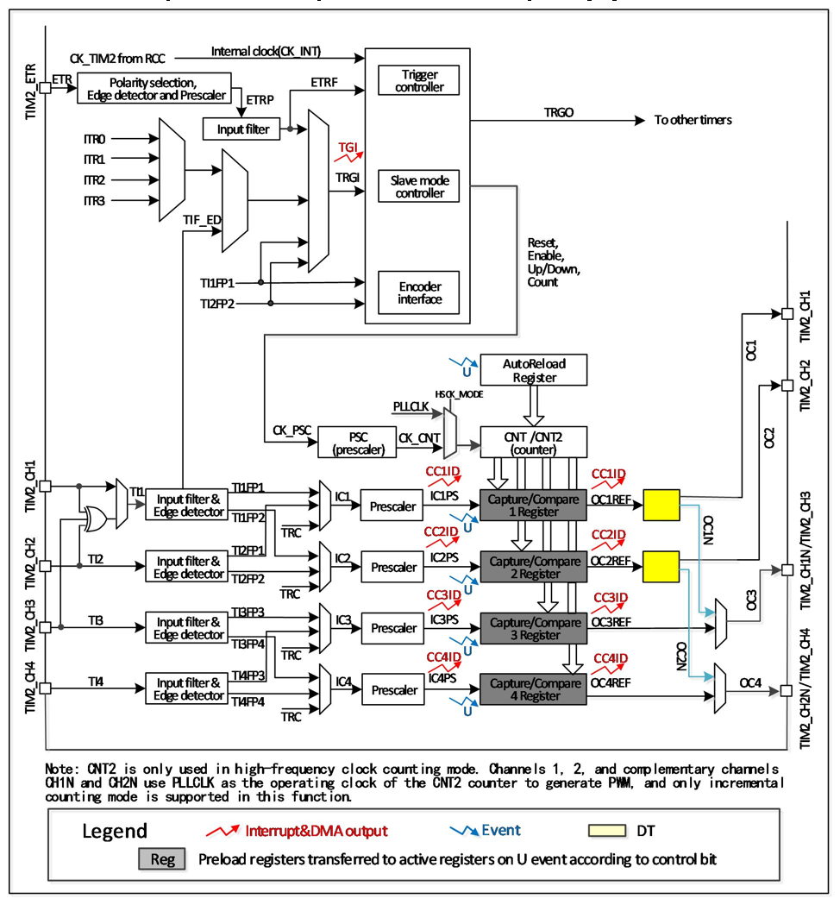

<!-- source-page: 134 -->

[← p.133](0133.md) · [index](../README.md) · [PDF p.134](https://ch32-riscv-ug.github.io/CH32M030/datasheet_en/CH32M030RM.PDF#page=134) · [p.135 →](0135.md)

<!-- header: CH32M030 Reference Manual https://wch-ic.com -->

## 10.2 Principle and Structure

Figure 10-1 Block diagram of the structure of the general-purpose timer  
 <!-- rendered from the PDF; verify at https://ch32-riscv-ug.github.io/CH32M030/datasheet_en/CH32M030RM.PDF#page=134 -->

🖼 Text parsed from the figure above

<!-- image: p134-draw-image-00002 inside the figure -->

### 10.2.1 Overview

As shown in Figure 10-1, the structure of the general-purpose timer can be roughly divided into three parts,  
namely the input clock part, the core counter part and the compare capture channel part.  
The clock for the general-purpose timer can come from the HB bus clock (CK_INT), from the external clock  
input pin (TIMx_ETR), from other timers with clock output (ITRx), and from the input of the compare capture  
channel (TIMx_CHx). These input clock signals become CK_PSC clocks after various set filtering and dividing  
operations, etc., and are output to the core counter section. In addition, these complex clock sources can also be  
output as TRGO to other peripherals such as timers and ADCs.  
<!-- image: p134-draw-image-00001 bbox=[515.52, 783.36, 535.44, 793.92] -->
<!-- footer: V1.2 139 -->
