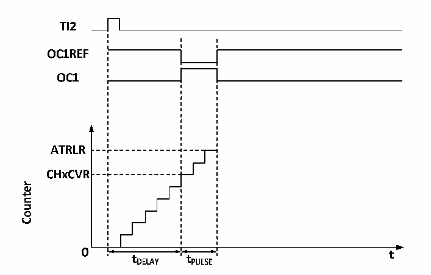

<!-- source-page: 140 -->

[← p.139](0139.md) · [index](../README.md) · [PDF p.140](https://ch32-riscv-ug.github.io/CH32M030/datasheet_en/CH32M030RM.PDF#page=140) · [p.141 →](0141.md)

<!-- header: CH32M030 Reference Manual https://wch-ic.com -->
Set 110b or 111b in the OCxM field to use PWM mode 1 or mode 2, set the OCxPE bit to enable the preload  
register, and finally set the ARPE bit to enable the automatic reload of the preload register. The value of the  
preload register can only be sent to the shadow register when an update event occurs, so the UG bit needs to be set  
to initialize all registers before the core counter starts counting.  
● Edge alignment  
When edge alignment is used, the core counter counts up or down. In the case of PWM mode 1, when the value of  
the core counter is greater than the comparison capture register, OCxREF rises to high. When the value of the core  
counter is less than the comparison capture register (for example, when the core counter increases to the value of  
R16_TIM2_ATRLR and returns to all zeros), OCxREF drops to low.  
● Central alignment  
When the central alignment mode is used, the core counter runs in the mode of alternately counting up and  
counting down, and OCxREF jumps up and down when the values of the core counter and the comparison capture  
register are consistent. However, the timing of setting the comparison mark is different under three central  
alignment modes. When using the central alignment mode, it is best to generate a software update flag (set UG bit)  
before starting the core counter.  

### 10.3.6 Single Pulse Mode

The single pulse mode can respond to a specific event by generating a pulse after a delay, with programmable  
delay and pulse width. Setting the OPM bit stops the core counter when the next update event UEV is generated  
(Counter flips to 0).  

Figure 10-4 Event generation and impulse response  
 <!-- rendered from the PDF; verify at https://ch32-riscv-ug.github.io/CH32M030/datasheet_en/CH32M030RM.PDF#page=140 -->

🖼 Text parsed from the figure above

<!-- image: p140-draw-image-00003 inside the figure -->
<!-- image: p140-draw-image-00002 inside the figure -->
<!-- image: p140-draw-image-00004 inside the figure -->
<!-- image: p140-draw-image-00005 inside the figure -->
<!-- image: p140-draw-image-00006 inside the figure -->
<!-- image: p140-draw-image-00007 inside the figure -->
<!-- image: p140-draw-image-00008 inside the figure -->
<!-- image: p140-draw-image-00015 inside the figure -->
<!-- image: p140-draw-image-00016 inside the figure -->
<!-- image: p140-draw-image-00017 inside the figure -->
<!-- image: p140-draw-image-00009 inside the figure -->
<!-- image: p140-draw-image-00014 inside the figure -->
<!-- image: p140-draw-image-00010 inside the figure -->
<!-- image: p140-draw-image-00012 inside the figure -->
<!-- image: p140-draw-image-00013 inside the figure -->
<!-- image: p140-draw-image-00011 inside the figure -->

As shown in Figure 10-4, a positive pulse of length Tpulse needs to be generated on OC1 after a delay Tdelay at  
the beginning of a rising edge detected on the TI2 input pin.  
1) Set TI2 to trigger. Setting the CC2S field to 01b to map TI2FP2 to TI2; setting the CC2P bit to 0b to set  
TI2FP2 as rising edge detection; setting the TS field to 110b to set TI2FP2 as trigger source; setting the SMS  
field to 110b to set TI2FP2 to be used to start the counter.  
2) Tdelay is defined by the Compare Capture Register and Tpulse is determined by the value of the Auto Reload  
Value Register and the Compare Capture Register.  
<!-- image: p140-draw-image-00001 bbox=[515.52, 783.36, 535.44, 793.92] -->
<!-- footer: V1.2 145 -->
