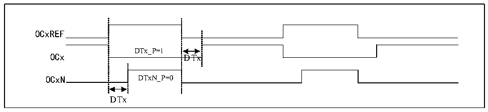

<!-- source-page: 142 -->

[← p.141](0141.md) · [index](../README.md) · [PDF p.142](https://ch32-riscv-ug.github.io/CH32M030/datasheet_en/CH32M030RM.PDF#page=142) · [p.143 →](0143.md)

<!-- header: CH32M030 Reference Manual https://wch-ic.com -->

Figure 10-5 Complementary output and dead time  
 <!-- rendered from the PDF; verify at https://ch32-riscv-ug.github.io/CH32M030/datasheet_en/CH32M030RM.PDF#page=142 -->

🖼 Text parsed from the figure above

OCxREF  
DTx_P=1  
OCx DTx  
OCxN DTxN_P=0  
DTx  

When complementary output, channel 3 and channel 4 serve as complementary output channel of channel 1 and  
channel 2.  
The complementary or co-directional output of configurable dead time is multiplexed with the output channels of  
channels 3 and 4 by configuring bits OC1N_EN and OC2N_EN.  

### 10.3.10 Dual Edge Capture Mode

The pulse can be measured by turning on the double-edge capture of the corresponding channel through the  
CAP_ED_CHx bit in the TIM2_CTLR2 register.  
For example, channel 2 is used to capture the pulse width. In the configuration of capture function, the source of  
IC2 signal is selected (CC2S bit in TIM2_CHCTLR1 register is 11b), and the double-edge capture function of  
channel 2 is enabled (CAP_ED_CH2 bit in TIM2_CTLR2 register is 1). So far, the configuration of double edge  
capture has been completed.  
The high and low level width values of the captured pulse can be read through the CH2CVR bit of the  
TIM2_CH2CVR register, and the level corresponding to the captured value can be indicated through the bit[16] of  
the TIM2_CH2CVR register by turning on the CAPLVL bit.  

### 10.3.11 High Frequency Clock Counting Mode

Channels 1, 2 and corresponding complementary channels of Timer 2 support the use of PLL clock as the working  
clock of the core counter to generate PWM(OCxM bit can only select PWM mode 1 or PWM mode 2), and only  
the incremental counting mode is supported under this function; Bits DT2[3:0] of TIM2_DTCR register can be  
configured at the value of dead time on the falling edge of OCXREF, and DT1[3:0] can be configured at the value  
of dead time on the rising edge of OCXREF; DT_DIV bit turns on the function of dividing the dead time counting  
clock by 4, and extends the dead time.  

### 10.3.12 Debug mode

When the system enters the debug mode, the timer can be controlled to continue running or stop according to the  
setting of DBG module.  

## 10.4 Register Description

<!-- p142-table-001 (table-10-3@1) pages 142-143 -->
<table><caption>Table 10-3 TIM2-related registers list</caption><tr><th>Name</th><th>Access address</th><th>Description</th><th>Reset value</th></tr><tr><td>R16_TIM2_CTLR1</td><td>0x40000000</td><td>Control register 1</td><td>0x0000</td></tr><tr><td>R16_TIM2_CTLR2</td><td>0x40000004</td><td>Control register 2</td><td>0x0000</td></tr><tr><td>R16_TIM2_SMCFGR</td><td>0x40000008</td><td>Slave mode control register</td><td>0x0000</td></tr><tr><td>R16_TIM2_DMAINTENR</td><td>0x4000000C</td><td>DMA/ interrupt enable register</td><td>0x0000</td></tr><tr><td>R16_TIM2_INTFR</td><td>0x40000010</td><td>Interrupt status register</td><td>0x0000</td></tr><tr><td>R16_TIM2_SWEVGR</td><td>0x40000014</td><td>Event generation register</td><td>0x0000</td></tr><tr><td>R16_TIM2_CHCTLR1</td><td>0x40000018</td><td>Compare/capture control register 1</td><td>0x0000</td></tr><tr><td>R16_TIM2_CHCTLR2</td><td>0x4000001C</td><td>Compare/capture control register 2</td><td>0x0000</td></tr><tr><td>R16_TIM2_CCER</td><td>0x40000020</td><td>Compare/capture enable register</td><td>0x0000</td></tr><tr><td>R16_TIM2_CNT</td><td>0x40000024</td><td>Counter of general-purpose timer</td><td>0x0000</td></tr><tr><td>R16_TIM2_PSC</td><td>0x40000028</td><td>Count clock prescaler</td><td>0x0000</td></tr><tr><td>R16_TIM2_ATRLR</td><td>0x4000002C</td><td>Auto-reload value register</td><td>0xFFFF</td></tr><tr><td>R32_TIM2_CH1CVR</td><td>0x40000034</td><td>Compare/capture register 1</td><td>0x00000000</td></tr><tr><td>R32_TIM2_CH2CVR</td><td>0x40000038</td><td>Compare/capture register 2</td><td>0x00000000</td></tr><tr><td>R32_TIM2_CH3CVR</td><td>0x4000003C</td><td>Compare/capture register 3</td><td>0x00000000</td></tr><tr><td>R32_TIM2_CH4CVR</td><td>0x40000040</td><td>Compare/capture register 4</td><td>0x00000000</td></tr><tr><td>R16_TIM2_DTCR</td><td>0x40000044</td><td>Deadtime function configuration register</td><td>0x0000</td></tr><tr><td>R16_TIM2_DMACFGR</td><td>0x40000048</td><td>DMA control register</td><td>0x0000</td></tr><tr><td>R16_TIM2_DMAADR</td><td>0x4000004C</td><td>DMA address register in continuous mode</td><td>0x0000</td></tr></table>

<!-- image: p142-draw-image-00001 bbox=[515.52, 783.36, 535.44, 793.92] -->
<!-- footer: V1.2 147 -->
