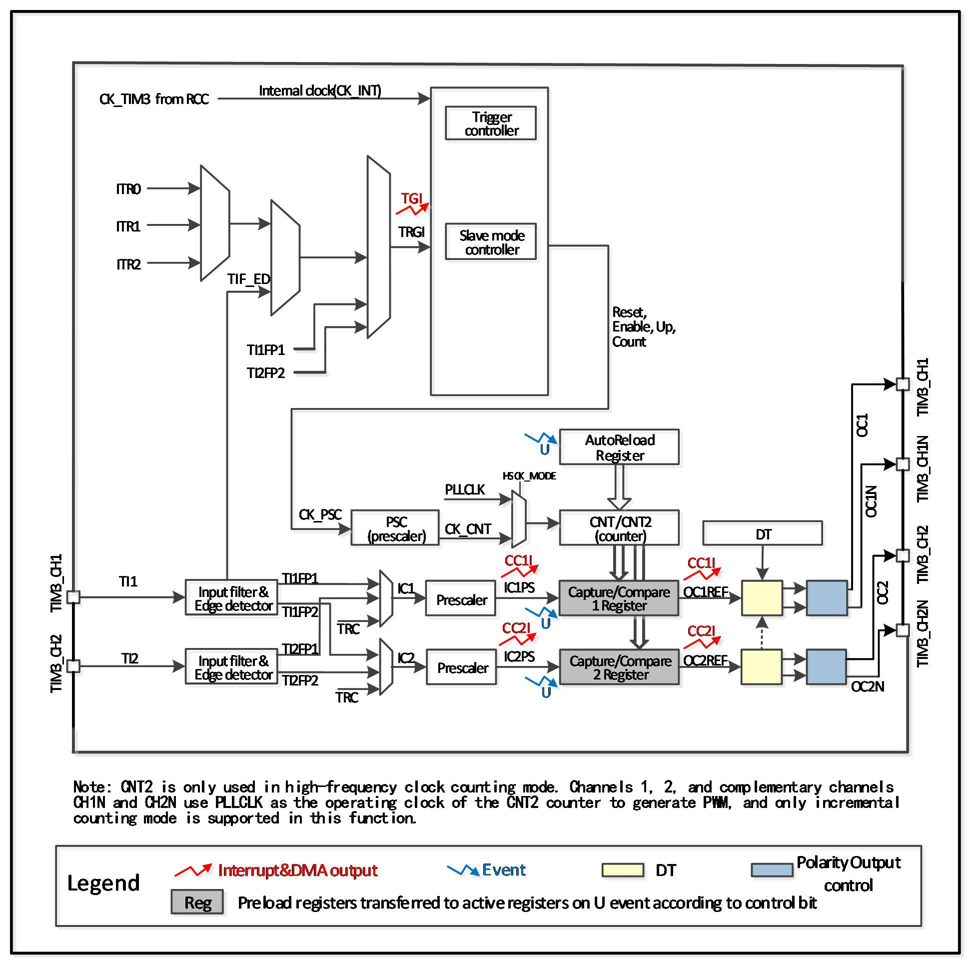

<!-- source-page: 160 -->

[← p.159](0159.md) · [index](../README.md) · [PDF p.160](https://ch32-riscv-ug.github.io/CH32M030/datasheet_en/CH32M030RM.PDF#page=160) · [p.161 →](0161.md)

<!-- header: CH32M030 Reference Manual https://wch-ic.com -->

## 11.2 Principle and Structure

Figure 11-1 Block diagram of the structure of the streamlined timer  
 <!-- rendered from the PDF; verify at https://ch32-riscv-ug.github.io/CH32M030/datasheet_en/CH32M030RM.PDF#page=160 -->

🖼 Text parsed from the figure above

<!-- image: p160-draw-image-00002 inside the figure -->

### 11.2.1 Overview

As shown in Figure 11-1, the structure of the streamlined timer can be roughly divided into three parts, namely the  
input clock part, the core counter part and the compare channel part.  
The clock of the streamlined timer can come from the HB bus clock (CK_INT), from other timers (ITRx) with  
clock output function, and from the input terminal of the compare capture channel (TIM3_CHx). These input  
clock signals are then used to become CK_PSC clocks after various set filtering and frequency division operations,  
and are output to the core counter part.  
The core of the streamlined timer is a 16-bit counter (CNT). CK_PSC input directly to CNT, CNT without  
frequency division supports incremental counting mode, decremental counting mode and incremental or  
decremental counting mode, and has an automatic reload value register (ATRLR) to reload initialization values for  
<!-- image: p160-draw-image-00001 bbox=[515.52, 783.36, 535.44, 793.92] -->
<!-- footer: V1.2 165 -->
