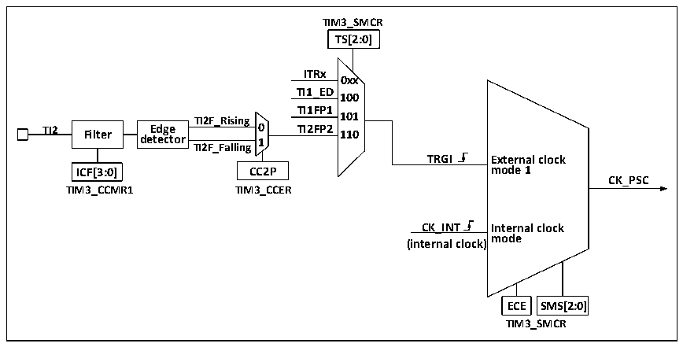

<!-- source-page: 161 -->

[← p.160](0160.md) · [index](../README.md) · [PDF p.161](https://ch32-riscv-ug.github.io/CH32M030/datasheet_en/CH32M030RM.PDF#page=161) · [p.162 →](0162.md)

<!-- header: CH32M030 Reference Manual https://wch-ic.com -->
CNT at the end of each counting cycle.  
The streamlined timer has 2 sets of comparison capture channels, each of which can input pulses from the  
exclusive pins or output waveforms to the pins, that is, the compare capture channel supports input and output  
modes. The inputs of each channel of the compare capture register support filtering, frequency division, edge  
detection and other operations, and support mutual triggering between channels, and can also provide clocks for  
the core counter CNT. Each compare capture channel has a set of compare capture registers (CHxCVR), which  
supports comparison with the main counter (CNT) and output pulses.  

### 11.2.2 Difference between Streamlined Timer and Advanced Timer

Compared to advanced timers, the streamlined timer lacks the following features:  
1) The streamlined timer lacks a repeat count register that counts the counting cycles of the core counter.  
2) The streamlined timer has no brake signal mechanism.  
3) The streamlined timer has no encoder mode.  
4) The streamlined timer 16-bit auto-reload counter does not support decrement counting mode and  
increment/decrement counting mode  
5) The streamlined timer does not support external clock pin (ETR) input clock.  

### 11.2.3 Clock Input

This section discusses the source of CK_PSC. The clock source part of the overall structure block diagram of the  
streamlined timer is intercepted here.  

Figure 11-2 Streamlined timer CK_PSC source block diagram  
 <!-- rendered from the PDF; verify at https://ch32-riscv-ug.github.io/CH32M030/datasheet_en/CH32M030RM.PDF#page=161 -->

🖼 Text parsed from the figure above

<strong>TIM3_SMCR</strong>  
<strong>TS[2:0]</strong>  
<strong>ITRx</strong>  
<strong>0xx</strong>  
<strong>TI1_ED</strong>  
<strong>100</strong>  
<strong>TI1FP1</strong>  
<strong>TI2F_Rising 101</strong>  
<strong>TI2 Filter de E t d e g c e tor 0 1 TI2FP2 110</strong>  
<strong>TI2F_Falling</strong>  
<strong>TRGI External clock</strong>  
<strong>ICF[3:0] CC2P mode 1</strong>  
<strong>CK_PSC</strong>  
<strong>TIM3_CCMR1 TIM3_CCER</strong>  
<strong>CK_INT Internal clock</strong>  
<strong>mode</strong>  
<strong>(internal clock)</strong>  
<strong>ECE SMS[2:0]</strong>  
<strong>TIM3_SMCR</strong>  

The optional input clocks can be divided into 3 categories.  
1) Internal HB clock input route: CK_INT  
2) Route from the compare capture channel Pin (TIM3_CHx):  
3) Input from other internal timers: ITRx.  
By determining the input pulse selection of the SMS from which the CK_PSC comes from, the actual operation  
can be divided into 2 categories:  
<!-- image: p161-draw-image-00001 bbox=[515.52, 783.36, 535.44, 793.92] -->
<!-- footer: V1.2 166 -->
