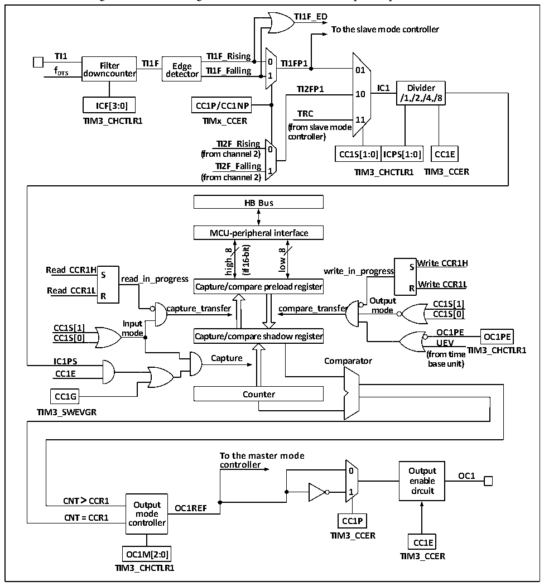

<!-- source-page: 163 -->

[← p.162](0162.md) · [index](../README.md) · [PDF p.163](https://ch32-riscv-ug.github.io/CH32M030/datasheet_en/CH32M030RM.PDF#page=163) · [p.164 →](0164.md)

<!-- header: CH32M030 Reference Manual https://wch-ic.com -->

Figure 11-3 Block diagram of the structure of the compare capture channel  
 <!-- rendered from the PDF; verify at https://ch32-riscv-ug.github.io/CH32M030/datasheet_en/CH32M030RM.PDF#page=163 -->

🖼 Text parsed from the figure above

<strong>TI1F_ED</strong>  
<strong>To the slave mode controller</strong>  
<strong>TI1 TI1F_Rising</strong>  
<strong>Filter TI1F Edge 0 TI1FP1</strong>  
<strong>f DTS downcounter detector TI1F_Falling 1 01</strong>  
<strong>TI2FP1 IC1 Divider</strong>  
<strong>10</strong>  
<strong>/1,/2,/4,/8</strong>  
<strong>ICF[3:0] CC1P/CC1NP</strong>  
<strong>TRC</strong>  
<strong>TIM3_CHCTLR1 TIMx_CCER 11</strong>  
<strong>(from slave mode</strong>  
<strong>controller)</strong>  
<strong>TI2F_Rising</strong>  
<strong>0</strong>  
CC1S[1:0]  ICPS[1:0]  
<strong>(from channel 2) CC1S[1:0] ICPS[1:0] CC1E</strong>  
<strong>TI2F_Falling</strong>  
<strong>1 TIM3_CCER</strong>  
<strong>TIM3_CHCTLR1</strong>  
<strong>(from channel 2)</strong>  
<strong>HB Bus</strong>  
<strong>MCU-peripheral interface</strong>  
<strong>16-bit)</strong>  
<strong>8</strong>  
<strong>8</strong>  
<strong>low</strong>  
<strong>high</strong>  
<strong>Write CCR1H</strong>  
<strong>Read CCR1H write_in_progress S S</strong>  
<strong>(if</strong>  
<strong>read_in_progress</strong>  
<strong>Write CCR1L Read CCR1L R</strong>  
<strong>Capture/compare preload register</strong>  
<strong>R</strong>  
<strong>Output</strong>  
<strong>CC1S[1]</strong>  
<strong>capture_transfer compare_transfer mode</strong>  
<strong>CC1S[0]</strong>  
<strong>Input</strong>  
<strong>CC1S[1]</strong>  
<strong>mode OC1PE CC1S[0] OC1PE</strong>  
<strong>Capture/compare shadow register</strong>  
<strong>UEV</strong>  
<strong>TIM3_CHCTLR1</strong>  
<strong>(from time</strong>  
<strong>IC1PS Capture Comparator base unit)</strong>  
<strong>CC1E</strong>  
<strong>CC1G Counter</strong>  
<strong>TIM3_SWEVGR</strong>  
<strong>To the master mode</strong>  
<strong>controller</strong>  
<strong>0 Output</strong>  
<strong>OC1</strong>  
<strong>enable</strong>  
<strong>1 circuit</strong>  
<strong>CNT &gt; CCR1</strong>  
<strong>Output OC1REF</strong>  
<strong>mode</strong>  
<strong>CNT = CCR1 controller CC1P</strong>  
<strong>TIM3_CCER</strong>  
<strong>CC1E</strong>  
<strong>OC1M[2:0] TIM3_CCER</strong>  
<strong>TIM3_CHCTLR1</strong>  

The signal comes in from the channel x pin and can be selected as TIx (TI1 can come from more than just CH1,  
see Block Diagram 11-1 of the timer), TI1 goes through the filter (ICF[3:0]) to generate TI1F, which is then  
divided by the edge detector into TI1F_Rising and TI1F_Falling, and these two signals are then selected (CC1P)  
to generate TI1FP1, TI1FP1 and TI2FP1 from channel 2 are sent together to CC1S to be selected as IC1, which is  
divided by ICPS and sent to the compare capture register.  
The compare capture register consists of a preload register and a shadow register, and only the preload register is  
operated during reading and writing. In capture mode, capture occurs on the shadow register and then copied to  
the preloaded register; In compare mode, the contents of the preloaded register are copied into the shadow register,  
and then the contents of the shadow register are compared with the core counter (CNT).  
<!-- image: p163-draw-image-00001 bbox=[515.52, 783.36, 535.44, 793.92] -->
<!-- footer: V1.2 168 -->
