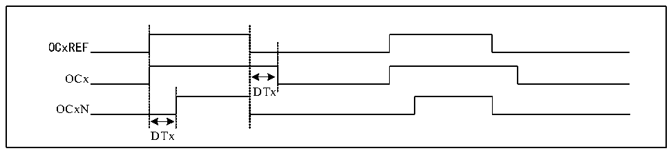

<!-- source-page: 164 -->

[← p.163](0163.md) · [index](../README.md) · [PDF p.164](https://ch32-riscv-ug.github.io/CH32M030/datasheet_en/CH32M030RM.PDF#page=164) · [p.165 →](0165.md)

<!-- header: CH32M030 Reference Manual https://wch-ic.com -->

### 11.2.6 Complementary Output and Dead-time

Generally, 2 channels have two output pins, which can output 2 complementary signals with dead time (OCx and  
OCxN). The polarity is controlled independently by COxP and COxNP bits, and the size of dead time can be set  
by setting DTx bits.  

Figure 11-4 Complementary output and dead time  
 <!-- rendered from the PDF; verify at https://ch32-riscv-ug.github.io/CH32M030/datasheet_en/CH32M030RM.PDF#page=164 -->

🖼 Text parsed from the figure above

OCxREF  
OCx  
DTx  
OCxN  
DTx  

## 11.3 Function and Implementation

The realization of the complex functions of the streamlined timer is realized by operating the compare capture  
channel, clock input circuit, counter and peripheral components of the timer. The clock input of the timer can  
come from multiple clock sources including the input of the comparison capture channel. The selection of the  
compare capture register channel and clock source directly determines its function. The compare capture channel  
is bidirectional and can work in input and output modes.  

### 11.3.1 Input Capture Mode

Input capture mode is one of the basic functions of timer. The principle of input capture mode is that when a  
certain edge on the ICxPS signal is detected, a capture event will be generated, and the current value of the  
counter will be latched into the comparison capture register (R16_TIM3_CHCTLRx). When a capture event  
occurs, CCxIF (in R16_TIM3_INTFR) is set, and if an interrupt or DMA is enabled, a corresponding interrupt or  
DMA will be generated. If CCxIF has been set when the capture event occurs, the CCxOF bit will be set. CCxIF  
can be cleared by software or by hardware by reading the comparison capture register. CCxOF is cleared by  
software.  
Take channel 1 as an example to illustrate the steps of using input capture mode.  
1) Configure CCxS domain and select the source of ICx signal. For example, if it is set to 10b, TI1FP1 is  
selected as the source of IC1, and the default setting cannot be used. The default setting of CCxS domain is  
to make the comparison capture module as the output channel.  
2) Configure ICxF domain and set the digital filter of TI signal. The digital filter will sample a certain number  
of times at a certain frequency, and then output a jump. The sampling frequency and times are determined by  
ICxF;  
3) Configure the CCxP bit and set the polarity of TIxFPx. For example, keep CC1P bit low and select rising  
edge transition;  
4) Configure the ICxPS domain and set the ICx signal as the frequency division coefficient between ICxPS. For  
example, keep ICxPS at 00b without frequency division;  
5) Configure the CCxE bit to allow capturing the value of the core counter (CNT) into the comparison capture  
register. Set CC1E bit;  
6) Configure the CCxIE and CCxDE bits as needed to decide whether to enable interrupts or DMA.  
<!-- image: p164-draw-image-00001 bbox=[515.52, 783.36, 535.44, 793.92] -->
<!-- footer: V1.2 169 -->
