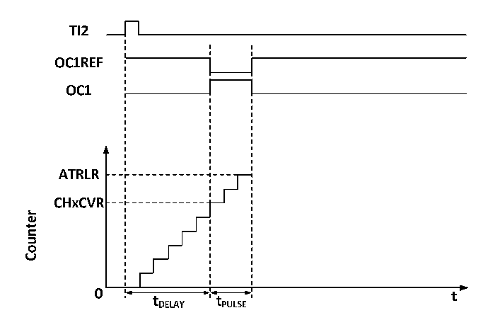

<!-- source-page: 166 -->

[← p.165](0165.md) · [index](../README.md) · [PDF p.166](https://ch32-riscv-ug.github.io/CH32M030/datasheet_en/CH32M030RM.PDF#page=166) · [p.167 →](0167.md)

<!-- header: CH32M030 Reference Manual https://wch-ic.com -->
3) Set TI1(TI1FP2) as the input of IC2 signal. Set CC2S to 10b;  
4) Select TI1FP2 as the effective falling edge. Set CC2P to 1;  
5) The source of the clock source is TI1FP1. Set TS to 101b;  
6) Set SMS to reset mode, that is, 100b;  
7) Can input capture. CC1E and CC2E are set.  
<em>Note: Since only TI1FP1 and TI2FP2 are connected to the slave mode controller, only TIM3_CH1/TIM3_CH2</em>  
<em>can be used in the PWM input mode.</em>  

### 11.3.5 PWM Output Mode

PWM output mode is one of the basic functions of timer. The most common method of PWM output mode is to  
determine PWM frequency by reloading value and determine duty cycle by using capture comparison register.  
Use PWM mode 1 or mode 2 to set the OCxM domain center 110b or 111b, set the OCxPE bit to enable the  
preload register, and finally set the ARPE bit to enable the automatic reload of the preload register. When an  
update event occurs, the value of the preloaded register can be sent to the shadow register, so before the core  
counter starts counting, it is necessary to set the UG bit to initialize all the registers.  
● Edge alignment  
When edge alignment is used, the core counter is incremented. In the case of PWM mode 1, when the value of the  
core counter is greater than the comparison capture register, OCxREF rises to high. When the value of the core  
counter is less than the comparison capture register (for example, when the core counter increases to the value of  
R16_TIM3_ATRLR and returns to all zeros), OCxREF drops to low.  

### 11.3.6 Monopulse Mode

Monopulse mode can respond to a specific event and generate a pulse after a delay. The delay and pulse width are  
programmable. Setting OPM bit can make the core counter stop when the next update event UEV is generated (the  
counter turns to 0).  

Figure 11-5 Event generation and impulse response  
 <!-- rendered from the PDF; verify at https://ch32-riscv-ug.github.io/CH32M030/datasheet_en/CH32M030RM.PDF#page=166 -->

🖼 Text parsed from the figure above

<!-- image: p166-draw-image-00003 inside the figure -->
<!-- image: p166-draw-image-00002 inside the figure -->
<!-- image: p166-draw-image-00004 inside the figure -->
<!-- image: p166-draw-image-00005 inside the figure -->
<!-- image: p166-draw-image-00006 inside the figure -->
<!-- image: p166-draw-image-00007 inside the figure -->
<!-- image: p166-draw-image-00008 inside the figure -->
<!-- image: p166-draw-image-00015 inside the figure -->
<!-- image: p166-draw-image-00016 inside the figure -->
<!-- image: p166-draw-image-00017 inside the figure -->
<!-- image: p166-draw-image-00009 inside the figure -->
<!-- image: p166-draw-image-00014 inside the figure -->
<!-- image: p166-draw-image-00010 inside the figure -->
<!-- image: p166-draw-image-00012 inside the figure -->
<!-- image: p166-draw-image-00013 inside the figure -->
<!-- image: p166-draw-image-00011 inside the figure -->

As shown in Figure 11-5, it is necessary to detect the beginning of a rising edge on the input pin of TI2, and then  
generate a positive pulse with the length of Tpulse on OC1 after a delay of Tdelay:  
1) Set TI2 to trigger. Set the CC2S domain to 01b, and map TI2FP2 to TI2；; Set CC2P bit to 0b, and set  
TI2FP2 as rising edge detection; Set TS domain as 110b and TI2FP2 as trigger source; Set the SMS domain  
<!-- image: p166-draw-image-00001 bbox=[515.52, 783.36, 535.44, 793.92] -->
<!-- footer: V1.2 171 -->
