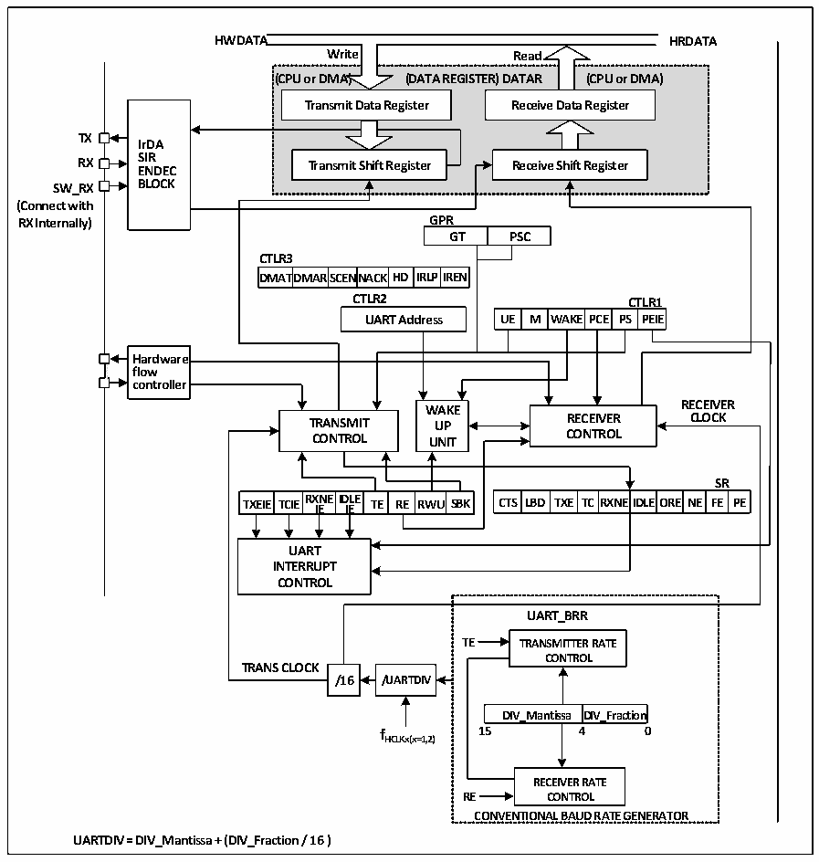

<!-- source-page: 179 -->

[← p.178](0178.md) · [index](../README.md) · [PDF p.179](https://ch32-riscv-ug.github.io/CH32M030/datasheet_en/CH32M030RM.PDF#page=179) · [p.180 →](0180.md)

<!-- header: CH32M030 Reference Manual https://wch-ic.com -->

## 12.2 Overview

Figure 12-1 Block diagram of a general-purpose synchronous/asynchronous transceiver  
 <!-- rendered from the PDF; verify at https://ch32-riscv-ug.github.io/CH32M030/datasheet_en/CH32M030RM.PDF#page=179 -->

🖼 Text parsed from the figure above

<strong>HWDATA HRDATA</strong>  
<strong>Write Read</strong>  
<strong>(CPU or DMA) (DATA REGISTER) DATAR (CPU or DMA)</strong>  
<strong>Transmit Data Register Receive Data Register</strong>  
<!-- image: p179-draw-image-00004 inside the figure -->
<strong>TX</strong>  
<strong>IrDA</strong>  
<strong>RX S E I N R DEC Transmit Shift Register Receive Shift Register</strong>  
<strong>SW_RX BLOCK</strong>  
<strong>(Connect with</strong>  
<strong>RX Internally) GPR</strong>  
GPRGT  PSC  
<strong>CTLR3</strong>  
DMAT  TDMAR  SCENNA  ACKHD  IRLP  
<strong>DMATDMARSCENNACKHD IRLPIREN</strong>  
<strong>CTLR2 CTLR1</strong>  
WAKE  PCE  CTLR PS PE  R1EIE  
Hardware flow controller  
<!-- image: p179-draw-image-00002 inside the figure -->
<!-- image: p179-draw-image-00003 inside the figure -->
<strong>WWAAKKEE RECEIVER</strong>  
<strong>TRANSMIT UUPP RECEIVER CLOCK</strong>  
<strong>CONTROL UUNNIITT CONTROL</strong>  
TXEIE  TCIE  RXNEIDLE IE IE  TE RE  RWU  
<strong>SR</strong>  
D TXE  TC  RXNE  EIDLE  EORE  NE  SRFE  RPE  
<strong>TXEIE TCIERX IE NEID IE LE TE RE RWU SBK CTS LBD TXE TCRXNEIDLEORE NE FE PE</strong>  
<strong>UART</strong>  
<strong>INTERRUPT</strong>  
<strong>CONTROL</strong>  
<strong>UART_BRR</strong>  
<strong>TE TRANSMITTER RATE</strong>  
<strong>CONTROL</strong>  
<strong>TRANS CLOCK</strong>  
<strong>/16 /UARTDIV</strong>  
DIV_Mantissa  DIV_Fraction  
<strong>f 15 4 0</strong>  
<strong>HCLKx(x=1,2)</strong>  
<strong>RECEIVER RATE</strong>  
<strong>RE CONTROL</strong>  
<strong>CONVENTIONAL BAUD RATE GENERATOR</strong>  
<strong>UARTDIV = DIV_Mantissa + (DIV_Fraction / 16 )</strong>  

When TE (transmit enable bit) is set, the data in the transmit shift register is output on the TX pin. When sending,  
least significant bit is the first to be moved out, and each data frame starts with a low-level start bit, then the  
transmitter sends an eight-or nine-bit data word according to the setting on the m (word length) bit, and finally a  
configurable number of stop bits. If parity bits are provided, the last bit of the data word is the parity bit. After TE  
is set, an idle frame is sent, which is 10-bit or 11-bit high level and contains stop bits. The disconnect frame is 10-  
bit or 11-bit low, followed by a stop bit.  

## 12.3 Baud Rate Generator

The baud rate of the transceiver = HCLK/(16*USARTDIV), HCLK is the clock of HB. The value of USARTDIV  
is determined by the 2 fields DIV_M and DIV_F in USART_BRR, which is calculated by the formula. The  
formula is as follows.  
<!-- image: p179-draw-image-00001 bbox=[515.52, 783.36, 535.44, 793.92] -->
<!-- footer: V1.2 184 -->
