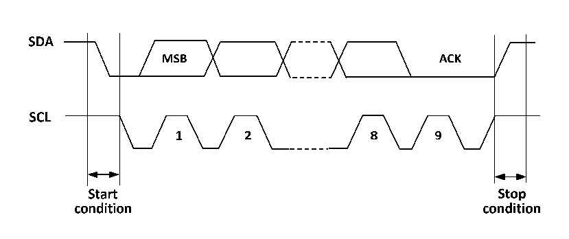

<!-- source-page: 188 -->

[← p.187](0187.md) · [index](../README.md) · [PDF p.188](https://ch32-riscv-ug.github.io/CH32M030/datasheet_en/CH32M030RM.PDF#page=188) · [p.189 →](0189.md)

<!-- header: CH32M030 Reference Manual https://wch-ic.com -->

# Chapter 13 Inter-integrated Circuit (I2C) interface

The internal integrated circuit bus (I2C or IIC) is widely used for communication between microcontrollers and  
sensors and other off-chip modules. It inherently supports multi-master and multi-slave modes and can  
communicate at 100KHz (Standard) and 400KHz (Fast) using just two wires (SDA and SCL).  

## 13.1 Main Features

● Support master and slave modes  
● Support 7-bit or 10-bit addresses  
● Slave devices support dual 7-bit addresses  
● Support 2 speed modes: 100kHz and 400kHz  
● Multiple status modes, multiple error flags  
● Support extended clock function  
● 2 interrupt vectors  
● Support DMA  
● Support PEC.  

## 13.2 Overview

I2C is a half-duplex bus that can only operate in one of the following 4 modes at the same time: master device  
transmit mode, master device receive mode, slave device transmit mode and slave device receive mode. the I2C  
module works in slave mode by default and automatically switches to master mode when a start condition is  
generated and to slave mode when arbitration is lost or a stop signal is generated. the I2C module supports multi-  
master functionality. When working in master mode, the I2C module actively emits data and addresses. Both data  
and address are transmitted in 8-bit units, with the high bit before and the low bit after. After the start event is a  
one-byte (In 7-bit address mode) or two-byte (In 10-bit address mode) address, and for every 8-bit data or address  
sent by the host, the slave needs to reply with an answer ACK, which pulls the SDA bus low, as shown in Figure  
13-1.  

Figure 13-1 I2C Timing Diagram  
 <!-- rendered from the PDF; verify at https://ch32-riscv-ug.github.io/CH32M030/datasheet_en/CH32M030RM.PDF#page=188 -->

🖼 Text parsed from the figure above

<!-- image: p188-draw-image-00002 inside the figure -->
<!-- image: p188-draw-image-00004 inside the figure -->
<!-- image: p188-draw-image-00005 inside the figure -->
<!-- image: p188-draw-image-00003 inside the figure -->
<!-- image: p188-draw-image-00007 inside the figure -->
<!-- image: p188-draw-image-00008 inside the figure -->
<!-- image: p188-draw-image-00009 inside the figure -->
<!-- image: p188-draw-image-00006 inside the figure -->
<!-- image: p188-draw-image-00010 inside the figure -->
<!-- image: p188-draw-image-00012 inside the figure -->
<!-- image: p188-draw-image-00011 inside the figure -->
<!-- image: p188-draw-image-00013 inside the figure -->

For normal use, the correct clock must be input to I2C. In standard mode, the minimum input clock is 2MHz, and  
in fast mode, the minimum input clock is 4MHz.  
<!-- image: p188-draw-image-00001 bbox=[515.52, 783.36, 535.44, 793.92] -->
<!-- footer: V1.2 193 -->
