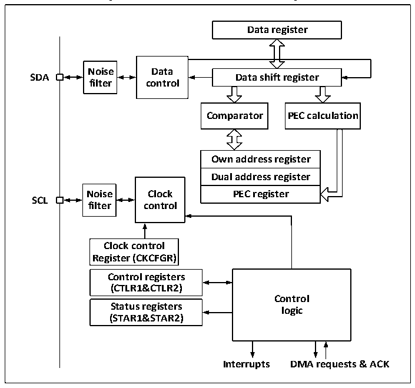

<!-- source-page: 189 -->

[← p.188](0188.md) · [index](../README.md) · [PDF p.189](https://ch32-riscv-ug.github.io/CH32M030/datasheet_en/CH32M030RM.PDF#page=189) · [p.190 →](0190.md)

<!-- header: CH32M030 Reference Manual https://wch-ic.com -->
Figure 13-2 is the functional block diagram of I2C module.  

Figure 13-2 I2C Functional block Diagram  
 <!-- rendered from the PDF; verify at https://ch32-riscv-ug.github.io/CH32M030/datasheet_en/CH32M030RM.PDF#page=189 -->

🖼 Text parsed from the figure above

<strong>Data register</strong>  
<strong>Noise Data</strong>  
<strong>SDA Data shift register</strong>  
<strong>filter control</strong>  
<strong>Comparator PEC calculation</strong>  
Own address register  Dual address register  PEC register  
<strong>Noise Clock PEC register</strong>  
<strong>SCL</strong>  
<strong>filter control</strong>  
<strong>Clock control</strong>  
<strong>Register (CKCFGR)</strong>  
Control registers (CTLR1&amp;CTLR2)  Status registers (STAR1&amp;STAR2)  
<strong>Control</strong>  
<strong>logic</strong>  
<strong>Interrupts DMA requests &amp; ACK</strong>  

## 13.3 Master Mode

In master mode, the I2C module dominates the data transfer and outputs the clock signal, and the data transfer  
starts with a start event and ends with an end event. The steps to use master mode communication are:  
1) Setting the correct clock in control register 2 (R16_I2C1_CTLR2) and clock control register  
(R16_I2C1_CKCFGR).  
2) Set an appropriate rising edge in the rising edge register (R16_I2C1_RTR);  
3) Set the PE bit in the control register (R16_I2C1_CTLR1) to start the peripheral;  
4) Set the START bit in the control register (R16_I2C1_CTLR1) to generate the start event.  
After the START bit is set, the I2C module will automatically switch to the main mode, the MSL bit will be set,  
and the start event will be generated. After the start event is generated, the SB bit will be set, and if the ITEVTEN  
bit (in R16_I2C1_CTLR2) is set, an interrupt will be generated. At this time, the status register  
1(R16_I2C1_STAR1) should be read, and the SB bit will be cleared automatically after writing from the address  
to the data register;  
If the 10-bit address mode is used, the write data register sends a header sequence (the header sequence is  
11110xx0b, where xx bits are the most significant two bits of the 10-bit address).  
After sending the header sequence, the ADD10 bit of the status register will be set. If the ITEVTEN bit has been  
set, an interrupt will be generated. At this time, read the R16_I2C1_STAR1 register, write the second address byte  
to the data register, and then clear the ADD10 bit.  
<!-- image: p189-draw-image-00001 bbox=[515.52, 783.36, 535.44, 793.92] -->
<!-- footer: V1.2 194 -->
