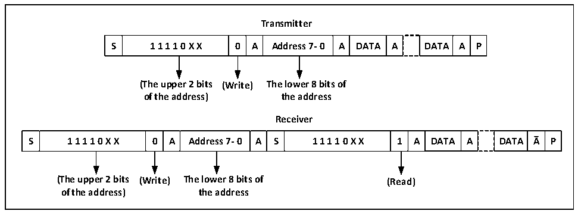

<!-- source-page: 190 -->

[← p.189](0189.md) · [index](../README.md) · [PDF p.190](https://ch32-riscv-ug.github.io/CH32M030/datasheet_en/CH32M030RM.PDF#page=190) · [p.191 →](0191.md)

<!-- header: CH32M030 Reference Manual https://wch-ic.com -->
Then write the data register and send the second address byte. After the second address byte is sent, the ADDR bit  
of the status register will be set. If the ITEVTEN bit has been set, an interrupt will be generated. At this time, read  
the R16_I2C1_STAR1 register and then read the R16_I2C1_STAR2 register again to clear the ADDR bit.  
If the 7-bit address mode is used, the write data register sends address bytes, and after the address bytes are sent,  
the ADDR bit of the status register will be set. If the ITEVTEN bit has been set, an interrupt will be generated. At  
this time, the R16_I2C1_STAR1 register should be read and then the R16_I2C1_STAR2 register should be read  
again to clear the ADDR bit.  
In the 7-bit address mode, the first byte sent is the address byte, the first 7 bits represent the address of the target  
slave device, and the eighth bit determines the direction of subsequent messages. 0 means that the master device  
writes data to the slave device, and 1 means that the master device reads information from the slave device.  
In 10-bit address mode, as shown in Figure 13-3, in the send address phase, the first byte is 11110xx0, xx is the  
highest 2 bits of the 10-bit address, and the second byte is the lower 8 bits of the 10-bit address. If subsequently  
enter the master device transmit mode, continue to send data; if subsequently ready to enter the master device  
receive mode, you need to re-send a start condition, follow to send a byte as 11110xx1, and then enter the master  
device receive mode.  

Figure 13-3 Schematic diagram of master transmitting and receiving data at 10-bit address  
 <!-- rendered from the PDF; verify at https://ch32-riscv-ug.github.io/CH32M030/datasheet_en/CH32M030RM.PDF#page=190 -->

🖼 Text parsed from the figure above

<strong>Transmitter</strong>  
S  1 1 1 1 0 X X  0  A  Address 7- 0  A  DATA  A  DATA  A  P  
<strong>(The upper 2 bits (Write) The lower 8 bits of</strong>  
<strong>of the address) the address</strong>  
<strong>Receiver</strong>  
S  1 1 1 1 0 X X  0  A  Address 7- 0  A  S  1 1 1 1 0 X X  1  A  DATA  A  DATA  A  P  
<strong>(The upper 2 bits (Write) The lower 8 bits of (Read)</strong>  
<strong>of the address) the address</strong>  

<strong>Master transmit mode:</strong>  
The master device&#x27;s internal shift register sends data from the data register to the SDA line. When the master  
device receives an ACK, TxE in status register 1 (R16_I2C1_STAR1) is set, and an interrupt is also generated if  
ITEVTEN and ITBUFEN are set. Writing data to the data register will clear the TxE bit.  
If the TxE bit is set and no new data was written to the data register before the last data was sent, then the BTF bit  
will be set and SCL will remain low until it is cleared, and writing data to the data register after reading  
R16_I2C1_STAR1 will clear the BTF bit.  
<!-- image: p190-draw-image-00001 bbox=[515.52, 783.36, 535.44, 793.92] -->
<!-- footer: V1.2 195 -->
