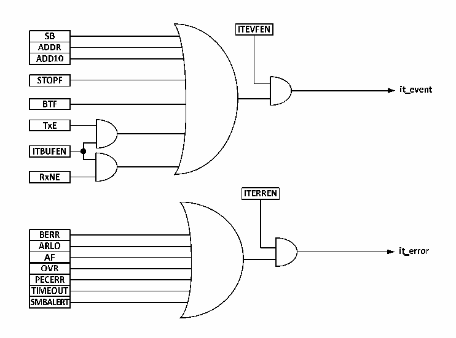

<!-- source-page: 195 -->

[← p.194](0194.md) · [index](../README.md) · [PDF p.195](https://ch32-riscv-ug.github.io/CH32M030/datasheet_en/CH32M030RM.PDF#page=195) · [p.196 →](0196.md)

<!-- header: CH32M030 Reference Manual https://wch-ic.com -->
reads the status register and reads the data register.  
It can be seen that enabling clock extension can avoid overrun/underrun errors.  

## 13.7 Interrupts

Each I2C module has 2 interrupt vectors, event interrupts and error interrupts. Both interrupts support the interrupt  
sources in Figure 13-8.  

Figure 13-8 I2C Interrupt Request  
 <!-- rendered from the PDF; verify at https://ch32-riscv-ug.github.io/CH32M030/datasheet_en/CH32M030RM.PDF#page=195 -->

🖼 Text parsed from the figure above

<!-- image: p195-draw-image-00018 inside the figure -->
<!-- image: p195-draw-image-00002 inside the figure -->
<!-- image: p195-draw-image-00003 inside the figure -->
<!-- image: p195-draw-image-00005 inside the figure -->
<!-- image: p195-draw-image-00004 inside the figure -->
<!-- image: p195-draw-image-00006 inside the figure -->
<!-- image: p195-draw-image-00020 inside the figure -->
<!-- image: p195-draw-image-00022 inside the figure -->
<!-- image: p195-draw-image-00021 inside the figure -->
<!-- image: p195-draw-image-00007 inside the figure -->
<!-- image: p195-draw-image-00008 inside the figure -->
<!-- image: p195-draw-image-00009 inside the figure -->
<!-- image: p195-draw-image-00010 inside the figure -->
<!-- image: p195-draw-image-00019 inside the figure -->
<!-- image: p195-draw-image-00011 inside the figure -->
<!-- image: p195-draw-image-00012 inside the figure -->
<!-- image: p195-draw-image-00023 inside the figure -->
<!-- image: p195-draw-image-00025 inside the figure -->
<!-- image: p195-draw-image-00013 inside the figure -->
<!-- image: p195-draw-image-00024 inside the figure -->
<!-- image: p195-draw-image-00014 inside the figure -->
<!-- image: p195-draw-image-00015 inside the figure -->
<!-- image: p195-draw-image-00016 inside the figure -->
<!-- image: p195-draw-image-00017 inside the figure -->

## 13.8 DMA

DMA can be used to send and receive batch data. The ITBUFEN bit of the control register cannot be set when  
DMA is used.  
● Send by DMA  
The DMA mode can be activated by setting the DMAEN bit in the CTLR2 register. As long as the TxE bit is set,  
data will be loaded into the I2C data register from the set memory by DMA. The following settings are required to  
allocate channels for I2C.  
1) Set the address of I2C1_DATAR register to DMA_PADDRx register and the address of memory to  
DMA_MADDRx register, so that data will be sent from memory to I2C1_DATAR register after every TxE  
event.  
2) Set the required number of transfer bytes in DMA_CNTRx register. After each TxE event, this value will be  
decremented.  
3) Configure the channel priority by using PL[0:1] bits in DMA_CFGRx register.  
4) Set the DIR bit in the DMA_CFGRx register, and according to the application requirements, it can be  
configured to issue an interrupt request when the whole transmission is completed halfway or completely.  
5) Activate the channel by setting the EN bit in the DMA_CFGRx register.  
<!-- image: p195-draw-image-00001 bbox=[515.52, 783.36, 535.44, 793.92] -->
<!-- footer: V1.2 200 -->
