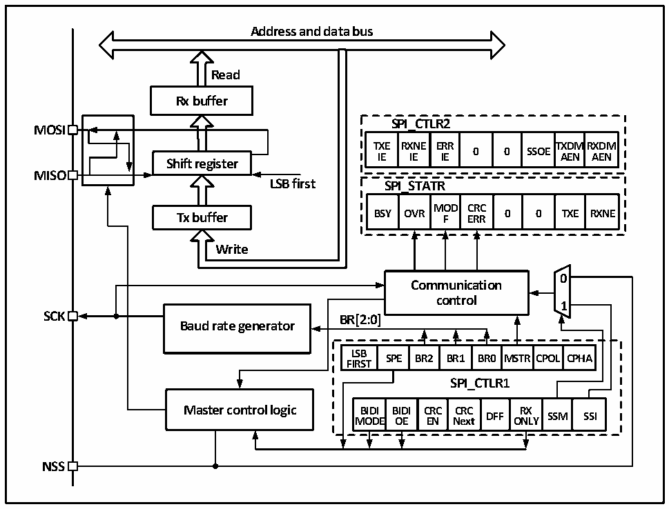

<!-- source-page: 204 -->

[← p.203](0203.md) · [index](../README.md) · [PDF p.204](https://ch32-riscv-ug.github.io/CH32M030/datasheet_en/CH32M030RM.PDF#page=204) · [p.205 →](0205.md)

<!-- header: CH32M030 Reference Manual https://wch-ic.com -->

Figure 14-1 SPI structure block diagram  
 <!-- rendered from the PDF; verify at https://ch32-riscv-ug.github.io/CH32M030/datasheet_en/CH32M030RM.PDF#page=204 -->

🖼 Text parsed from the figure above

<strong>Address and data bus</strong>  
<strong>Read</strong>  
<strong>Rx buffer</strong>  
<strong>SPI_CTLR2</strong>  
<strong>MOSI</strong>  
<strong>TXE RXNE ERR TXDMRXDM</strong>  
<strong>0 0 SSOE</strong>  
<strong>IE IE IE AEN AEN</strong>  
<strong>Shift register</strong>  
<strong>MISO</strong>  
<strong>LSB first SPI_STATR</strong>  
OVR  MODF  CRCERR  0  0  TXE  
<strong>Tx buffer BSY OVR F ERR 0 0 TXE RXNE</strong>  
<strong>Write</strong>  
<!-- image: p204-draw-image-00002 inside the figure -->
<!-- image: p204-draw-image-00003 inside the figure -->
<strong>0</strong>  
<strong>Communication</strong>  
<strong>control</strong>  
<strong>1</strong>  
<strong>SCK BR[2:0]</strong>  
<strong>Baud rate generator</strong>  
SPE  BR2  BR1  BR0  MSTR  CPOL  CPHA  
<strong>LSB</strong>  
<strong>FIRST</strong>  
<strong>SPI_CTLR1</strong>  
BIDIMODE  BIDIOE  CRCEN  CRCNext  DFF  RXONLY  SSM  SSI  
<strong>NSS</strong>  

As can be seen from Figure 14-1, the 4 main SPI-related pins are MISO, M0SI, SCK and NSS. The MISO pin is  
the data input pin when the SPI module is operating in Master mode and the data output pin when it is operating in  
Slave mode. the MOSI pin is the data output pin when it is operating in Master mode and the data input pin when  
it is operating in Slave mode. the SCK is the clock pin, the clock signal is always output by the host and the slave  
receives the clock signal and synchronizes the data sending and receiving. the NSS pin is the chip select pin with  
the following usage:  
1) NSS controlled by software: when SSM is set and the internal NSS signal is output high or low as  
determined by SSI, this case is generally used in SPI Master mode.  
2) NSS is controlled by hardware: when NSS output is enabled, i.e., when SSOE is set, the NSS pin will be  
actively pulled low when the SPI host sends output outward, and a hardware error will be generated if the  
NSS pin is pulled low; if SSOE is not set, it can be used in Multi-master mode, and if it is pulled low it will  
be forced into Slave mode and the MSTR bit will be cleared automatically.  
The working mode of SPI can be configured through CPHA and CPOL. When CPHA is set, it means that the  
module samples data at the second edge of the clock and the data is latched; when CPHA is not set, it means that  
the SPI module samples at the first edge of the clock and the data is latched. CPOL indicates whether the clock  
remains high or low when there is no data. See Figure 14-2 below for details.  
<!-- image: p204-draw-image-00001 bbox=[515.52, 783.36, 535.44, 793.92] -->
<!-- footer: V1.2 209 -->
