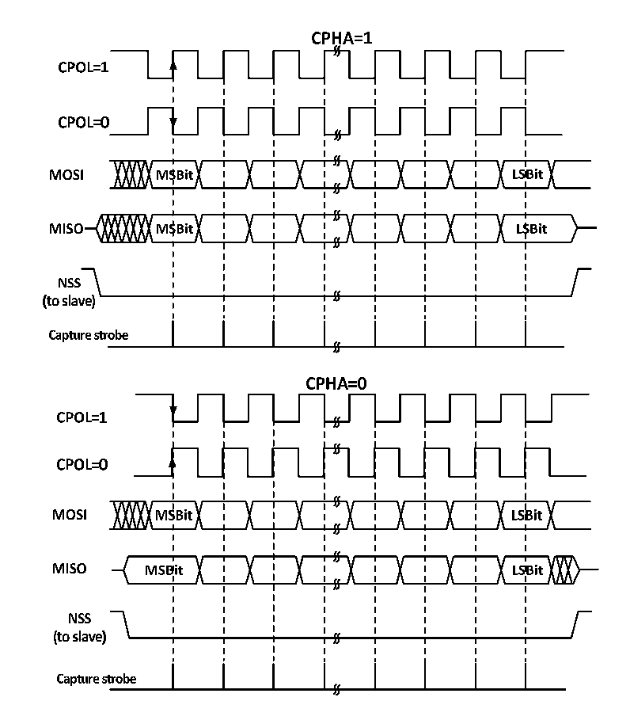

<!-- source-page: 205 -->

[← p.204](0204.md) · [index](../README.md) · [PDF p.205](https://ch32-riscv-ug.github.io/CH32M030/datasheet_en/CH32M030RM.PDF#page=205) · [p.206 →](0206.md)

<!-- header: CH32M030 Reference Manual https://wch-ic.com -->

Figure 14-2 SPI mode  
 <!-- rendered from the PDF; verify at https://ch32-riscv-ug.github.io/CH32M030/datasheet_en/CH32M030RM.PDF#page=205 -->

🖼 Text parsed from the figure above

<!-- image: p205-draw-image-00002 inside the figure -->
<!-- image: p205-draw-image-00004 inside the figure -->
<!-- image: p205-draw-image-00003 inside the figure -->
<!-- image: p205-draw-image-00005 inside the figure -->
<!-- image: p205-draw-image-00007 inside the figure -->
<!-- image: p205-draw-image-00006 inside the figure -->
<!-- image: p205-draw-image-00008 inside the figure -->
<!-- image: p205-draw-image-00028 inside the figure -->
<!-- image: p205-draw-image-00010 inside the figure -->
<!-- image: p205-draw-image-00030 inside the figure -->
<!-- image: p205-draw-image-00009 inside the figure -->
<!-- image: p205-draw-image-00029 inside the figure -->
<!-- image: p205-draw-image-00020 inside the figure -->
<!-- image: p205-draw-image-00018 inside the figure -->
<!-- image: p205-draw-image-00011 inside the figure -->
<!-- image: p205-draw-image-00019 inside the figure -->
<!-- image: p205-draw-image-00021 inside the figure -->
<!-- image: p205-draw-image-00012 inside the figure -->
<!-- image: p205-draw-image-00013 inside the figure -->
<!-- image: p205-draw-image-00014 inside the figure -->
<!-- image: p205-draw-image-00016 inside the figure -->
<!-- image: p205-draw-image-00015 inside the figure -->
<!-- image: p205-draw-image-00017 inside the figure -->
<!-- image: p205-draw-image-00022 inside the figure -->
<!-- image: p205-draw-image-00024 inside the figure -->
<!-- image: p205-draw-image-00023 inside the figure -->
<!-- image: p205-draw-image-00025 inside the figure -->
<!-- image: p205-draw-image-00027 inside the figure -->
<!-- image: p205-draw-image-00026 inside the figure -->
<!-- image: p205-draw-image-00031 inside the figure -->
<!-- image: p205-draw-image-00033 inside the figure -->
<!-- image: p205-draw-image-00032 inside the figure -->
<!-- image: p205-draw-image-00041 inside the figure -->
<!-- image: p205-draw-image-00043 inside the figure -->
<!-- image: p205-draw-image-00034 inside the figure -->
<!-- image: p205-draw-image-00035 inside the figure -->
<!-- image: p205-draw-image-00042 inside the figure -->
<!-- image: p205-draw-image-00044 inside the figure -->
<!-- image: p205-draw-image-00036 inside the figure -->
<!-- image: p205-draw-image-00037 inside the figure -->
<!-- image: p205-draw-image-00039 inside the figure -->
<!-- image: p205-draw-image-00038 inside the figure -->
<!-- image: p205-draw-image-00040 inside the figure -->

The host and the device need to be set to the same SPI mode, and the SPE bit needs to be cleared before  
configuring SPI mode. The DEF bit can determine whether the single data length of SP is 8 bits or 16 bits.  
LSBFIRST can control whether a single data word is high-order or low-order.  

### 14.2.2 Master Mode

The serial clock is generated by SCK when the SPI module is operating in master mode. The following steps are  
performed to configure into master mode:  
1) The BR[2:0] field of the configuration control register to determine the clock;  
2) Configure the CPOL and CPHA bits to determine the SPI mode;  
3) Configure DEF to determine the data word length;  
4) Configure LSBFIRST to determine the frame format;  
5) Configure the NSS pin, for example by setting the SSOE bit and letting the hardware set the NSS. it is also  
possible to set the SSM bit and set the SSI bit high;  
6) To set the MSTR bit and the SPE bit, you need to make sure that the NSS is already high at this time.  
<!-- image: p205-draw-image-00001 bbox=[515.52, 783.36, 535.44, 793.92] -->
<!-- footer: V1.2 210 -->
