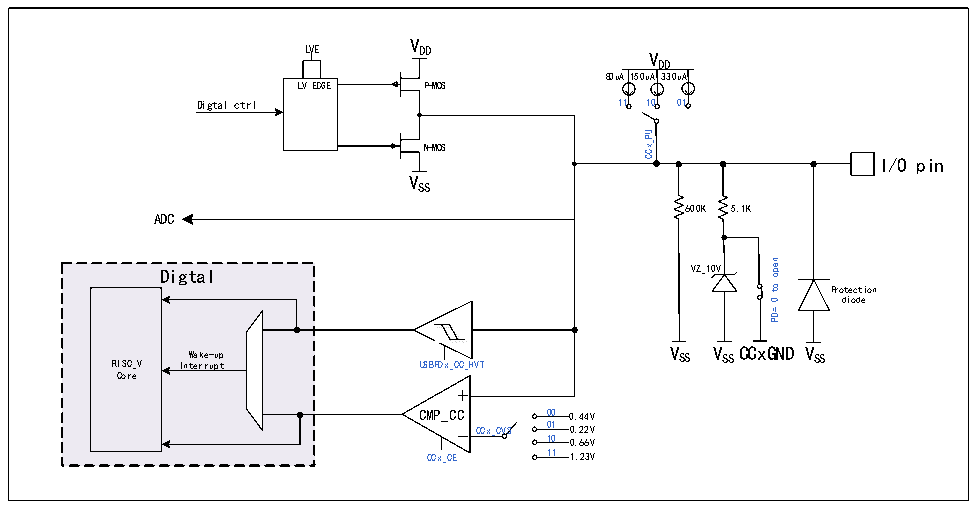

<!-- source-page: 212 -->

[← p.211](0211.md) · [index](../README.md) · [PDF p.212](https://ch32-riscv-ug.github.io/CH32M030/datasheet_en/CH32M030RM.PDF#page=212) · [p.213 →](0213.md)

<!-- header: CH32M030 Reference Manual https://wch-ic.com -->

# Chapter 15 USB PD Controller (USBPD)

## 15.1 Introduction to USB PD Controller

The chip has built-in 2 groups of USB Power Delivery controllers and PD transceiver PHYs, providing 4 high  
voltage resistant CC pins.  
It supports USB Type-C master-slave detection, automatic BMC codec and CRC, hardware edge control, USB  
PD2.0 and PD3.0 power delivery control, fast charging, UFP/PD powered end Sink and DFP/PD powered end  
Source application, DRP application and dynamic switching. Built-in USB Type-C interface, support master-slave  
detection, DRP, Sink/Consumer and Source/Provider.  
● Built-in USBPD transceiver PHY, integrated hardware edge slope control  
● Built-in USB Power Delivery controller, automatic BMC codec, 4b5b codec and CRC.  
● Support PD packages such as SOP, SOP&#x27; and SOP&quot;, and support hardware reset of USB PD reset signal  
frame.  
● Support the maximum packet length of 510 bytes, and support DMA.  
● Support USB PD 2.0 and 3.0 power transmission protocols, and USB port supports charging protocols such  
as BC.  
● The comparator is supported, and the negative input reference voltage can be selected in multiple steps, and  
the pull-up current can be programmed.  
● Support programmable charging current module ISINK cooperation can support PPS high-precision voltage  
regulation.  

Figure 15-1 CC port structure diagram  
 <!-- rendered from the PDF; verify at https://ch32-riscv-ug.github.io/CH32M030/datasheet_en/CH32M030RM.PDF#page=212 -->

🖼 Text parsed from the figure above

V  
LVE  
DD V  
DD  
80uA150uA330uA  
LVEDGE  
P-MOS  
Digtal ctrl 11 10 01  
CCx_PU  
N-MOS  
I/O pin  
VSS  
600K  
5.1K  
ADC  
open  
VZ_10V  
Digtal  
to  
Protection  
diode  
0  
PD=  
<!-- image: p212-draw-image-00002 inside the figure -->
<!-- image: p212-draw-image-00003 inside the figure -->
Wake-up V SS V SS CCxGND V SS  
RISC_V  
USBPDx_CC_HVT  
Interrupt  
Core  
CMP_CC 00 0.44V  
CCx_CVS 01 0.22V  
10 0.66V  
CCx_CE 11 1.23V  

<em>Note: CCxGND is the internal GND of CCx. If CCx has suffix R, that is CCxR, its CCxGND has been shorted to</em>  
<em>VSS inside the chip.</em>  
<!-- image: p212-draw-image-00001 bbox=[515.52, 783.36, 535.44, 793.92] -->
<!-- footer: V1.2 217 -->
