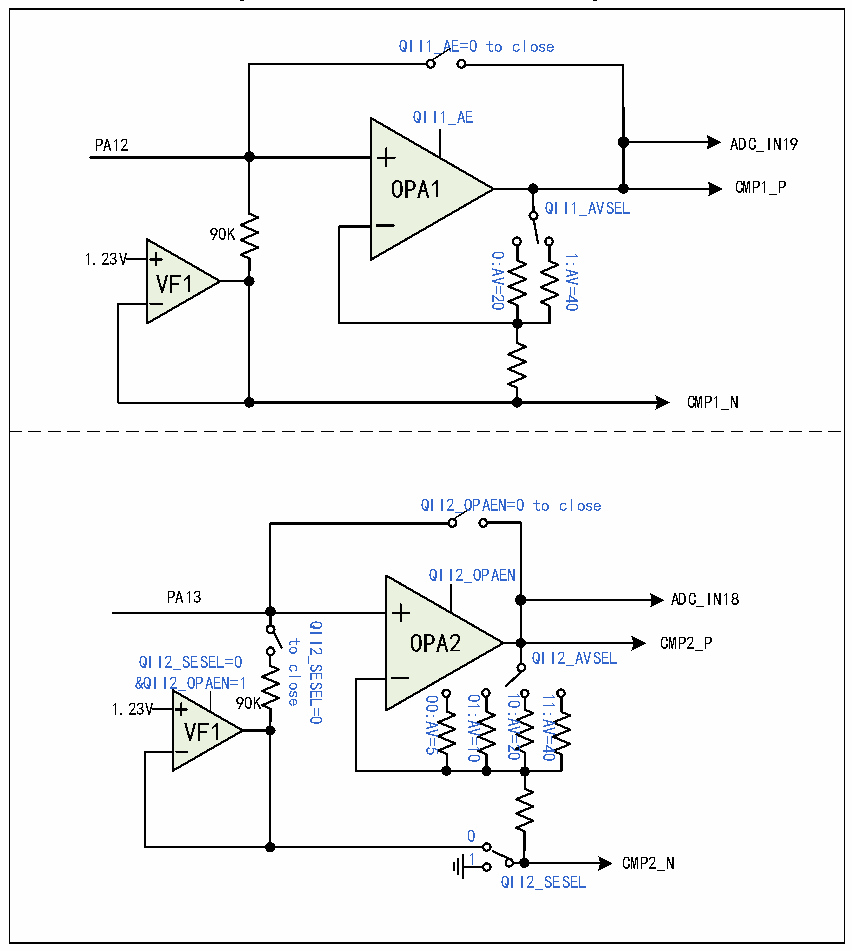

<!-- source-page: 235 -->

[← p.234](0234.md) · [index](../README.md) · [PDF p.235](https://ch32-riscv-ug.github.io/CH32M030/datasheet_en/CH32M030RM.PDF#page=235) · [p.236 →](0236.md)

<!-- header: CH32M030 Reference Manual https://wch-ic.com -->

Figure 17-1 OPA1 and OPA2 structure diagram  
 <!-- rendered from the PDF; verify at https://ch32-riscv-ug.github.io/CH32M030/datasheet_en/CH32M030RM.PDF#page=235 -->

🖼 Text parsed from the figure above

QII1_AE=0 to close  
QII1_AE  
PA12 ADC_IN19  
OPA1 CMP1_P  
OPA1  
QII1_AVSEL  
90K  
1.23V  
0:AV=20 1:AV=40  
VF1  
VF1  
CMP1_N  
QII2_OPAEN=0 to close  
QII2_OPAEN  
PA13  
ADC_IN18  
QII2_SESEL=0  
OPA2 CMP2_P  
OPA2  
to  
QII2_SESEL=0 QII2_AVSEL  
close  
&amp;QII2_OPAEN=1  
00:AV=5 01:AV=10 10:AV=20 11:AV=40  
1.23V 90K  
VF1  
VF1  
0  
1 CMP2_N  
QII2_SESEL  

### 17.2.2 OPA3/OPA4

The OPA3 and OPA4 support single-ended and differential inputs, with PGA amplification selectable by changing  
the configuration, and also provide internal self-bias voltage. The outputs of OPA3 are internally connected to  
voltage comparator CMP2 or CMP3 and ADC channel IN9, while the outputs of OPA4 are internally connected to  
voltage comparator CMP3 and ADC channel IN10.  
In the ISP_CTLR register: configure the ISPx_EN bit to enable the OPA module; Configure the ISPx_GAIN[1:0]  
bits to enable the magnitude of the operational amplifier gain; Configure the ISPx_VFBIAS bit and select the  
module reference voltage; Configure the ISPx_NSEL bit and the negative input of the module; Configure the  
ISPx_SEL_IO bit to enable the module to output to ADC; Configure QDETx_EN bit to enable q value detection;  
Configure the DETx_PD30K bit to enable the Q value detection 30K resistor; Configure the QDETx_VBSEL bit  
to enable the q-value detection reference voltage.  
<!-- image: p235-draw-image-00001 bbox=[515.52, 783.36, 535.44, 793.92] -->
<!-- footer: V1.2 240 -->
