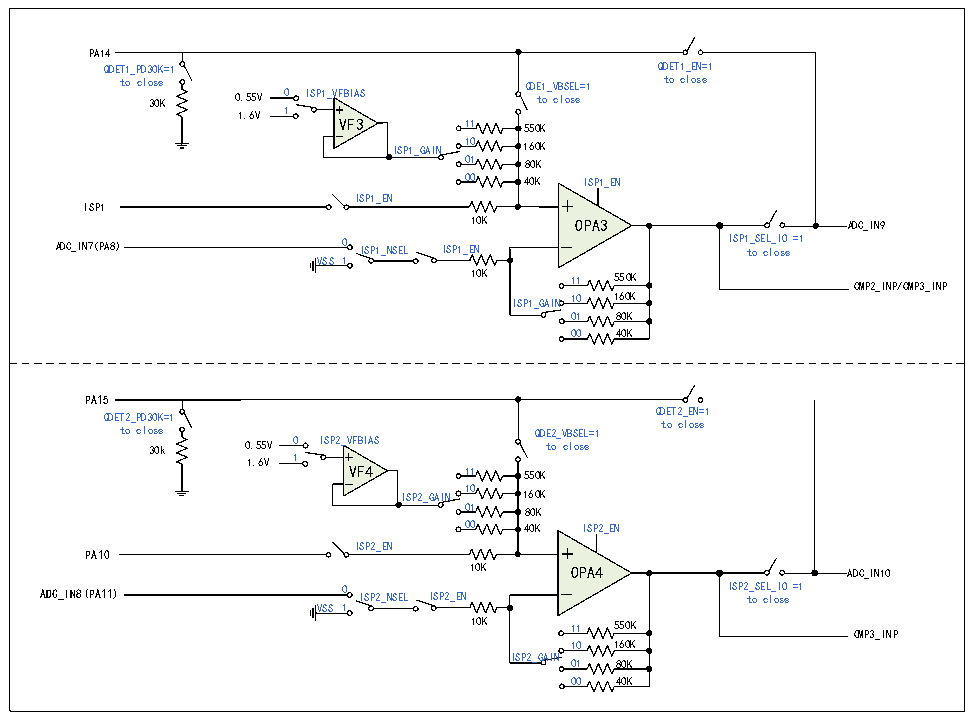

<!-- source-page: 236 -->

[← p.235](0235.md) · [index](../README.md) · [PDF p.236](https://ch32-riscv-ug.github.io/CH32M030/datasheet_en/CH32M030RM.PDF#page=236) · [p.237 →](0237.md)

<!-- header: CH32M030 Reference Manual https://wch-ic.com -->

Figure 17-2 OPA3 and OPA4 structure diagram  
 <!-- rendered from the PDF; verify at https://ch32-riscv-ug.github.io/CH32M030/datasheet_en/CH32M030RM.PDF#page=236 -->

🖼 Text parsed from the figure above

PA14 QDET1_PD30K=1 QDET1_EN=1 to close QDE1_VBSEL=1 to close 30K 0.55V 0 ISP1_VFBIAS to close 1.6V 1 VF3 11 550K ISP1_GAIN 10 160K 01 80K 00 40K ISP1_ENISP1_ENISP1 10K OPA3 ADC_IN9 ADC_IN7(PA8) 0 ISP1_NSEL ISP1_EN ISP 1 t _ o S E c L l _ o I s O e =1 VSS 1 10K 11 550K CMP2_INP/CMP3_INP ISP1_GAIN 10 160K 01 80K 00 40K  PA15 QDET2_PD30K=1 QDET2_EN=1 to close QDE2_VBSEL=1 to close 30k 0.55V 0 ISP2_VFBIAS to close 1.6V 1 VF4 11 550K ISP2_GAIN 10 160K 01 80K 00 40K ISP2_ENISP2_ENPA10 10K OPA4 ADC_IN10 ADC_IN8(PA11) 0 ISP2_NSEL ISP2_EN ISP 2 t _ o S E c L l _ o I s O e =1 VSS 1 10K 11 550K CMP3_INP 10 160KISP2_GAIN 01 80K 00 40K  

### 17.2.3 CMP1/CMP2

CMP1 supports optional hysteresis characteristics, digital filtering at the output, and optional output filtering.  
CMP2 supports optional hysteresis, optional internal N-terminal bias and digital filtering at the output. Its P-side  
channel can be input by GPIO or connected with OPA in the chip. Its N-terminal channel can be input by GPIO or  
connected with DAC output inside the chip.  
In QII_CFGR register: configure QII1_AE bit to enable CMP1 module; Configure the QII1_HYPSEL bit to select  
CMP hysteresis voltage.  
In the CMP_CTLR register: configure the CMP1_FILT_EN bit to enable the CMP1 output digital filtering  
function; configure the CMP1_FILT_CFG[4:0] bits to select the CMP1 output digital sampling interval, with the  
sampling interval set to be greater than the noise width and less than twice the noise width; configure the  
CMP1_TO_IO bits to enable the CMP1 output to the IO.  
In the CMP_STATR register: the CMP1_OUT/CMP1_OUT_FILT bits allow you to read the output of the CMP1  
filter function off/on.  
In the QII_CFGR register: configure the QII2_AE bit to enable the CMP2 module; configure the QII2_HYPSEL  
bit to select the comparator hysteresis voltage.  
In the CMP_CTLR register: configure the CMP2_FILT_EN bit to enable the CMP2 output digital filtering  
function; configure the CMP2_FILT_CFG[4:0] bits to select the CMP2 output digital sampling interval, and the  
<!-- image: p236-draw-image-00001 bbox=[515.52, 783.36, 535.44, 793.92] -->
<!-- footer: V1.2 241 -->
