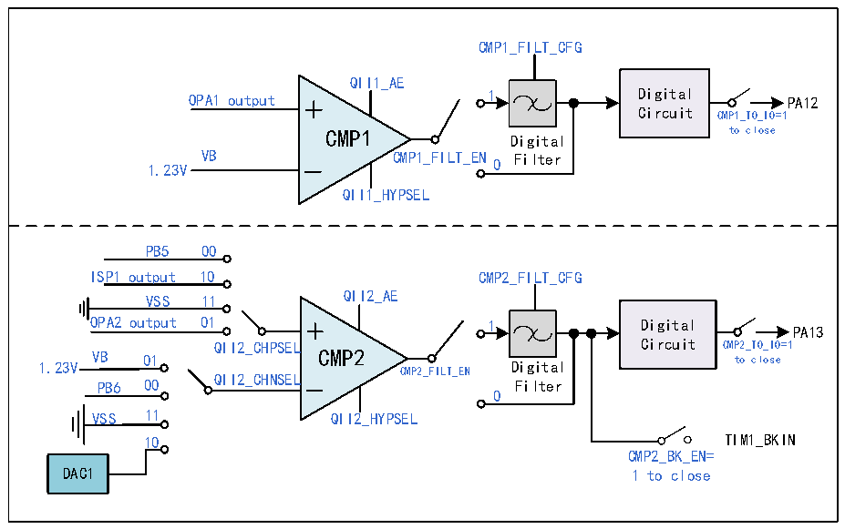

<!-- source-page: 237 -->

[← p.236](0236.md) · [index](../README.md) · [PDF p.237](https://ch32-riscv-ug.github.io/CH32M030/datasheet_en/CH32M030RM.PDF#page=237) · [p.238 →](0238.md)

<!-- header: CH32M030 Reference Manual https://wch-ic.com -->
sampling interval setting should be greater than the noise width and less than twice the noise width; configure the  
CMP2_TO_IO bit to enable the CMP2 output internal connection to IO function; configure CMP2_BK_EN bit to  
enable CMP2 output to be connected to Timer1 brake input; CMP2_INT_EN bit can be configured to enable  
CMP2 output interrupt.  
In the CMP_STATR register: with the CMP2_OUT/CMP2_OUT_FILT bits, the output result of the CMP2  
filtering function off/on can be read; with the CMP2_COMIF bit, the CMP2 output for high level interrupt flag  
can be read.  

Figure 17-3 CMP1 and CMP2 structure diagram  
 <!-- rendered from the PDF; verify at https://ch32-riscv-ug.github.io/CH32M030/datasheet_en/CH32M030RM.PDF#page=237 -->

🖼 Text parsed from the figure above

CMP1_FILT_CFG  
QII1_AE  
OPA1 output 1 Digital PA12  
Circuit CMP1_TO_IO=1  
CMP1 to close  
Digital  
1.23V VB CMP1_FILT_EN 0 Filter  
QII1_HYPSEL  
PB5 00  
ISP1 output 10 CMP2_FILT_CFG  
VSS 11 QII2_AE  
OPA2 output 01 1 Digital  
PA13  
QII2_CHPSEL Circuit CMP2_TO_IO=1  
1.23V V P B B6 0 0 1 0 QII2_CHNSEL CMP2 CMP2_FILT_EN D F i i g l i t t e a r l to close  
0  
VSS 11 QII2_HYPSEL  
10 TIM1_BKIN  
CMP2_BK_EN=  
DAC1 1 to close  

### 17.2.4 CMP3

CMP3 supports optional hysteresis, optional internal N-terminal bias, and digital filtering at the output. Its P-side  
channel can be input by GPIO or connected with OPA in the chip. Its N-terminal channel is input by GPIO; The  
voltage comparison result OUT0 is analog output by GPIO, and OUT1 and OUT2 are push-pull output through  
GPIO port. In addition, inside the chip, the output channel of CMP3 is connected to the four channels of TIM2 for  
capturing the trigger, and also connected to the BKIN channel of TIM1 as the brake source of TIM1.  
In the CMP3_CFGR register: configure the EN bit to enable the CMP3 module; Configure the PSEL/NSEL bit,  
and select the positive/negative input channel of CMP3; Configure HYS bit and select the size of hysteresis  
voltage; Configure DACDAT[3:0] bits, and select DAC output voltage of CMP3 module; Configure OEN bit to  
enable CMP3 output to IO; Configure the MODE_IOSEL bit, and select the output of CMP3 to connect to IO; Or  
configure CMP3_BK_EN bit of CMP_CTLR register to connect the output to the brake input of TIM1.  
In the CMP_CTLR register: configure the CMP3_FILT_EN bit to enable the CMP3 output digital filtering  
function; configure the CMP3_FILT_CFG bit to select the CMP3 output digital sampling interval, with the  
sampling interval set to be greater than the noise width and less than twice the noise width; configure the  
CMP3_CAP bit to enable the CMP3 comparison output to be internally connected to the Timer2&#x27;s 4-channel  
<!-- image: p237-draw-image-00001 bbox=[515.52, 783.36, 535.44, 793.92] -->
<!-- footer: V1.2 242 -->
