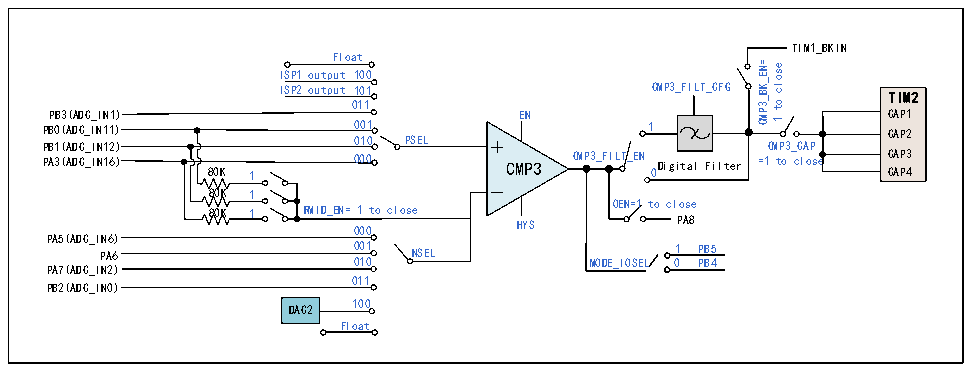

<!-- source-page: 238 -->

[← p.237](0237.md) · [index](../README.md) · [PDF p.238](https://ch32-riscv-ug.github.io/CH32M030/datasheet_en/CH32M030RM.PDF#page=238) · [p.239 →](0239.md)

<!-- header: CH32M030 Reference Manual https://wch-ic.com -->
function; configure the CMP3_TRG_SRC bit to select the CMP3 Timer2 channel switching hardware trigger  
source, and set the CMP3_TRG_GATE bit to turn on/off the CMP3 Timer2 channel hardware trigger channel  
switching; or configure the CMP3_COM_MODE bit to enable the CMP3 Continuous Compare mode; configure  
the CMP3_INT_EN bit to enable the CMP3 Continuous Compare mode; configure the CMP3_CAP bit to enable  
the CMP3 Compare output to be internally connected to the CMP3 Compare output to be internally connected to  
the CMP3 Compare output. INT_EN bit, can generate CMP3 output interrupt, and can be read through the  
CMP_STATR register CMP3_CHOUTx bit, CMP3 each channel for switching the comparison output results, that  
is, the CMP3 output is high level interrupt flag.  
In the CMP3_SW register: configuring the CH_NUM bit configures the number of channels to be captured by  
Timer 2&#x27;s channel and the output polarity of the corresponding channel via the OUT_POL_CHx bit.  
In the CMP_STATR register: the CMP3_OUT/CMP3_OUT_FILT bits allow you to read the output result of the  
CMP3 filtering function being turned off/on, and you can read the comparison output result of the switching  
carried out by each channel of the CMP3, i.e., the interrupt flag of the CMP3 output going high, through the  
CMP3_CHOUTx bit.  

Figure 17-4 CMP3 structure diagram  
 <!-- rendered from the PDF; verify at https://ch32-riscv-ug.github.io/CH32M030/datasheet_en/CH32M030RM.PDF#page=238 -->

🖼 Text parsed from the figure above

TIM1_BKIN  
Float  
CMP3_BK_EN= close  
ISP1 output 100  
ISP2 output 101 CMP3_FILT_CFG  
TIM2  
to  
011  
CAP1  
PB3(ADC_IN1) EN  
e  
1  
PB0(ADC_IN11) 001 PB1(ADC_IN12) 010 PSEL CMP3_CAP  
1 CAP2  
CAP3 0 CAP4  
PA3(ADC_IN16) 80K 1 000 CMP3 CMP3_FILT_EN Digital Filter =1 to close  
80K 1  
80K 1 RMID_EN= 1 to close OEN=1 to close 000 HYS  
PA8  
PA5(ADC_IN6)  
PA6 0 0 1 0 0 1 NSEL MODE_IOSEL 0 1 P P B B 4 5  
PA7(ADC_IN2)  
011  
PB2(ADC_IN0)  
DAC2 100  
Float  

### 17.2.5 AC Small Signal Amplification Decoder (QII1/QII2)

The AC small signal amplifier-decoder (QII) consists of a pre-stage adjustable gain amplifier OPA and a post-  
stage voltage comparator CMP. the input AC small signal is amplified by the OPA and shaped into a digital signal  
using the CMP, which is digitally filtered and then decoded, or the amplified signal can be fed into the ADC for  
decoding.  
In the QII_CFGR register: configure the QII1_AE bit to enable the QII1 module; configure the QII1_HYPSEL bit  
to select the comparator hysteresis voltage of the QII1 module; and configure the QII1_AVSEL bit to select the  
gain size of the QII1 module op amp.  
In the CMP_CTLR register: configure the CMP1_FILT_EN bit to enable the CMP1 output digital filtering  
function; configure the CMP1_FILT_CFG[4:0] bits to select the CMP1 output digital sampling interval, with the  
sampling interval set to be greater than the noise width and less than twice the noise width; configure the  
CMP1_TO_IO bit to enable the CMP1 output to the IO; configure the QII_CAP_EN bit to enable the QII outputs  
to be sent internally directly to TIM3 channel 1 for capture.  
In the CMP_STATR register: with the CMP1_OUT/CMP1_OUT_FILT bits, you can read the output result of the  
CMP1 filter function off/on.  
<!-- image: p238-draw-image-00001 bbox=[515.52, 783.36, 535.44, 793.92] -->
<!-- footer: V1.2 243 -->
