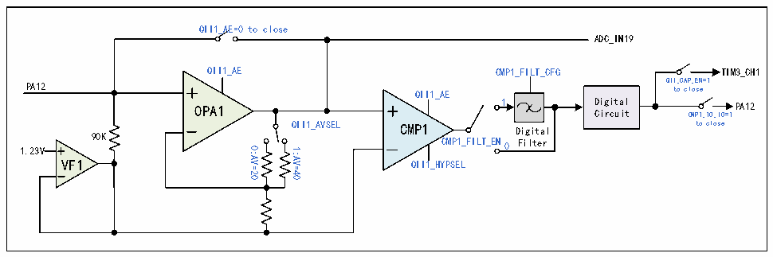
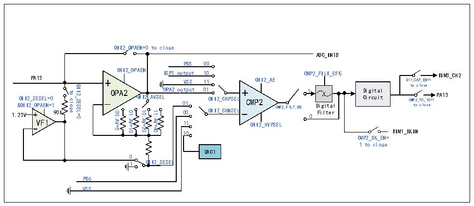

<!-- source-page: 239 -->

[← p.238](0238.md) · [index](../README.md) · [PDF p.239](https://ch32-riscv-ug.github.io/CH32M030/datasheet_en/CH32M030RM.PDF#page=239) · [p.240 →](0240.md)

<!-- header: CH32M030 Reference Manual https://wch-ic.com -->

Figure 17-5 QII1 structure diagram  
 <!-- rendered from the PDF; verify at https://ch32-riscv-ug.github.io/CH32M030/datasheet_en/CH32M030RM.PDF#page=239 -->

🖼 Text parsed from the figure above

QII1_AE=0 to close  
ADC_IN19  
QII1_AE CMP1_FILT_CFG  
TIM3_CH1  
QII_CAP_EN=1 to close  
PA12 QII1_AE  
Digital OPA1 Circuit  
1 PA12 CMP1_TO_IO=1  
QII1_AVSEL to close Digital  
CMP1  
90K  
CMP1_FILT_EN0 Filter  
0:AV=20  
1.23V  
1:AV=40  
VF1  
QII1_HYPSEL  

In the CMP_CTLR register: configure the CMP2_FILT_EN bit to enable the CMP2 output digital filtering  
function; configure the CMP2_FILT_CFG[4:0] bits to select the CMP2 output digital sampling interval, and the  
sampling interval setting should be greater than the noise width and less than twice the noise width; configure the  
CMP2_TO_IO bit to enable the CMP2 output Configure CMP2_TO_IO bit to enable CMP2 output to connect to  
IO function internally; Configure QII_CAP_EN bit to enable QII output to send to TIM3 channel 1 capture  
directly internally; Configure CMP2_BK_EN bit to enable CMP2 output to connect to Timer1 brake input;  
Configurable CMP2_INT_EN bit to enable CMP2 output interrupt.  
In CMP_STATR register: the output result of CMP2 filtering function closing/opening can be read through  
CMP2_OUT/CMP2_OUT_FILT bits; With the CMP2_COMIF bit, the interrupt flag that CMP2 output is high  
level can be read.  

Figure 17-6 QII2 structure diagram  
 <!-- rendered from the PDF; verify at https://ch32-riscv-ug.github.io/CH32M030/datasheet_en/CH32M030RM.PDF#page=239 -->

🖼 Text parsed from the figure above

QII2_OPAEN=0 to close  
ADC_IN18  
PB5 00  
QII2_OPAEN  
ISP1 output 10 VSS 11  
CMP2_FILT_CFG PA13 QII2_AE  
TIM3_CH2 QII_CAP_EN=1  
to close  
OPA2 OPA2 output 01 01 CMP2 90K  
1 Digital QII2_SESEL=0 QII2_AVSELtocloseQII2_SESEL=0 QII2_CHPSEL Circuit CMP2_TO_IO=1 PA13 1. &amp; 2 Q 3 I V I2_OPAEN=1 00 QII2_CHNSEL CMP2_FILT_EN 0 D F i i g l i t t e a r l to close  
00:AV=5 01:AV=10 10:AV=20 11:AV=40  
VF1  
11 QII2_HYPSEL  
TIM1_BKIN  
10  
CMP2_BK_EN=  
1 to close  
DAC1  
0  
1 QII2_SESEL  
PB6  
VSS  

### 17.2.6 Differential Input Current Sampling (ISP1/ISP2)

Differential input current sampling (ISP) amplifies the weak voltage signal collected by external resistor by  
closed-loop amplifier OPA, and sends the result to ADC or comparator through ADC channel. The ADC sampling  
result can be used for upper limit comparison, calculation and analysis, etc.  
ISP1 and ISP2 support differential or single-ended applications. When differential applications are used, ISP1 and  
ISN1/PA8 pins are one pair of differential inputs, and ISP2/PA10 and ISN2/PA11 pins are the other pair of  
differential inputs; while when single-ended applications are used, the negative input ISN is not required, and the  
<!-- image: p239-draw-image-00001 bbox=[515.52, 783.36, 535.44, 793.92] -->
<!-- footer: V1.2 244 -->
