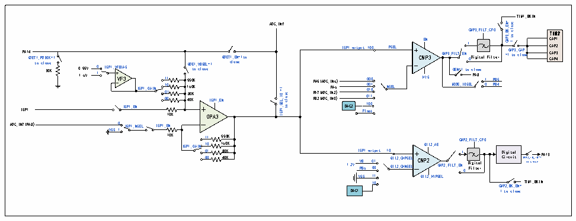
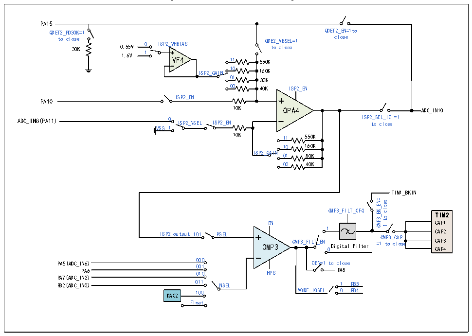

<!-- source-page: 240 -->

[← p.239](0239.md) · [index](../README.md) · [PDF p.240](https://ch32-riscv-ug.github.io/CH32M030/datasheet_en/CH32M030RM.PDF#page=240) · [p.241 →](0241.md)

<!-- header: CH32M030 Reference Manual https://wch-ic.com -->
ISN1/PA8 and ISN2/PA11 pins can be used for any purpose at that time, such as ADC or GPIO.  
In the ISP_CTLR register: configure the ISPx_EN bit to enable the ISPx module; configure the ISPx_GAIN[1:0]  
bits to enable the magnitude of the ISPx module op-amp gain; configure the ISPx_VFBIAS bit to select the ISPx  
module reference voltage; configure the ISPx_NSEL bit to configure the module&#x27;s negative end input; configure  
the ISPx_SEL IO bit, ISPx module outputs to ADC; configure QDETx_EN bit to enable ISPx module Q value  
detection; configure DETx_PD30K bit to enable ISPx module Q value detection of 30K resistor; configure  
QDETx_VBSEL bit to enable ISPx module Q value detection of reference voltage.  

Figure 17-7 ISP1 structure diagram  
 <!-- rendered from the PDF; verify at https://ch32-riscv-ug.github.io/CH32M030/datasheet_en/CH32M030RM.PDF#page=240 -->

🖼 Text parsed from the figure above

TIM1_BKIN  
CMP3_BK_EN= close  
ADC_IN9  
1= OI_LES_1PSI esolc ot CMP3_FILT_CFG EN QDET1_PD30K=1 ISP1 output100 CMP3 CMP3_FILT_EN Digital Filter =1 C M t P o 3 _ c C l A o P se ISP1 to clo 3 s 0 e K 1.6V 0 1 ISP1_VFBIA IS S P1_EN ISP1_GAIN 0 1 1 0 0 1 0 1 QD t E o 1_ c V l B o S s E e L= I 1 S P1_EN P P P A B A 7 2 5 ( ( ( A A A D D D C C C _ _ _ I I I P N N N A 2 0 6 6 ) ) ) DAC2 Fl 0 1 o 0 0 0 1 0 a 0 1 0 1 t 0 0 0 1 NSEL HYS OEN=1 to close  
TIM2CAP1CAP2CAP3CAP4  e  
TIM2 CAP1 PSEL 1 CAP2 CAP3 QDET c 1 l _ o E s N e =1to 0 CAP4 PA8 1 PB5 MODE_IOSEL 0 PB4  
1to  
PA14 0.55V VF3 550K 160K 80K 40K 10K OPA3  
VSS 0 1 ISP1_NSEL ISP1_EN  
ADC_IN7(PA8)  
10K 550K  
11 CMP2_FILT_CFG  
160K  
ISP1_GAIN10 QII2_AE  
01 ISP1 output 10 1 Digital 00 PB6 0 0 1 0 Q Q I I I I 2 2 _ _ C C H H N P S S E E L L CMP2 CMP2_FILT_EN 0 D F i i g l i t t e a r l Circuit  
80K 40K  
PA13 1.2V VB CMPto2 _TcOl_oIsOe=1  
VSS 11 QII2_HYPSEL  
TIM1_BKIN CMP2_BK_EN=  
10  
DAC1  
1 to close  

Figure 17-8 ISP1 structure diagram  
 <!-- rendered from the PDF; verify at https://ch32-riscv-ug.github.io/CH32M030/datasheet_en/CH32M030RM.PDF#page=240 -->

🖼 Text parsed from the figure above

PA15  
QDET2_EN=1to  
QDET2_PD30K=1  
close  
to close QDE2_VBSEL=1  
30K 0.55V 0 ISP2_VFBIAS to close  
1.6V 1  
VF4 11 550K  
ISP2_GAIN 10 160K  
01 80K  
00 40K ISP2_EN  
ISP2_EN  
PA10  
10K OPA4 ADC_IN10  
ADC_IN8(PA11) 0 ISP2_NSEL ISP2_EN ISP 2 t _ o S E c L l _ o I s O e =1  
VSS 1  
10K 11 550K  
10 160K  
ISP2_GAIN  
01 80K  
00 40K  
TIM1_BKIN  
CMP3_BK_EN= close  
CMP3_FILT_CFG  
TIM2  
to  
CAP1  
EN  
1  
1 CAP2  
ISP2 output 101 PSEL CMP3_CAP  
CAP3 0 CAP4  
CMP3 CMP3_FILT_EN Digital Filter =1 to close  
PA5(ADC_IN6) 000 OEN=1 to close  
001  
PA8  
PA6 010 HYS  
PA7(ADC_IN2)  
011 PB2(ADC_IN0) NSEL  
1 PB5  
MODE_IOSEL 0 PB4  
DAC2 100  
Float  

<!-- image: p240-draw-image-00001 bbox=[515.52, 783.36, 535.44, 793.92] -->
<!-- footer: V1.2 245 -->
