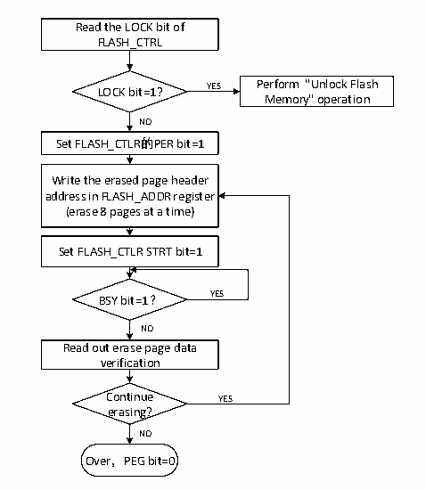

<!-- source-page: 258 -->

[← p.257](0257.md) · [index](../README.md) · [PDF p.258](https://ch32-riscv-ug.github.io/CH32M030/datasheet_en/CH32M030RM.PDF#page=258) · [p.259 →](0259.md)

<!-- header: CH32M030 Reference Manual https://wch-ic.com -->

## 19.4 Flash Operation Procedure

### 19.4.1 Read Operation

Direct addressing is in the general address space, and the user can access the content of the flash memory module  
and get the corresponding data through any read operation of 8/16/32-bit data.  

### 19.4.2 Unlock Flash Memory

After the system reset, the flash memory controller (FPEC) and FLASH_CTLR register will be locked and cannot  
be accessed. The flash memory controller module can be unlocked by writing the sequence to the FLASH_KEYR  
register.  
Unlock sequence:  
1） Write KEY1 = 0x45670123 to the FLASH_KEYR register (Must operate KEY1 first);  
2） Write KEY2 = 0xCDEF89AB to the FLASH_KEYR register (Must operate KEY2 secondly).  
The above operations must be performed sequentially and continuously. Otherwise, it is an error operation, which  
will lock the FPEC module and FLASH_CTLR register and generate a bus error until the next system reset.  
The flash memory controller (FPEC) and the FLASH_CTLR register can be locked again by setting the &quot;LOCK&quot;  
bit in the FLASH_CTLR register to 1.  

### 19.4.3 Main Memory Standard Erase

Flash memory can be erased by standard page (1K bytes) or by whole chip.  

Figure 19-1 FLASH page erase  
 <!-- rendered from the PDF; verify at https://ch32-riscv-ug.github.io/CH32M030/datasheet_en/CH32M030RM.PDF#page=258 -->

🖼 Text parsed from the figure above

Read the LOCK bit of  
FLASH_CTRL  
LOCK bit=1? YES Perform &quot;Unlock Flash  
Memory&quot; operation  
NO  
Set FLASH_CTLR的PER bit=1  
Write the erased page header  
address in FLASH_ADDR register  
(erase 8 pages at a time)  
Set FLASH_CTLR STRT bit=1  
BSY bit=1？ YES  
NO  
Read out erase page data  
verification  
Continue YES  
erasing?  
NO  
Over，PEG bit=0  

1) Check the LOCK bit of FLASH_CTLR register, if it is 1, you need to perform the &quot;Unlock Flash&quot; operation.  
2) Set the PER bit of FLASH_CTLR register to &#x27;1&#x27; to enable the standard page erase mode.  
3) Write the page header address to the FLASH_ADDR register to select the page to be erased.  
<!-- image: p258-draw-image-00001 bbox=[515.52, 783.36, 535.44, 793.92] -->
<!-- footer: V1.2 263 -->
