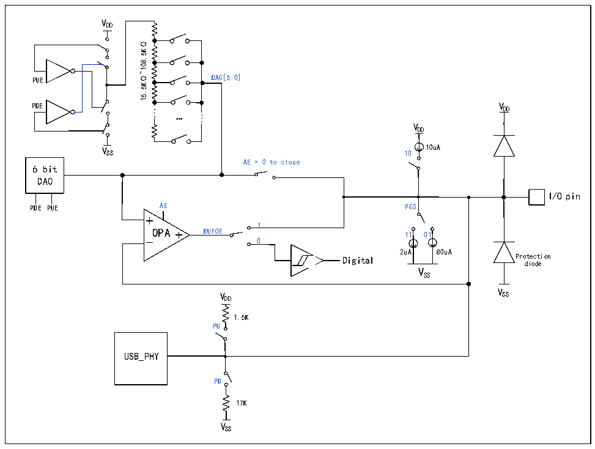

<!-- source-page: 266 -->

[← p.265](0265.md) · [index](../README.md) · [PDF p.266](https://ch32-riscv-ug.github.io/CH32M030/datasheet_en/CH32M030RM.PDF#page=266) · [p.267 →](0267.md)

<!-- header: CH32M030 Reference Manual https://wch-ic.com -->

Figure 20-1 BC interface structure diagram  
 <!-- rendered from the PDF; verify at https://ch32-riscv-ug.github.io/CH32M030/datasheet_en/CH32M030RM.PDF#page=266 -->

🖼 Text parsed from the figure above

VDD  
15.5K Ω~108.5K Ω  
PUE DAC[5:0]  
PDE V DD  
...  
...  
…  
VDD  
V SS 10 10uA  
AE = 0 to close  
6 bit  
DAC  
I/O pin  
PDE PUE AE PCS  
1  
OPA BUFOE 11 01  
0  
Digital 2uA 80uA Protection  
<!-- image: p266-draw-image-00002 inside the figure -->
<!-- image: p266-draw-image-00003 inside the figure -->
diode  
VSS  
V  
V SS  
DD  
1.5K  
PU  
USB_PHY  
PD  
17K  
VSS  

## 20.2 Functional Description

As shown in the BC interface structure diagram in Figure 20-1, the following modes can be configured through  
the UDM/UDP corresponding control bits of the EXTEN_CTLR1 register:  
<strong>DAC mode</strong>  
1. When PDE=1, PUE=1, AE=0, DAC[5:0] input data, BUFOE=0, this is the DAC mode without buffer.  
2. When PDE=1, PUE=1, AE=1, DAC[5:0] input data, BUFOE=1, this is DAC mode with buffer.  
The DAC mode output voltage DAC_OUT is:  
DAC_OUT=DAC[5:0]*VDD33/64  
<strong>CMP mode</strong>  
When PDE=1, PUE=1, AE=1, DAC[5:0] input data, BUFOE=0, this is the comparator mode, the input of the  
positive end of the comparator is DAC_OUT, the input voltage of the negative end of the comparator is the IO  
port, and the output signal of the comparator is sent to the digital terminal. if the IO input voltage is less than  
DAC_OUT then the comparator outputs 1, the IO input voltage is greater than DAC_OUT then the Comparator  
output 0.  
<strong>Pull-up/pull-down resistance mode</strong>  
1. When PDE=0, PUE=1, AE=0, DAC[5:0] input data, BUFOE=0, this is the programmable pull-up resistor mode.  
<!-- image: p266-draw-image-00001 bbox=[515.52, 783.36, 535.44, 793.92] -->
<!-- footer: V1.2 271 -->
