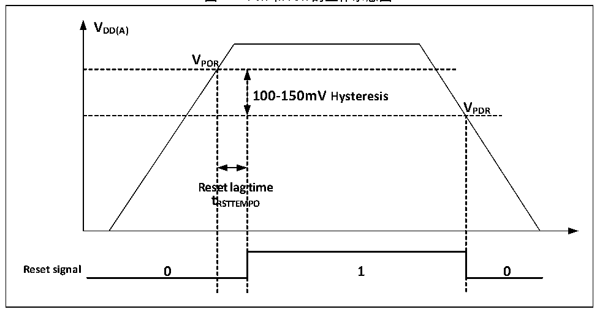

<!-- source-page: 5 -->

[← p.4](0004.md) · [index](../README.md) · [PDF p.5](https://ch32-riscv-ug.github.io/CH32M030/datasheet_zh/CH32M030RM.PDF#page=5) · [p.6 →](0006.md)

<!-- header: CH32M030应用手册 https://wch.cn -->

# 第 2 章 电源控制（PWR）

## 2.1 概述

系统工作电压VHV 范围为4.0～29.0V。  

## 2.2 电源管理

### 2.2.1 上电复位和掉电复位

系统内部集成了上电复位POR和掉电复位PDR电路，当芯片供电电压VDD 和VDDA 低于对应门限电压  
时，系统被相关电路复位，无需外置额外的复位电路。上电门限电压 VPOR 和掉电门限电压 VPDR 的参数  
请参考对应的数据手册。  

图2-1 POR和PDR的工作示意图  
 <!-- rendered from the PDF; verify at https://ch32-riscv-ug.github.io/CH32M030/datasheet_zh/CH32M030RM.PDF#page=5 -->

🖼 Text parsed from the figure above

<strong>VDD(A)</strong>  
<strong>VPOR</strong>  
100-150mV Hysteresis  Rese t R  et lag RSTTEM  time MPO  V  
<strong>VPDR</strong>  
<strong>tRSTTEMPO</strong>  
<strong>Reset signal 0 1 0</strong>  

### 2.2.2 过压复位

通过配置SEL_IO_VHV[1:0]位，使能PB4端口过压保护检测。该功能可通过PB4引脚在芯片外部  
自主配置 OVP 过压保护，根据芯片内部判决电路的阈值电压以及片外电阻分压的比例，自主设置 VHV  
的过压保护点，当VHV 电压过高时可强行复位MCU。  

### 2.2.3 分压监测

通过配置SEL_IO_VHV[1:0]位，使能PB4端口VHV 分压监测。该功能可通过PB4引脚输入VHV 分压，  
由 ADC 进行采样监测电压值，根据片外电阻的分压比例，可推算出实时的 VHV 值。例如：外部分压电  
阻为 10K和 1K，此时采样电压与 VHV 的比例为 1:11，如果 ADC 采样电压值为 1V，则可推算出此时 VHV  
的电压值为11V。  

## 2.3 低功耗模式

在系统复位后，微控制器处于正常工作状态（运行模式），此时可以通过降低系统主频或者关闭  
不用外设时钟或者降低工作外设时钟来节省系统功耗。如果系统不需要工作，可设置系统进入低功耗  
模式，并通过特定事件让系统跳出此状态。  
微控制器目前提供了3种低功耗模式，从处理器、外设、电压调节器等的工作差异上分为：  
● 睡眠模式：内核停止运行，所有外设（包含内核私有外设）仍在运行。  
<!-- image: p5-draw-image-00001 bbox=[507.84, 786.48, 527.52, 797.04] -->
<!-- footer: V1.2 4 -->
