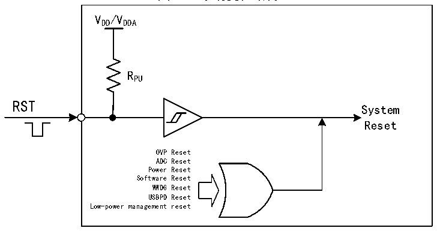

<!-- source-page: 10 -->

[← p.9](0009.md) · [index](../README.md) · [PDF p.10](https://ch32-riscv-ug.github.io/CH32M030/datasheet_zh/CH32M030RM.PDF#page=10) · [p.11 →](0011.md)

<!-- header: CH32M030应用手册 https://wch.cn -->

图3-1 系统复位结构  
 <!-- rendered from the PDF; verify at https://ch32-riscv-ug.github.io/CH32M030/datasheet_zh/CH32M030RM.PDF#page=10 -->

🖼 Text parsed from the figure above

VDD/VDDA  
RPU  
RST  
System  
Reset  
OVP Reset  
ADC Reset  
Power Reset  
Software Reset  
WWDG Reset  
USBPD Reset  
Low-power management reset  

### 3.2.3 过温复位

CH32M030内置了OTP过温保护模块，可通过配置PMUPROEN位为1，PMU过温保护使能，开启在芯  
片温度过高时将强行复位MCU。  
<!-- image: p10-draw-image-00001 bbox=[507.84, 786.48, 527.52, 797.04] -->
<!-- footer: V1.2 9 -->
