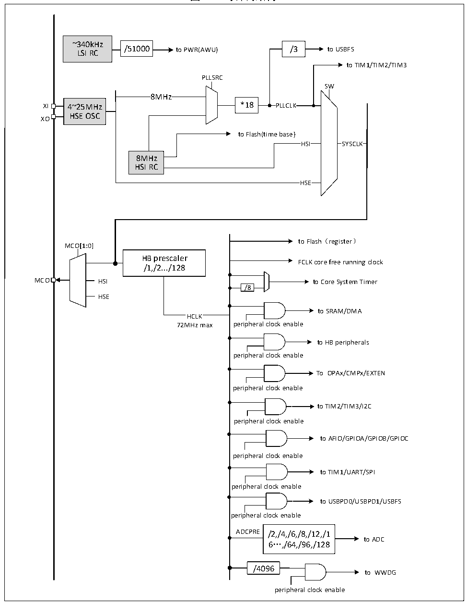

<!-- source-page: 11 -->

[← p.10](0010.md) · [index](../README.md) · [PDF p.11](https://ch32-riscv-ug.github.io/CH32M030/datasheet_zh/CH32M030RM.PDF#page=11) · [p.12 →](0012.md)

<!-- header: CH32M030应用手册 https://wch.cn -->

## 3.3 时钟

### 3.3.1 系统时钟结构

图3-2 时钟树结构  
 <!-- rendered from the PDF; verify at https://ch32-riscv-ug.github.io/CH32M030/datasheet_zh/CH32M030RM.PDF#page=11 -->

🖼 Text parsed from the figure above

~340kHz  
/51000  /51000  
LSI RC /51000 to PWR(AWU) /3 to USBFS  
to TIM1/TIM2/TIM3  
PLLSRC  
SW  
8MHz  
XI 4~25MHz *18  
HSE OSC  
XO  
to Flash(time base)  
HS  HS  
SYSCLK  SYSCLK  
HSI SYSCLK  
8MHz  
HSI RC  
HS  HS  
to Flash（register）  
MCO[1:0]  
HB prescaler  
FCLK core free running clock  
/1,/2.../128  
MCO HSI to Core System Timer  
/8  
HSE  
to SRAM/DMA  
HCLK  
72MHz max peripheral clock enable  
to HB peripherals  
peripheral clock enable  
To OPAx/CMPx/EXTEN  
peripheral clock enable  
to TIM2/TIM3/I2C  
peripheral clock enable  
to AFIO/GPIOA/GPIOB/GPIOC  
peripheral clock enable  
to TIM1/UART/SPI  
peripheral clock enable  
to USBPD0/USBPD1/USBFS  
peripheral clock enable  
ADCPRE /2,/4,/6,/8,/12,/1  
to ADC  
6…,/64,/96,/128  
/4096  
to WWDG  
peripheral clock enable  

### 3.3.2 高速时钟（HSI/HSE）

# HSI是系统内部8MHz的RC振荡器产生的高速时钟信号。HSI RC振荡器能够在不需要任何外部器

<!-- image: p11-draw-image-00001 bbox=[507.84, 786.48, 527.52, 797.04] -->
<!-- footer: V1.2 10 -->
