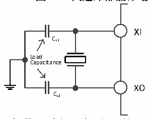

<!-- source-page: 12 -->

[← p.11](0011.md) · [index](../README.md) · [PDF p.12](https://ch32-riscv-ug.github.io/CH32M030/datasheet_zh/CH32M030RM.PDF#page=12) · [p.13 →](0013.md)

<!-- header: CH32M030应用手册 https://wch.cn -->
件的条件下提供系统时钟，其启动时间很短。HSI 通过设置 RCC_CTLR 寄存器中的 HSION 位被启动和  
关闭，HSIRDY位指示 HSIRC振荡器是否稳定。系统默认 HSION和 HSIRDY置 1（建议不要关闭）。如  
果设置了RCC_INTR寄存器的HSIRDYIE位，将产生相应中断。  
● 出厂校准：制造工艺的差异会导致每个芯片的 RC 振荡频率不同，所以在芯片出厂前，会为每颗  
芯片进行HSI校准。系统复位后，工厂校准值被装载到RCC_CTLR寄存器的HSICAL[7:0]中。  
● 用户调整：基于不同的电压或环境温度，应用程序可以通过RCC_CTLR寄存器里的HSITRIM[4:0]  
位来调整HSI频率。  
HSE是外部的高速时钟信号，包括外部晶体/陶瓷谐振器产生或者外部高速时钟送入。  
● 外部晶体/陶瓷谐振器（HSE晶体）：外接外部振荡器为系统提供更为精确的时钟源。进一步信息  
可参考数据手册的电气特性部分。HSE 晶体可以通过设置 RCC_CTLR 寄存器中的 HSEON 位被启动  
和关闭，HSERDY位指示HSE晶体振荡是否稳定，硬件在HSERDY位置1后才将时钟送入系统。如  
果设置了RCC_INTR寄存器的HSERDYIE位，将产生相应中断。  

图3-3 高速外部晶体电路  
 <!-- rendered from the PDF; verify at https://ch32-riscv-ug.github.io/CH32M030/datasheet_zh/CH32M030RM.PDF#page=12 -->

🖼 Text parsed from the figure above

XI  
CL1  
Load  
Capacitance  
XO  
CL2  

注：负载电容需要尽可能地靠近振荡器引脚，并根据晶体厂家参数选择容值。  
● 外部高速时钟源（HSE 旁路）：此模式从外部直接送入时钟源到 XI 引脚，XO 引脚悬空。应用程  
序需在HSEON位为0情况下，置位HSEBYP位，打开HSE旁路功能，然后再置位HSEON位。  

图3-4 高速时钟源电路  
 <!-- rendered from the PDF; verify at https://ch32-riscv-ug.github.io/CH32M030/datasheet_zh/CH32M030RM.PDF#page=12 -->

🖼 Text parsed from the figure above

<!-- image: p12-draw-image-00002 inside the figure -->

### 3.3.3 低速时钟（LSI）

LSI 是系统内部的 RC 振荡器产生的低速时钟信号。它可以在待机模式下保持运行，为唤醒单元  
提供时钟基准。进一步信息可参考数据手册的电气特性部分。LSI可以通过设置RCC_RSTSCKR寄存器  
中的LSION位被启动和关闭，然后通过查询LSIRDY位检测LSI RC振荡是否稳定，硬件在LSIRDY位  
置1后才将时钟送入。如果设置了RCC_INTR寄存器的LSIRDYIE位，将产生相应中断。  

### 3.3.4 PLL 时钟（PLLCLK）

通过配置 RCC_CFGR0寄存器的 PLLSRC位，内部 PLL时钟可以选择 2种时钟来源，这些设置必须  
在 PLL 被开启前完成，一旦 PLL 被启动，这些参数就不能被改动。设置 RCC_CTLR 寄存器中的 PLLON  
位被启动和关闭，PLLRDY 位指示 PLL 时钟是否稳定，硬件在 PLL 位置 1 后才将时钟送入系统。如果  
设置了RCC_INTR寄存器的PLLRDYIE位、将产生相应中断。  
PLL时钟来源：  
● HSI不分频送入  
<!-- image: p12-draw-image-00001 bbox=[507.84, 786.48, 527.52, 797.04] -->
<!-- footer: V1.2 11 -->
