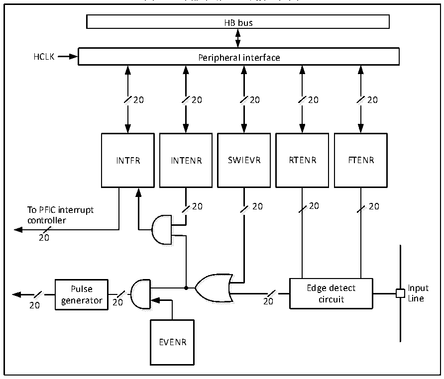

<!-- source-page: 28 -->

[← p.27](0027.md) · [index](../README.md) · [PDF p.28](https://ch32-riscv-ug.github.io/CH32M030/datasheet_zh/CH32M030RM.PDF#page=28) · [p.29 →](0029.md)

<!-- header: CH32M030应用手册 https://wch.cn -->

## 5.4 外部中断和事件控制器（EXTI）

### 5.4.1 概述

图5-1 外部中断(EXTI)接口框图  
 <!-- rendered from the PDF; verify at https://ch32-riscv-ug.github.io/CH32M030/datasheet_zh/CH32M030RM.PDF#page=28 -->

🖼 Text parsed from the figure above

HB bus  
HCLK Peripheral interface  
20 20 20 20 20  
<!-- image: p28-draw-image-00002 inside the figure -->
<!-- image: p28-draw-image-00003 inside the figure -->
<!-- image: p28-draw-image-00004 inside the figure -->
<!-- image: p28-draw-image-00005 inside the figure -->
<!-- image: p28-draw-image-00006 inside the figure -->
<!-- image: p28-draw-image-00007 inside the figure -->
<!-- image: p28-draw-image-00008 inside the figure -->
<!-- image: p28-draw-image-00009 inside the figure -->
<!-- image: p28-draw-image-00010 inside the figure -->
<!-- image: p28-draw-image-00011 inside the figure -->
INTFR INTENR SWIEVR RTENR FTENR  
20 20 20 20  
To PFIC interrupt  
<!-- image: p28-draw-image-00022 inside the figure -->
<!-- image: p28-draw-image-00023 inside the figure -->
<!-- image: p28-draw-image-00024 inside the figure -->
<!-- image: p28-draw-image-00025 inside the figure -->
<!-- image: p28-draw-image-00026 inside the figure -->
<!-- image: p28-draw-image-00027 inside the figure -->
<!-- image: p28-draw-image-00028 inside the figure -->
<!-- image: p28-draw-image-00029 inside the figure -->
<!-- image: p28-draw-image-00016 inside the figure -->
<!-- image: p28-draw-image-00017 inside the figure -->
controller  
<!-- image: p28-draw-image-00012 inside the figure -->
<!-- image: p28-draw-image-00013 inside the figure -->
20  
<!-- image: p28-draw-image-00020 inside the figure -->
<!-- image: p28-draw-image-00021 inside the figure -->
<!-- image: p28-draw-image-00014 inside the figure -->
<!-- image: p28-draw-image-00015 inside the figure -->
Pulse Edge detect Input  
<!-- image: p28-draw-image-00030 inside the figure -->
<!-- image: p28-draw-image-00031 inside the figure -->
<!-- image: p28-draw-image-00032 inside the figure -->
<!-- image: p28-draw-image-00033 inside the figure -->
<!-- image: p28-draw-image-00018 inside the figure -->
<!-- image: p28-draw-image-00019 inside the figure -->
20 generator 20 20 circuit Line  
EVENR  

由图5-1可以看出，外部中断的触发源既可以是软件中断（SWIEVR）也可以是实际的外部中断通  
道，外部中断通道的信号会先经过边沿检测电路（edge detect circuit）的筛选。只要产生软中断  
或者外部中断信号其一，就会通过图中的或门电路输出给事件使能和中断使能两个与门电路，只要有  
中断被使能或者事件被使能，就会产生中断或者事件。EXTI的六个寄存器由处理器通过HB接口访问。  

### 5.4.2 唤醒事件说明

系统可以通过唤醒事件来唤醒由WFE指令引起的睡眠模式。唤醒事件通过以下两种配置产生：  
● 在外设的寄存器里使能一个中断，但不在内核的 PFIC 里使能这个中断，同时在内核里使能  
SEVONPEND位。体现在EXTI中，就是使能EXTI中断，但不在PFIC中使能EXTI中断，同时使能  
SEVONPEND位。当CPU从WFE中唤醒后，需要清除EXTI的中断标志位和PFIC挂起位。  
● 使能一个 EXTI 通道为事件通道，CPU 从 WFE 唤醒后无需清除中断标志位和 PFIC 挂起位的操作。  

### 5.4.3 说明

使用外部中断需要配置好外部中断通道，即选择好触发沿，使能好中断。当外部中断通道上出现  
了设定的触发沿时，将产生一个中断请求，对应的中断标志位也会被置位。对标志位写1可以清除该  
标志位。  
使用外部硬件中断步骤：  
<!-- image: p28-draw-image-00001 bbox=[507.84, 786.48, 527.52, 797.04] -->
<!-- footer: V1.2 27 -->
