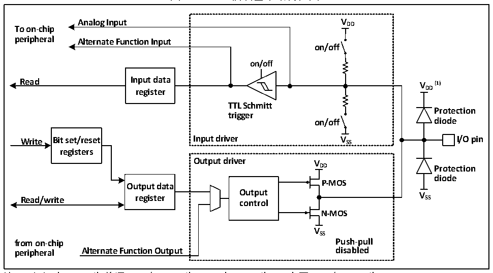

<!-- source-page: 49 -->

[← p.48](0048.md) · [index](../README.md) · [PDF p.49](https://ch32-riscv-ug.github.io/CH32M030/datasheet_zh/CH32M030RM.PDF#page=49) · [p.50 →](0050.md)

<!-- header: CH32M030应用手册 https://wch.cn -->

图6-1 GPIO模块基本结构框图  
 <!-- rendered from the PDF; verify at https://ch32-riscv-ug.github.io/CH32M030/datasheet_zh/CH32M030RM.PDF#page=49 -->

🖼 Text parsed from the figure above

<strong>Analog Input V DD</strong>  
<strong>To on-chip</strong>  
<strong>peripheral Alternate Function Input</strong>  
<strong>on/off</strong>  
<strong>on/off</strong>  
<strong>Read Input data V (1)</strong>  
<strong>register DD</strong>  
<strong>TTL Schmitt</strong>  
<strong>Protection</strong>  
<strong>trigger</strong>  
<strong>on/off diode</strong>  
<strong>Write Bit set/reset Input driver V SS I/O pin</strong>  
<strong>registers</strong>  
<strong>Output driver V</strong>  
<strong>DD Protection</strong>  
<strong>diode</strong>  
<strong>Output data P-MOS</strong>  
<strong>Read/write register O co u n t t p r u o t l V SS</strong>  
<strong>N-MOS</strong>  
<strong>VSS</strong>  
<strong>from on-chip Push-pull</strong>  
<strong>peripheral Alternate Function Output disabled</strong>  

注：（1）当GPIO为普通IO时，VDD为VDD，当GPIO为HV高压IO时，VDD为VHV。  
如图6-1所示IO口结构，每个引脚在芯片内部都有两只保护二极管，IO口内部可分为输入和输  
出驱动模块。其中输入驱动有弱上下拉电阻（仅部分IO支持可控下拉）可选，可连接到AD等模拟输  
入的外设；如果输入到数字外设，就需要经过一个 TTL 施密特触发器，再连接到 GPIO 输入寄存器或  
其他复用外设。而输出驱动有一对 MOS管，可通过配置上下的 MOS 管是否使能来将 IO口配置成开漏  
或推挽输出；输出驱动内部也可以配置成由GPIO控制输出还是由复用的其他外设控制输出。  

### 6.2.2 GPIO 的初始化功能

刚复位后，GPIO口运行在初始状态，这时大多数IO口都是运行在浮空输入状态，但也有HSE等  
外设相关的引脚是运行在外设复用的功能上。具体的初始化功能请参照引脚描述相关的章节。  

### 6.2.3 外部中断

所有的 GPIO 口都可以被配置外部中断输入通道，但一个外部中断输入通道最多只能映射到一个  
GPIO 引脚上，且外部中断通道的序号必须和 GPIO端口的位号一致，比如 PA1（或 PB1/PC1等）只能  
映射到EXTI1上，且EXTI1只能接受PA1、PB1、PC1等其中之一的映射，两方都是一对一的关系。  

### 6.2.4 复用功能

使用复用功能必须要注意：  
● 使用输入方向的复用功能，端口必须配置成复用输入模式，上下拉设置可根据实际需要来设置  
● 使用输出方向的复用功能，端口必须配置成复用输出模式，推挽或开漏可根据实际情况设置  
● 对于双向的复用功能，端口必须配置成复用输出模式，这时驱动器被配置成浮空输入模式  
同一个 IO 口可能有多个外设复用到此管脚，因此为了使各个外设都有最大的发挥空间，外设的  
复用引脚除了默认复用引脚，还可以进行重映射，重映射到其他的引脚，避开被占用的引脚。  

### 6.2.5 锁定机制

锁定机制可以锁定IO口的配置。经过特定的一个写序列后，选定的IO引脚配置将被锁定，在下  
一个复位前无法更改。  
<!-- image: p49-draw-image-00001 bbox=[507.84, 786.48, 527.52, 797.04] -->
<!-- footer: V1.2 48 -->
