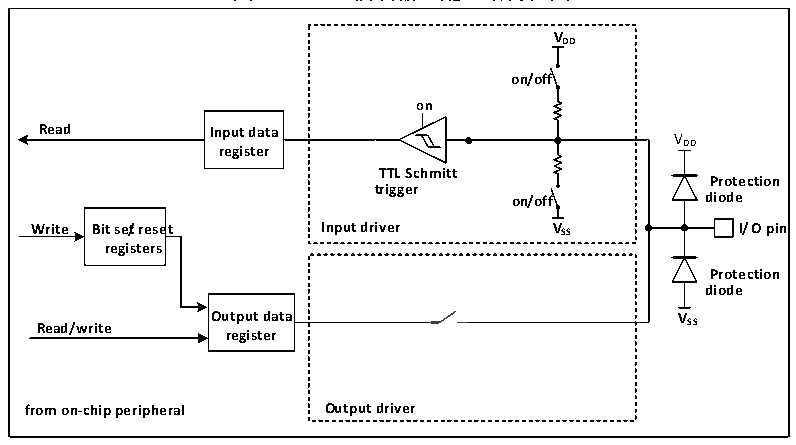
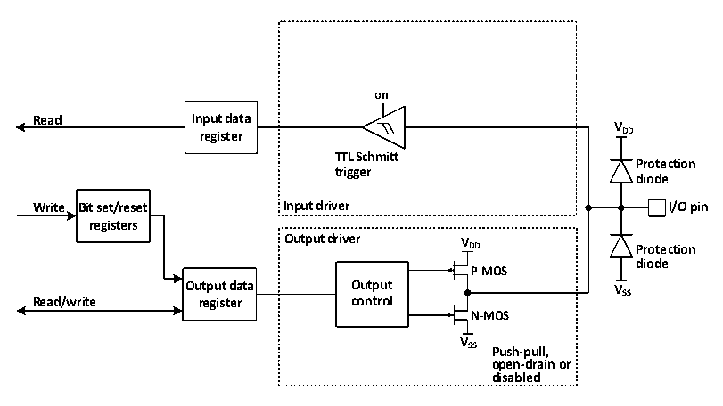

<!-- source-page: 50 -->

[← p.49](0049.md) · [index](../README.md) · [PDF p.50](https://ch32-riscv-ug.github.io/CH32M030/datasheet_zh/CH32M030RM.PDF#page=50) · [p.51 →](0051.md)

<!-- header: CH32M030应用手册 https://wch.cn -->

### 6.2.6 输入配置

图6-2 GPIO模块输入配置结构框图  
 <!-- rendered from the PDF; verify at https://ch32-riscv-ug.github.io/CH32M030/datasheet_zh/CH32M030RM.PDF#page=50 -->

🖼 Text parsed from the figure above

<strong>VDD</strong>  
<strong>on/off</strong>  
<strong>on</strong>  
<strong>Read Input data</strong>  
VDD  
<strong>register</strong>  
<strong>TTL Schmitt</strong>  
<strong>Protection</strong>  
<strong>trigger</strong>  
<strong>on/off diode</strong>  
<strong>Write Bit se/treset Input driver VSS I/O pin</strong>  
<strong>registers</strong>  
<strong>Protection</strong>  
<strong>diode</strong>  
<strong>Output data VSS</strong>  
<strong>Read/write</strong>  
<strong>register</strong>  
<strong>from on-chip peripheral Output driver</strong>  

当IO口配置成输入模式时，输出驱动断开，输入上下拉可选（仅部分IO支持可控下拉），不连  
接复用功能和模拟输入。在每个IO口上的数据将会在每个HB时钟被采样到输入数据寄存器，读取输  
入数据寄存器对应位即获取了对应引脚的电平状态。  

### 6.2.7 输出配置

图6-3 GPIO模块输出配置结构框图  
 <!-- rendered from the PDF; verify at https://ch32-riscv-ug.github.io/CH32M030/datasheet_zh/CH32M030RM.PDF#page=50 -->

🖼 Text parsed from the figure above

<strong>on</strong>  
<strong>Read Input data</strong>  
<strong>V</strong>  
<strong>register DD</strong>  
<strong>TTL Schmitt</strong>  
<strong>Protection</strong>  
<strong>trigger</strong>  
<strong>diode</strong>  
<strong>Write Bit set/reset Input driver I/O pin</strong>  
<strong>registers</strong>  
<strong>Output driver V</strong>  
<strong>DD Protection</strong>  
<strong>diode</strong>  
<strong>P-MOS</strong>  
<strong>Output data Output VSS</strong>  
<strong>Read/write register control</strong>  
<strong>N-MOS</strong>  
<strong>V</strong>  
<strong>SS Push-pull,</strong>  
<strong>open-drain or</strong>  
<strong>disabled</strong>  

当 IO 口配置成输出模式时，输出驱动器中的一对 MOS 可根据需要被配置成推挽或开漏模式，不  
使用复用功能。输入驱动的上下拉电阻被禁用，TTL施密特触发器被激活，出现在IO引脚上的电平将  
会在每个HB时钟被采样到输入数据寄存器，所以读取输入数据寄存器将会得到IO状态，在推挽输出  
模式时，对输出数据寄存器的访问就会得到最后一次写入的值。  

### 6.2.8 复用功能配置

<!-- image: p50-draw-image-00001 bbox=[507.84, 786.48, 527.52, 797.04] -->
<!-- footer: V1.2 49 -->
