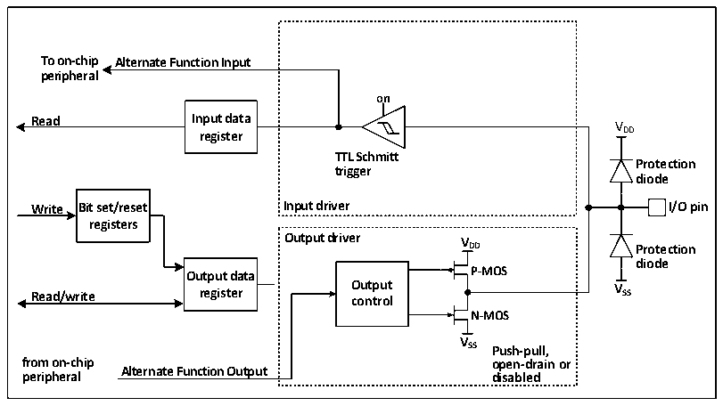
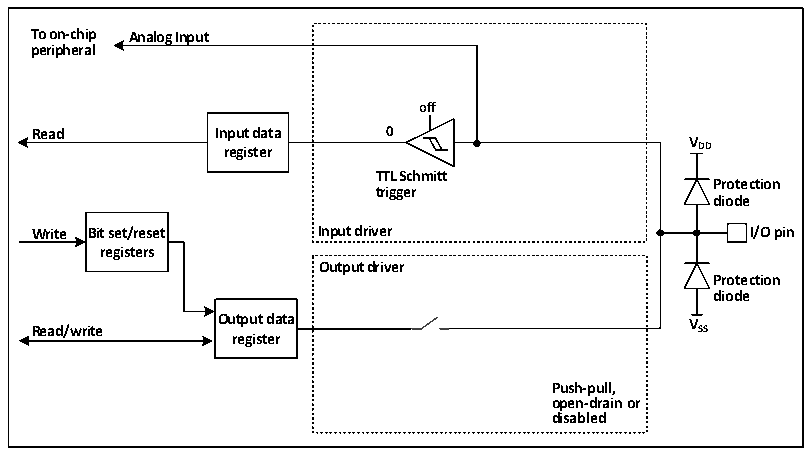

<!-- source-page: 51 -->

[← p.50](0050.md) · [index](../README.md) · [PDF p.51](https://ch32-riscv-ug.github.io/CH32M030/datasheet_zh/CH32M030RM.PDF#page=51) · [p.52 →](0052.md)

<!-- header: CH32M030应用手册 https://wch.cn -->

图6-4 GPIO模块被其他外设复用时的结构框图  
 <!-- rendered from the PDF; verify at https://ch32-riscv-ug.github.io/CH32M030/datasheet_zh/CH32M030RM.PDF#page=51 -->

🖼 Text parsed from the figure above

<strong>To on-chip Alternate Function Input</strong>  
<strong>peripheral</strong>  
<strong>on</strong>  
<strong>Read Input data V</strong>  
<strong>register DD</strong>  
<strong>TTL Schmitt</strong>  
<strong>Protection</strong>  
<strong>trigger</strong>  
<strong>diode</strong>  
<strong>Write Bit set/reset Input driver I/O pin</strong>  
<strong>registers</strong>  
<strong>Output driver V</strong>  
<strong>DD Protection</strong>  
<strong>diode</strong>  
<strong>Output data P-MOS</strong>  
<strong>Read/write register O co u n t t p r u o t l V SS</strong>  
<strong>N-MOS</strong>  
<strong>V</strong>  
<strong>SS Push-pull,</strong>  
<strong>from on-chip open-drain or</strong>  
<strong>Alternate Function Output</strong>  
<strong>peripheral disabled</strong>  

在启用复用功能时，输出驱动器被使能，可以按需要配置成开漏或推挽模式，施密特触发器也被  
打开，复用功能的输入和输出线都被连接，但是输出数据寄存器被断开，出现在 IO 引脚上的电平将  
会在每个HB时钟被采样到输入数据寄存器，在开漏模式下，读取输入数据寄存器将会得到IO口当前  
状态；在推挽模式下，读取输出数据寄存器将会得到最后一次写入的值。  

### 6.2.9 模拟输入配置

图6-5 GPIO模块作为模拟输入时的配置结构框图  
 <!-- rendered from the PDF; verify at https://ch32-riscv-ug.github.io/CH32M030/datasheet_zh/CH32M030RM.PDF#page=51 -->

🖼 Text parsed from the figure above

<strong>To on-chip Analog Input</strong>  
<strong>peripheral</strong>  
<strong>off</strong>  
<strong>Read Input data 0</strong>  
<strong>V</strong>  
<strong>register DD</strong>  
<strong>TTL Schmitt</strong>  
<strong>Protection</strong>  
<strong>trigger</strong>  
<strong>diode</strong>  
<strong>Write Bit set/reset Input driver I/O pin</strong>  
<strong>registers</strong>  
<strong>Output driver</strong>  
<strong>Protection</strong>  
<strong>diode</strong>  
<strong>Output data V</strong>  
<strong>Read/write SS</strong>  
<strong>register</strong>  
<strong>Push-pull,</strong>  
<strong>open-drain or</strong>  
<strong>disabled</strong>  

# 在启用模拟输入时，输出缓冲器被断开，输入驱动中施密特触发器的输入被禁止以防止产生 IO

口上的消耗，上下拉电阻被禁止，读取输入数据寄存器将一直为0。  

### 6.2.10 MV 的 GPIO 结构

<!-- image: p51-draw-image-00001 bbox=[507.84, 786.48, 527.52, 797.04] -->
<!-- footer: V1.2 50 -->
