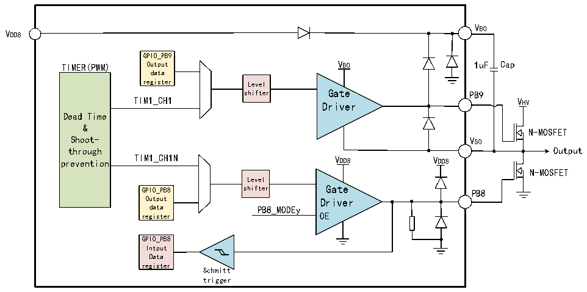

<!-- source-page: 52 -->

[← p.51](0051.md) · [index](../README.md) · [PDF p.52](https://ch32-riscv-ug.github.io/CH32M030/datasheet_zh/CH32M030RM.PDF#page=52) · [p.53 →](0053.md)

<!-- header: CH32M030应用手册 https://wch.cn -->

图6-6 MV的GPIO结构框图  
 <!-- rendered from the PDF; verify at https://ch32-riscv-ug.github.io/CH32M030/datasheet_zh/CH32M030RM.PDF#page=52 -->

🖼 Text parsed from the figure above

VB0  
VDD8  
GPIO_PB9  
TIMER(PWM) Output VB0 1uF Cap  
data  
register Level  
shifter Gate PB9  
TIM1_CH1  
VHV  
Driver  
Dead Time  
&amp;  
N-MOSFET  
Shoot- VS0  
through Output  
prevention TIM1_CH1N VDD8 VDD8  
N-MOSFET  
Level  
GPIO_PB8 shifter Gate PB8  
Output Driver  
data PB8_MODEy  
register OE  
GPIO_PB8  
Intput  
Data  
register  
Schmitt  
trigger  

注：Cap为1uF的片外电容；N-MOSFET为片外N型MOSFET功率管。  
CH32M030集成了4个独立半桥驱动器，每个半桥均包含低压降的自举二极管、高侧和低侧电平移  
位电路、高侧和低侧输出驱动电路，支持 4 对 N型 MOSFET功率管的栅极驱动，外部仅需一个电容保  
存自举电源，栅极驱动电压取决于VDD8，从5V到10V共4档可调。  
PB9 和 PB8分别控制为第一个半桥驱动的高侧和低侧功率管，PB11 和 PB10分别控制为第二个半  
桥驱动的高侧和低侧功率管，PB13和PB12分别控制为第三个半桥驱动的高侧和低侧功率管，PB15和  
PB14分别控制为第四个半桥驱动的高侧和低侧功率管。  
4个独立半桥可组成三相半桥，用于三相电机的栅极驱动，由TIM1产生的PB8～PB13信号控制；  
4 个独立半桥也可组成 2 组全桥，用于两路独立的全桥驱动，分别由 TIM1 产生的 PB8～PB11 信号和  
TIM2产生的PB12～PB15信号控制。定时器产生PWM信号，支持死区时间控制。  
除了半桥栅极驱动，PB8～PB15也可以用于GPIO，输入支持VDD8 耐压，输出摆幅参考VDD8 电压。其  
中，PB9、PB11、PB13、PB15用于GPIO时需将VS 接到GND作为VDD8 供电的GPIO；也可将VS 和VB 分别  
接到浮动电压的低端和高端，输出高/低电平时电压分别为VB、VS。  

### 6.2.11 外设的 GPIO 设置

下列表格推荐了各个外设的引脚相应的GPIO口配置。  

<!-- p52-table-001 (table-6-1@1) -->
<table><caption>表6-1 高级定时器（TIM1）</caption><tr><th>TIM1</th><th>配置</th><th>GPIO配置</th></tr><tr><td rowspan="2">TIM1_CHx</td><td>输入捕获通道x</td><td>浮空输入</td></tr><tr><td>输出比较通道x</td><td>推挽复用输出</td></tr><tr><td>TIM1_CHxN</td><td>互补输出通道x</td><td>推挽复用输出</td></tr><tr><td>TIM1_BKIN</td><td>刹车输入</td><td>浮空输入</td></tr><tr><td>TIM1_ETR</td><td>外部触发时钟输入</td><td>浮空输入</td></tr></table>

<!-- p52-table-002 (table-6-2@1) pages 52-53 -->
<table><caption>表6-2 通用定时器（TIM2）</caption><tr><th>TIM2引脚</th><th>配置</th><th>GPIO配置</th></tr><tr><td rowspan="2">TIM2_CHx</td><td>输入捕获通道x</td><td>浮空输入</td></tr><tr><td>输出比较通道x</td><td>推挽复用输出</td></tr><tr><td>TIM2_ETR</td><td>外部触发时钟输入</td><td>浮空输入</td></tr></table>

<!-- image: p52-draw-image-00001 bbox=[507.84, 786.48, 527.52, 797.04] -->
<!-- footer: V1.2 51 -->
