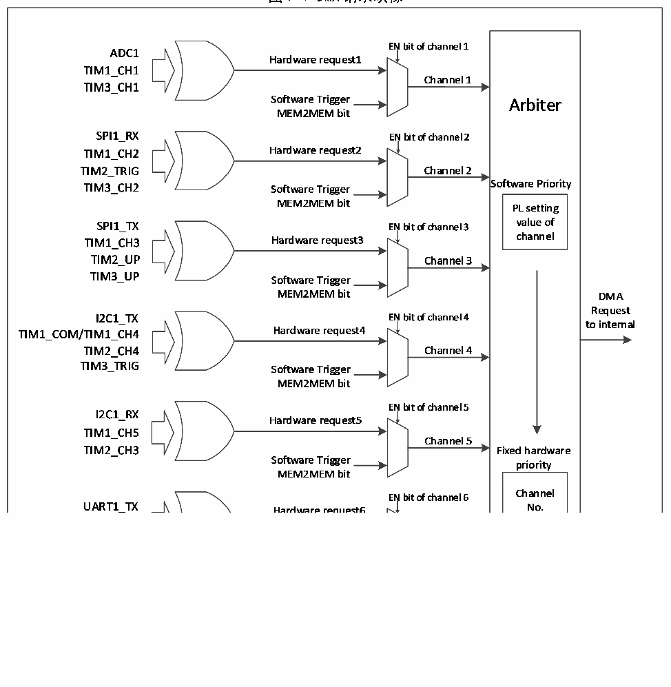

<!-- source-page: 66 -->

[← p.65](0065.md) · [index](../README.md) · [PDF p.66](https://ch32-riscv-ug.github.io/CH32M030/datasheet_zh/CH32M030RM.PDF#page=66) · [p.67 →](0067.md)

<!-- header: CH32M030应用手册 https://wch.cn -->

### 7.2.3 DMA 请求映射

DMA控制器提供7个通道，每个通道对应多个外设请求，通过设置相应外设寄存器中对应DMA控  
制位，可以独立的开启或关闭各个外设的DMA功能。  

图7-1 DMA请求映像  
 <!-- rendered from the PDF; verify at https://ch32-riscv-ug.github.io/CH32M030/datasheet_zh/CH32M030RM.PDF#page=66 -->

🖼 Text parsed from the figure above

<!-- image: p66-draw-image-00002 inside the figure -->
<!-- image: p66-draw-image-00003 inside the figure -->
<!-- image: p66-draw-image-00004 inside the figure -->
<!-- image: p66-draw-image-00005 inside the figure -->

<!-- p66-table-001 (table-7-2@1) -->
<table><caption>表7-2 DMA各通道外设映射表</caption><tr><th>外设</th><th>通道1</th><th>通道2</th><th>通道3</th><th>通道4</th><th>通道5</th><th>通道6</th><th>通道7</th></tr><tr><td>ADC</td><td>ADC</td><td></td><td></td><td></td><td></td><td></td><td></td></tr><tr><td>SPI1</td><td></td><td>SPI1_RX</td><td>SPI1_TX</td><td></td><td></td><td></td><td></td></tr><tr><td>UART1</td><td></td><td></td><td></td><td></td><td></td><td>UART1_TX</td><td>UART1_RX</td></tr><tr><td>I2C1</td><td></td><td></td><td></td><td>I2C1_TX</td><td>I2C1_RX</td><td></td><td></td></tr><tr><td>TIM1</td><td>TIM1_CH1</td><td>TIM1_CH2</td><td>TIM1_CH3</td><td style="text-align:left">TIM1_CH4TIM1_COM</td><td>TIM1_CH5</td><td>TIM1_UP</td><td>TIM1_TRIG</td></tr><tr><td>TIM2</td><td></td><td>TIM2_TRIG</td><td>TIM2_UP</td><td>TIM2_CH4</td><td>TIM2_CH3</td><td>TIM2_CH2</td><td>TIM2_CH1</td></tr><tr><td>TIM3</td><td>TIM3_CH1</td><td>TIM3_CH2</td><td>TIM3_UP</td><td>TIM3_TRIG</td><td></td><td></td><td></td></tr></table>

<!-- image: p66-draw-image-00001 bbox=[507.84, 786.48, 527.52, 797.04] -->
<!-- footer: V1.2 65 -->
