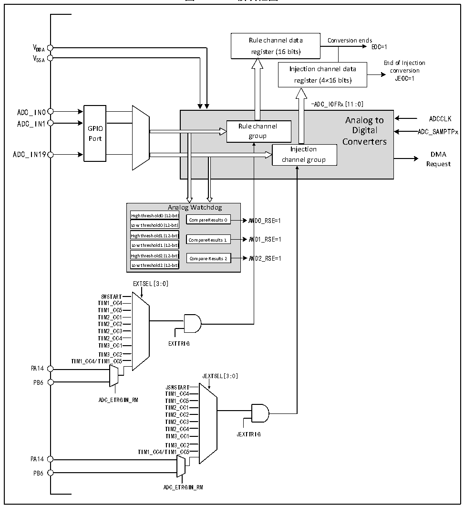

<!-- source-page: 72 -->

[← p.71](0071.md) · [index](../README.md) · [PDF p.72](https://ch32-riscv-ug.github.io/CH32M030/datasheet_zh/CH32M030RM.PDF#page=72) · [p.73 →](0073.md)

<!-- header: CH32M030应用手册 https://wch.cn -->

## 8.2 功能描述

### 8.2.1 模块结构

图8-1 ADC模块框图  
 <!-- rendered from the PDF; verify at https://ch32-riscv-ug.github.io/CH32M030/datasheet_zh/CH32M030RM.PDF#page=72 -->

🖼 Text parsed from the figure above

Rule channel data Conversion ends  
V EOC=1  
DDA register (16 bits)  
V  
SSA End of Injection  
Injection channel data conversion  
register (4×16 bits) JEOC=1  
-ADC_IOFRx[11:0]  
GPIOPort  
Analog to Rule channel Digital group Converters Injection channel group  
ADC_IN0  
Analog to ADCCLK  
ADC_IN1  
ADC_IN19 DMA  
Request  
Analog Watchdog  
High threshold0 (12-bit)  
Compare Results 0 AWD0_RSE=1  
Low threshold0 (12-bit)  
High threshold1 (12-bit) Compare Results 1 AWD1_RSE=1  
Low threshold1 (12-bit)  
High threshold2 (12-bit) Compare Results 2 AWD2_RSE=1  
Low threshold2 (12-bit)  
EXTSEL[3:0]  
SWSTART  
TIM1_CC4  
TIM1_CC5  
TIM2_CC1  
TIM2_CC2  
TIM2_CC3  
TIM2_CC4  
TIM3_CC1 EXTTRIG  
TIM3_CC2  
TIM1_CC4/TIM1_CC5  
PA14  
JEXTSEL[3:0]  
PB6  
JSWSTART  
TIM1_CC4  
ADC_ETRGIN_RM TIM1_CC5  
TIM2_CC1  
TIM2_CC2  
TIM2_CC3  
TIM2_CC4  
TIM3_CC1 JEXTTRIG  
TIM3_CC2  
TIM1_CC4/TIM1_CC5  
PA14  
PB6  
ADC_ETRGIN_RM  

### 8.2.2 ADC 配置

1）模块上电  
ADC_CTLR2 寄存器的 ADON 位为 1 表示 ADC 模块上电。当 ADC 模块从断电模式（ADON=0）下进入  
上电状态（ADON=1）后，需要延迟一段时间tSTAB 用于模块稳定时间。之后再次写入ADON位为1，用于  
作为软件启动 ADC 转换的启动信号。通过清除 ADON 位为 0，可以终止当前转换并将 ADC 模块置于断  
电模式，这个状态下，ADC几乎不耗电。  
<!-- image: p72-draw-image-00001 bbox=[507.84, 786.48, 527.52, 797.04] -->
<!-- footer: V1.2 71 -->
