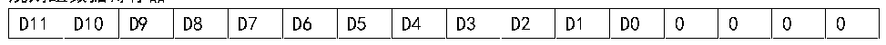
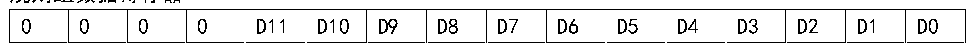

<!-- source-page: 74 -->

[← p.73](0073.md) · [index](../README.md) · [PDF p.74](https://ch32-riscv-ug.github.io/CH32M030/datasheet_zh/CH32M030RM.PDF#page=74) · [p.75 →](0075.md)

<!-- header: CH32M030应用手册 https://wch.cn -->

图8-2 数据左对齐  
 <!-- rendered from the PDF; verify at https://ch32-riscv-ug.github.io/CH32M030/datasheet_zh/CH32M030RM.PDF#page=74 -->

规则组数据寄存器  

🖼 Text parsed from the figure above

D11  D10  D9  D8  D7  D6  D5  D4  D3  D2  D1  D0  0  0  0  0  

注入组数据寄存器  

<!-- p74-table-002 (table-7-3@1) -->
<table><tr><th>SIGNB</th><th>D11</th><th>D10</th><th>D9</th><th>D8</th><th>D7</th><th>D6</th><th>D5</th><th>D4</th><th>D3</th><th>D2</th><th>D1</th><th>D0</th><th>0</th><th>0</th><th>0</th></tr></table>

图8-3 数据右对齐  
 <!-- rendered from the PDF; verify at https://ch32-riscv-ug.github.io/CH32M030/datasheet_zh/CH32M030RM.PDF#page=74 -->

规则组数据寄存器  

🖼 Text parsed from the figure above

0  0  0  0  D11  D10  D9  D8  D7  D6  D5  D4  D3  D2  D1  D0  

注入组数据寄存器  

<!-- p74-table-004 (table-7-3@1) -->
<table><tr><th>SIGNB</th><th>SIGNB</th><th>SIGNB</th><th>SIGNB</th><th>D11</th><th>D10</th><th>D9</th><th>D8</th><th>D7</th><th>D6</th><th>D5</th><th>D4</th><th>D3</th><th>D2</th><th>D1</th><th>D0</th></tr></table>

### 8.2.3 外部触发源

ADC转换的启动事件可以由外部事件触发。如果设置了ADC_CTLR2寄存器的EXTTRIG或JEXTTRIG  
位，则可分别通过外部事件触发规则组或注入组通道的转换。此时，EXTSEL[3:0]和JEXTSEL[3:0]位  
的配置决定规则组和注入组的外部事件源。  
注：当外部触发信号被选为ADC规则或注入转换时，只有它的上升沿可以启动转换。  

<!-- p74-table-005 (table-8-1@1) -->
<table><caption>表8-1 规则组通道的外部触发源</caption><tr><th>EXTSEL[3:0]</th><th>触发源</th><th>类型</th></tr><tr><td>0000</td><td>SWSTART位置1软件触发</td><td>软件控制位</td></tr><tr><td>0001</td><td>定时器1的CC4事件</td><td rowspan="8">来自片上定时器的内部信号</td></tr><tr><td>0010</td><td>定时器1的CC5事件</td></tr><tr><td>0011</td><td>定时器2的CC1事件</td></tr><tr><td>0100</td><td>定时器2的CC2事件</td></tr><tr><td>0101</td><td>定时器2的CC3事件</td></tr><tr><td>0110</td><td>定时器2的CC4事件</td></tr><tr><td>0111</td><td>定时器3的CC1事件</td></tr><tr><td>1000</td><td>定时器3的CC2事件</td></tr><tr><td>1001</td><td>PA14/PB6事件</td><td>来自外部引脚</td></tr><tr><td>1010</td><td>定时器1的CC4事件/CC5事件</td><td>来自片上定时器的内部信号</td></tr></table>

<!-- p74-table-006 (table-8-2@1) -->
<table><caption>表8-2注入组通道的外部触发源</caption><tr><th>JEXTSEL[3:0]</th><th>触发源</th><th>类型</th></tr><tr><td>0000</td><td>JSWSTART位置1软件触发</td><td>软件控制位</td></tr><tr><td>0001</td><td>定时器1的CC4事件</td><td rowspan="9">来自片上定时器的内部信号</td></tr><tr><td>0010</td><td>定时器1的CC5事件</td></tr><tr><td>0011</td><td>定时器2的CC1事件</td></tr><tr><td>0100</td><td>定时器2的CC2事件</td></tr><tr><td>0101</td><td>定时器2的CC3事件</td></tr><tr><td>0110</td><td>定时器2的CC4事件</td></tr><tr><td>0111</td><td>定时器3的CC1事件</td></tr><tr><td>1000</td><td>定时器3的CC2事件</td></tr><tr><td>1001</td><td>定时器1的CC4事件/CC5事件</td></tr><tr><td>1010</td><td>PA14/PB6事件</td><td>来自外部引脚</td></tr></table>

<!-- image: p74-draw-image-00001 bbox=[507.84, 786.48, 527.52, 797.04] -->
<!-- footer: V1.2 73 -->
