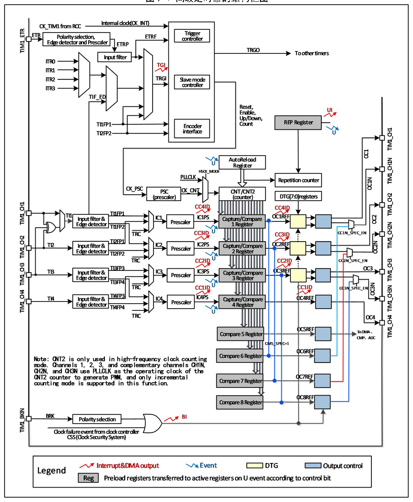

<!-- source-page: 93 -->

[← p.92](0092.md) · [index](../README.md) · [PDF p.93](https://ch32-riscv-ug.github.io/CH32M030/datasheet_zh/CH32M030RM.PDF#page=93) · [p.94 →](0094.md)

<!-- header: CH32M030应用手册 https://wch.cn -->

图9-1 高级定时器的结构框图  
 <!-- rendered from the PDF; verify at https://ch32-riscv-ug.github.io/CH32M030/datasheet_zh/CH32M030RM.PDF#page=93 -->

🖼 Text parsed from the figure above

<!-- image: p93-draw-image-00002 inside the figure -->

<!-- image: p93-draw-image-00001 bbox=[507.84, 786.48, 527.52, 797.04] -->
<!-- footer: V1.2 92 -->
