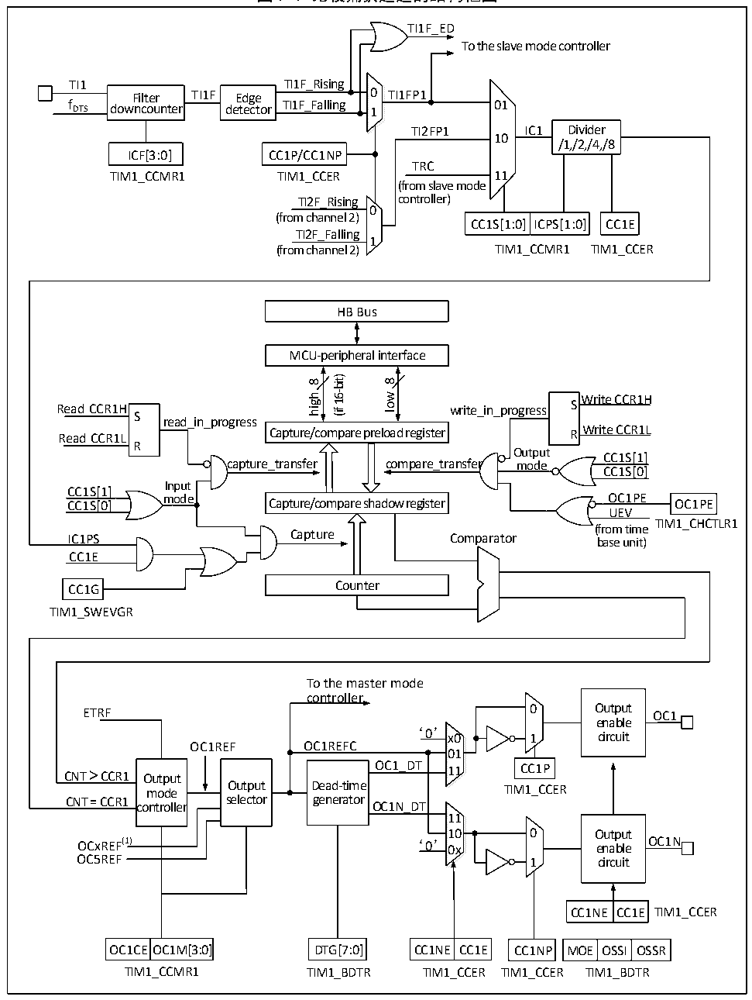

<!-- source-page: 96 -->

[← p.95](0095.md) · [index](../README.md) · [PDF p.96](https://ch32-riscv-ug.github.io/CH32M030/datasheet_zh/CH32M030RM.PDF#page=96) · [p.97 →](0097.md)

<!-- header: CH32M030应用手册 https://wch.cn -->

图9-3 比较捕获通道的结构框图  
 <!-- rendered from the PDF; verify at https://ch32-riscv-ug.github.io/CH32M030/datasheet_zh/CH32M030RM.PDF#page=96 -->

🖼 Text parsed from the figure above

TI1F_ED  
To the slave mode controller  
<!-- image: p96-draw-image-00002 inside the figure -->
<!-- image: p96-draw-image-00003 inside the figure -->
TI1 TI1F_Rising  
Filter TI1F Edge 0 TI1FP1  
f DTS downcounter detector TI1F_Falling 1 01  
TI2FP1 IC1 Divider  
10  
/1,/2,/4,/8  
ICF[3:0] CC1P/CC1NP  
TRC  
TIM1_CCMR1 TIM1_CCER 11  
(from slave mode  
TI2F_Rising controller)  
0  
(from channel 2)  
CC1S[1:0] ICPS[1:0] CC1E  
TI2F_Falling  
1  
(from channel 2) TIM1_CCMR1 TIM1_CCER  
HB Bus  
MCU-peripheral interface  
16-bit)  
8  
8  
wol Write CCR1H  
high  
Read CCR1H write_in_progress S S  
(if  
read_in_progress  
Write CCR1L Read CCR1L R  
Capture/compare preload register  
R  
Output CC1S[1]  
capture_transfer compare_transfer mode  
CC1S[0]  
Input  
CC1S[1]  
mode OC1PE CC1S[0] OC1PE  
Capture/compare shadow register  
UEV  
TIM1_CHCTLR1  
(from time  
IC1PS Capture Comparator base unit)  
CC1E  
CC1G Counter  
TIM1_SWEVGR  
To the master mode  
controller  
ETRF 0 Output OC1  
enable  
<!-- image: p96-draw-image-00004 inside the figure -->
<!-- image: p96-draw-image-00005 inside the figure -->
‘0’ x0 1 circuit  
OC1REF OC1REFC  
01  
D  Dead-time generator  
CNT = CCR1 selector generator  
controller OC1N_DT  
<!-- image: p96-draw-image-00006 inside the figure -->
<!-- image: p96-draw-image-00007 inside the figure -->
11  
10 0 Output  
OCxREF(1) ‘0’ 0x enable OC1N  
OC5REF 1 circuit  
CC1NE  CC1E  
OC1CE  OC1M[3:0]  
CC1NE  CC1E  
MOE  OSSI  OSSR  
OC1CEOC1M[3:0] DTG[7:0] CC1NE CC1E CC1NP MOE OSSI OSSR  
TIM1_CCMR1 TIM1_BDTR TIM1_CCER TIM1_CCER TIM1_BDTR  

比较捕获通道的结构框图如图 9-3所示。信号从通道 x 引脚输入进来后可选做为 TIx（TI1的来  
源可以不只是 CH1，见定时器的结构框图 9-1），TI1 经过滤波器（ICF[3:0]）生成 TI1F，再经过边  
沿检测器分成TI1F_Rising和TI1F_Falling，这两个信号经过选择（CC1P）生成TI1FP1，TI1FP1和  
来自通道2的TI2FP1一起送给CC1S选择成为IC1，经过ICPS分频后送给比较捕获寄存器。  
比较捕获寄存器由一个预装载寄存器和一个影子寄存器组成，读写过程仅操作预装载寄存器。在  
<!-- image: p96-draw-image-00001 bbox=[507.84, 786.48, 527.52, 797.04] -->
<!-- footer: V1.2 95 -->
