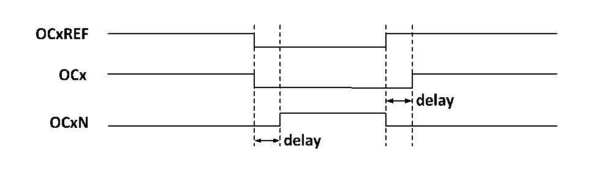

<!-- source-page: 99 -->

[← p.98](0098.md) · [index](../README.md) · [PDF p.99](https://ch32-riscv-ug.github.io/CH32M030/datasheet_zh/CH32M030RM.PDF#page=99) · [p.100 →](0100.md)

<!-- header: CH32M030应用手册 https://wch.cn -->

### 9.3.6 互补输出和死区

比较捕获通道一般有两个输出引脚（比较捕获通道4只有一个输出引脚），能输出两个互补的信  
号（OCx 和 OCxN），OCx和 OCxN可以通过 CCxP 和 CCxNP位独立地设置极性，通过 CCxE和 CCxNE 独  
立地设置输出使能，通过 MOE、OIS、OISN、OSSI、OSSR 位进行死区和其他的控制。同时使能 OCx 和  
OCxN输出将插入死区，每个通道都有一个10位的死区发生器。如果存在刹车电路则还要设置MOE位。  
OCx和OCxN由OCxREF关联产生，如果OCx和OCxN都是高有效，那么OCx与OCxREF相同，只是OCx  
的上升沿相当于 OCxREF 有一个延迟，OCxN 与 OCxREF 相反，它的上升沿相对参考信号的下降沿会有  
一个延迟，如果延迟大于有效输出宽度，则不会产生相应的脉冲。  
如图9-4展示了OCx和OCxN与OCxREF的关系，并展示出死区。  

图9-4 互补输出和死区  
 <!-- rendered from the PDF; verify at https://ch32-riscv-ug.github.io/CH32M030/datasheet_zh/CH32M030RM.PDF#page=99 -->

🖼 Text parsed from the figure above

<!-- image: p99-draw-image-00002 inside the figure -->
<!-- image: p99-draw-image-00003 inside the figure -->
<!-- image: p99-draw-image-00006 inside the figure -->
<!-- image: p99-draw-image-00004 inside the figure -->
<!-- image: p99-draw-image-00005 inside the figure -->

### 9.3.7 死区时间不对称

在互补输出配置和死区控制基础上通过配置 DT_VLU2 寄存器（配置值大小需大于 0 且小于  
TIM1_BDTR寄存器DTG[7:0]中设置的Tdtg的个数），配置DTP_MODE位或者DTN_MODE位选择DT_VLU2  
配置的死区时间发生在OCXREF的上升沿或下降沿。通过此方法实现死区时间不对称。  

### 9.3.8 刹车信号

当产生刹车信号时，输出使能信号和无效电平都会根据MOE、OIS、OISN、OSSI和OSSR等位进行  
修改。但OCx和OCxN不会在任何时间都处在有效电平。刹车事件源可以来自于刹车输入引脚。  
在系统复位后，刹车功能被默认禁止（MOE位为低），置BKE位可以使能刹车功能，输入的刹车  
信号的极性可以通过设置BKP设置，BKE和BKP信号可以被同时写入，在真正写入之前会有一个HB时  
钟的延迟，因此需要等一个HB周期才能正确读出写入值。  
在刹车引脚出现选定的电平系统将产生如下动作：  
1）MOE位被异步清零，根据SOOI位的设置将输出置为无效状态、空闲状态或者复位状态；  
2）在MOE被清零后，每一个输出通道输出由OISx确定的电平；  
3）当使用互补输出时：输出被置于无效状态，具体取决于极性；  
4）如果BIE被置位，当BIF置位，会产生一个中断；如果设置了BDE位，则会产生一个DMA请求；  
5）如果AOE被置位，在下一个更新事件UEV时，MOE位被自动置位。  

### 9.3.9 单脉冲模式

单脉冲模式可以用于让微控制器响应一个特定的事件，使之在一个延迟之后产生一个脉冲，延迟  
和脉冲的宽度可编程。置 OPM 位可以使核心计数器在产生下一个更新事件 UEV 时（计数器翻转到 0）  
停止。  
如图9-5，需要在TI2输入引脚上检测到一个上升沿开始，延迟Tdelay之后，在OC1上产生一个  
长度为Tpulse的正脉冲：  
<!-- image: p99-draw-image-00001 bbox=[507.84, 786.48, 527.52, 797.04] -->
<!-- footer: V1.2 98 -->
