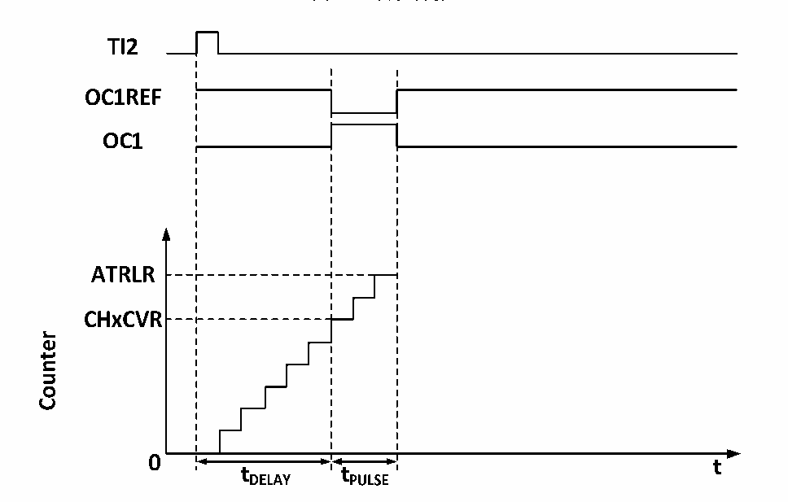

<!-- source-page: 100 -->

[← p.99](0099.md) · [index](../README.md) · [PDF p.100](https://ch32-riscv-ug.github.io/CH32M030/datasheet_zh/CH32M030RM.PDF#page=100) · [p.101 →](0101.md)

<!-- header: CH32M030应用手册 https://wch.cn -->

图9-5 单脉冲的产生  
 <!-- rendered from the PDF; verify at https://ch32-riscv-ug.github.io/CH32M030/datasheet_zh/CH32M030RM.PDF#page=100 -->

🖼 Text parsed from the figure above

<!-- image: p100-draw-image-00003 inside the figure -->
<!-- image: p100-draw-image-00002 inside the figure -->
<!-- image: p100-draw-image-00004 inside the figure -->
<!-- image: p100-draw-image-00005 inside the figure -->
<!-- image: p100-draw-image-00006 inside the figure -->
<!-- image: p100-draw-image-00007 inside the figure -->
<!-- image: p100-draw-image-00008 inside the figure -->
<!-- image: p100-draw-image-00015 inside the figure -->
<!-- image: p100-draw-image-00016 inside the figure -->
<!-- image: p100-draw-image-00017 inside the figure -->
<!-- image: p100-draw-image-00009 inside the figure -->
<!-- image: p100-draw-image-00014 inside the figure -->
<!-- image: p100-draw-image-00010 inside the figure -->
<!-- image: p100-draw-image-00012 inside the figure -->
<!-- image: p100-draw-image-00013 inside the figure -->
<!-- image: p100-draw-image-00011 inside the figure -->

1）设定TI2为触发。置CC2S域为01b，把TI2FP2映射到TI2；置CC2P位为0b，TI2FP2设为上升沿  
检测；置TS域为110b，TI2FP2设为触发源；置SMS域为110b，TI2FP2被用来启动计数器；  
2）Tdelay由比较捕获寄存器的的值确定，Tpulse由自动重装值寄存器的值和比较捕获寄存器的值确  
定。  

### 9.3.10 编码器模式

编码器模式是定时器的一个典型应用，可以用来接入编码器的双相输出，核心计数器的计数方向  
和编码器的转轴方向同步，编码器每输出一个脉冲就会使核心计数器加一或减一。使用编码器的步骤  
为：将SMS域置为001b（只在TI2边沿计数）、010b（只在TI1边沿计数）或者011b（在TI1和TI2  
双边沿计数），将编码器接到比较捕获通道 1、2 的输入端，给重装值寄存器设一个值，这个值可以  
设的大一点。在编码器模式时，定时器内部的比较捕获寄存器，预分频器，重复计数寄存器等都正常  
工作。下表表明了计数方向和编码器信号的关系。  

<!-- p100-table-001 (table-9-1@1) -->
<table><caption>表9-1 定时器编码器模式的计数方向和编码器信号之间的关系</caption><tr><th rowspan="2">计数有效边沿</th><th rowspan="2" style="text-align:left">相对信号的电平</th><th colspan="2">TI1FP1信号边沿</th><th colspan="2">TI2FP2信号</th></tr><tr><td>上升沿</td><td>下降沿</td><td>上升沿</td><td>下降沿</td></tr><tr><td rowspan="2">仅在TI1边沿计数</td><td>高</td><td>向下计数</td><td>向上计数</td><td rowspan="2" colspan="2">不计数</td></tr><tr><td>低</td><td>向上计数</td><td>向下计数</td></tr><tr><td rowspan="2">仅在TI2边沿计数</td><td>高</td><td rowspan="2" colspan="2">不计数</td><td>向上计数</td><td>向下计数</td></tr><tr><td>低</td><td>向下计数</td><td>向上计数</td></tr><tr><td rowspan="2">在TI1和TI2双边沿计数</td><td>高</td><td>向下计数</td><td>向上计数</td><td>向上计数</td><td>向下计数</td></tr><tr><td>低</td><td>向上计数</td><td>向下计数</td><td>向下计数</td><td>向上计数</td></tr></table>

### 9.3.11 定时器同步模式

定时器能够输出时钟脉冲（TRGO），也能接收其他定时器的输入（ITRx）。不同的定时器的ITRx  
的来源（别的定时器的TRGO）是不一样的。  
<!-- image: p100-draw-image-00001 bbox=[507.84, 786.48, 527.52, 797.04] -->
<!-- footer: V1.2 99 -->
