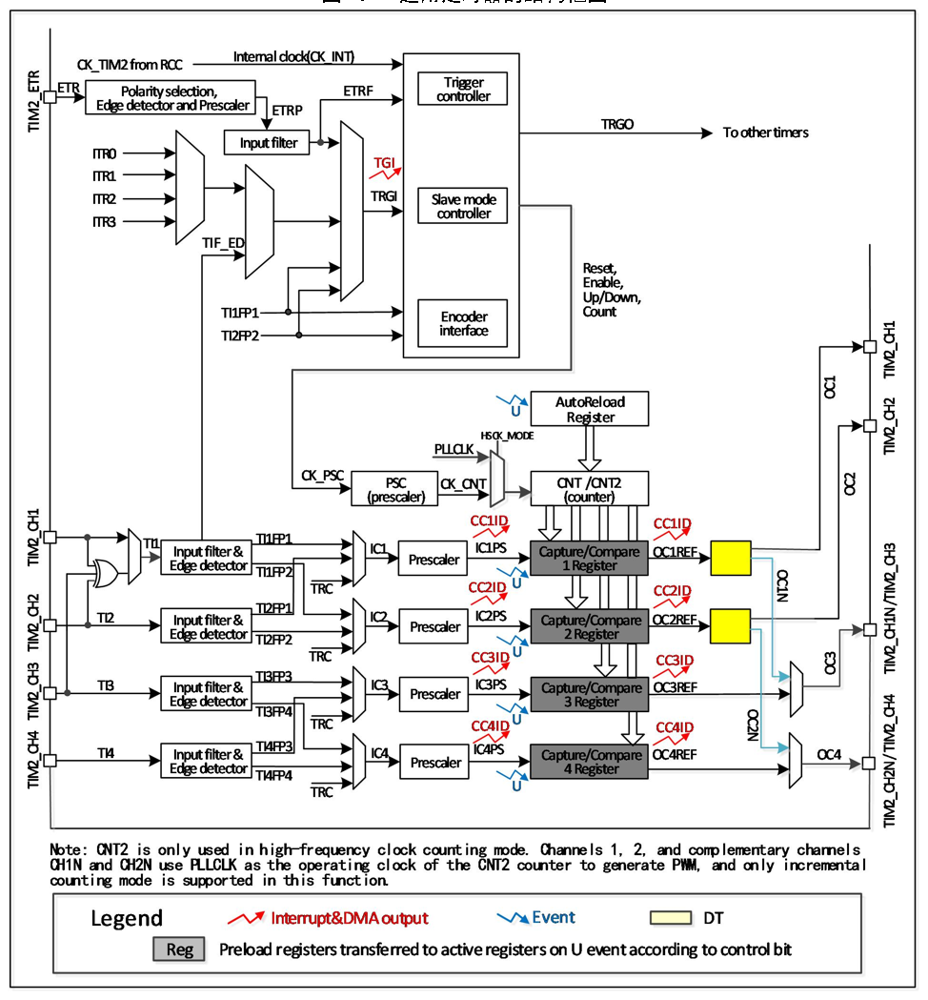

<!-- source-page: 122 -->

[← p.121](0121.md) · [index](../README.md) · [PDF p.122](https://ch32-riscv-ug.github.io/CH32M030/datasheet_zh/CH32M030RM.PDF#page=122) · [p.123 →](0123.md)

<!-- header: CH32M030应用手册 https://wch.cn -->

## 10.2 原理和结构

图10-1 通用定时器的结构框图  
 <!-- rendered from the PDF; verify at https://ch32-riscv-ug.github.io/CH32M030/datasheet_zh/CH32M030RM.PDF#page=122 -->

🖼 Text parsed from the figure above

<!-- image: p122-draw-image-00002 inside the figure -->

### 10.2.1 概述

如图 10-1 所示，通用定时器的结构大致可以分为三部分，即输入时钟部分，核心计数器部分和  
比较捕获通道部分。  
通用定时器的时钟可以来自于HB总线时钟（CK_INT），可以来自外部时钟输入引脚（TIM2_ETR），  
可以来自于其他具有时钟输出功能的定时器（ITRx），还可以来自于比较捕获通道的输入端（TIM2_CHx）。  
这些输入的时钟信号经过各种设定的滤波分频等操作后成为 CK_PSC 时钟，输出给核心计数器部分。  
另外，这些复杂的时钟来源还可以作为TRGO输出给其他的定时器和ADC等外设。  
通用定时器的核心是一个16位计数器（CNT）。CK_PSC经过预分频器（PSC）分频后，成为CK_CNT  
再最终输给 CNT，CNT 支持增计数模式、减计数模式和增减计数模式，并有一个自动重装值寄存器  
（ATRLR）在每个计数周期结束后为CNT重装载初始化值。  
通用定时器拥有四组比较捕获通道，每组比较捕获通道都可以从专属的引脚上输入脉冲，也可以  
<!-- image: p122-draw-image-00001 bbox=[507.84, 786.48, 527.52, 797.04] -->
<!-- footer: V1.2 121 -->
