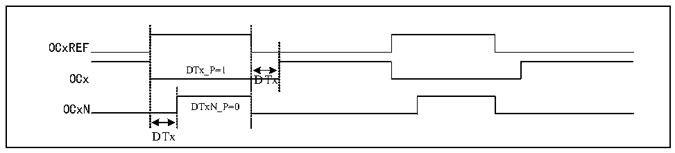

<!-- source-page: 129 -->

[← p.128](0128.md) · [index](../README.md) · [PDF p.129](https://ch32-riscv-ug.github.io/CH32M030/datasheet_zh/CH32M030RM.PDF#page=129) · [p.130 →](0130.md)

<!-- header: CH32M030应用手册 https://wch.cn -->

> ⬆ **Table continued** — rendered in full at [page 128](0128.md). <!-- p129-table-001 -->

### 10.3.9 互补输出和死区

TIM2能够输出两个互补带死区的信号（OCx和OCxN），通过DTx_P和DTxN_P位独立进行极性控  
制，通过设置DTx位能够设置死区时间大小。  

图10-5 互补输出和死区  
 <!-- rendered from the PDF; verify at https://ch32-riscv-ug.github.io/CH32M030/datasheet_zh/CH32M030RM.PDF#page=129 -->

🖼 Text parsed from the figure above

OCxREF  
DTx_P=1  
OCx DTx  
OCxN DTxN_P=0  
DTx  

当互补输出时，通道3和通道4作为通道1和通道2互补输出通道。  
可配置死区时间的互补或同向的输出，通过配置位OC1N_EN、OC2N_EN复用通道3，4的输出通  
道输出  

### 10.3.10 双边沿捕获模式

可通过TIM2_CTLR2寄存器CAP_ED_CHx位开启对应通道双边沿捕获对脉冲进行测量。  
例如：通过通道2来捕获脉冲宽度，在捕获功能配置上，选择IC2信号的来源（TIM2_CHCTLR1寄  
存器的CC2S位为11b），使能通道2的双边沿捕获功能（TIM2_CTLR2寄存器的CAP_ED_CH2位为1）。  
至此已经将双边沿捕获配置完成。  
可通过TIM2_CH2CVR寄存器的CH2CVR位读取捕获的脉冲的高低电平宽度值，开启CAPLVL位可通  
过TIM2_CH2CVR寄存器bit[16]指示捕获值对应的电平。  

### 10.3.11 高频时钟计数模式

定时器2的通道1、2和相应互补通道支持使用PLL时钟作为核心计数器工作时钟产生PWM(OCxM  
位只能选择 PWM 模式 1 或 PWM 模式 2)，此功能下仅支持递增计数模式；TIM2_DTCR 寄存器 DT2[3:0]  
位可配置在OCXREF下降沿死区时间的值，DT1[3:0]可配置在OCXREF上升沿死区时间的值；DT_DIV位  
开启死区时间计数时钟4分频功能，扩展死区时间。  

### 10.3.12 调试模式

当系统进入调试模式时，根据DBG模块的设置可以控制定时器继续运转或者停止。  

## 10.4 寄存器描述

<!-- p129-table-002 (table-10-3@1) pages 129-130 -->
<table><caption>表10-3 TIM2相关寄存器列表</caption><tr><th>名称</th><th>访问地址</th><th>描述</th><th>复位值</th></tr><tr><td>R16_TIM2_CTLR1</td><td>0x40000000</td><td>控制寄存器1</td><td>0x0000</td></tr><tr><td>R16_TIM2_CTLR2</td><td>0x40000004</td><td>控制寄存器2</td><td>0x0000</td></tr><tr><td>R16_TIM2_SMCFGR</td><td>0x40000008</td><td>从模式控制寄存器</td><td>0x0000</td></tr><tr><td>R16_TIM2_DMAINTENR</td><td>0x4000000C</td><td>DMA/中断使能寄存器</td><td>0x0000</td></tr><tr><td>R16_TIM2_INTFR</td><td>0x40000010</td><td>中断状态寄存器</td><td>0x0000</td></tr><tr><td>R16_TIM2_SWEVGR</td><td>0x40000014</td><td>事件产生寄存器</td><td>0x0000</td></tr><tr><td>R16_TIM2_CHCTLR1</td><td>0x40000018</td><td>比较/捕获控制寄存器1</td><td>0x0000</td></tr><tr><td>R16_TIM2_CHCTLR2</td><td>0x4000001C</td><td>比较/捕获控制寄存器2</td><td>0x0000</td></tr><tr><td>R16_TIM2_CCER</td><td>0x40000020</td><td>比较/捕获使能寄存器</td><td>0x0000</td></tr><tr><td>R16_TIM2_CNT</td><td>0x40000024</td><td>通用定时器的计数器</td><td>0x0000</td></tr><tr><td>R16_TIM2_PSC</td><td>0x40000028</td><td>计数时钟预分频器</td><td>0x0000</td></tr><tr><td>R16_TIM2_ATRLR</td><td>0x4000002C</td><td>自动重装值寄存器</td><td>0xFFFF</td></tr><tr><td>R32_TIM2_CH1CVR</td><td>0x40000034</td><td>比较/捕获寄存器1</td><td>0x00000000</td></tr><tr><td>R32_TIM2_CH2CVR</td><td>0x40000038</td><td>比较/捕获寄存器2</td><td>0x00000000</td></tr><tr><td>R32_TIM2_CH3CVR</td><td>0x4000003C</td><td>比较/捕获寄存器3</td><td>0x00000000</td></tr><tr><td>R32_TIM2_CH4CVR</td><td>0x40000040</td><td>比较/捕获寄存器4</td><td>0x00000000</td></tr><tr><td>R16_TIM2_DTCR</td><td>0x40000044</td><td>死区功能配置寄存器</td><td>0x0000</td></tr><tr><td>R16_TIM2_DMACFGR</td><td>0x40000048</td><td>DMA控制寄存器</td><td>0x0000</td></tr><tr><td>R16_TIM2_DMAADR</td><td>0x4000004C</td><td>连续模式的DMA地址寄存器</td><td>0x0000</td></tr></table>

<!-- image: p129-draw-image-00001 bbox=[507.84, 786.48, 527.52, 797.04] -->
<!-- footer: V1.2 128 -->
