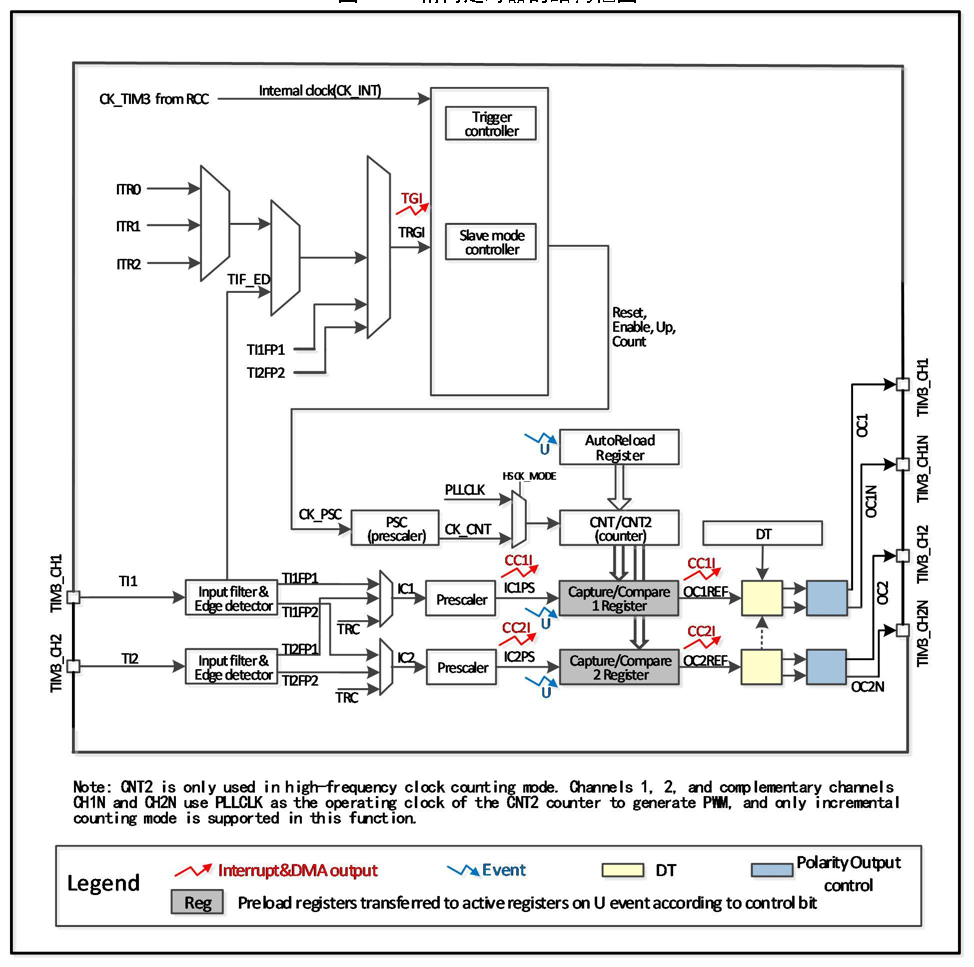

<!-- source-page: 147 -->

[← p.146](0146.md) · [index](../README.md) · [PDF p.147](https://ch32-riscv-ug.github.io/CH32M030/datasheet_zh/CH32M030RM.PDF#page=147) · [p.148 →](0148.md)

<!-- header: CH32M030应用手册 https://wch.cn -->

## 11.2 原理和结构

图11-1 精简定时器的结构框图  
 <!-- rendered from the PDF; verify at https://ch32-riscv-ug.github.io/CH32M030/datasheet_zh/CH32M030RM.PDF#page=147 -->

🖼 Text parsed from the figure above

<!-- image: p147-draw-image-00002 inside the figure -->

### 11.2.1 概述

如图 11-1 所示，精简定时器的结构大致可以分为三部分，即输入时钟部分，核心计数器部分和  
比较捕获通道部分。  
精简定时器的时钟可以来自于 HB 总线时钟（CK_INT），可以来自于其他具有时钟输出功能的定  
时器（ITRx），还可以来自于比较捕获通道的输入端（TIM3_CHx）。这些输入的时钟信号经过各种设  
定的滤波分频等操作后成为CK_PSC时钟，输出给核心计数器部分。  
精简定时器的核心是一个16位计数器（CNT）。CK_PSC经过预分频器（PSC）分频后，成为CK_CNT  
再最终输给CNT，CNT支持增计数模式，并有一个自动重装值寄存器（ATRLR）在每个计数周期结束后  
为CNT重装载初始化值。  
精简定时器拥有两组比较捕获通道，每组比较捕获通道都可以从专属的引脚上输入脉冲，也可以  
向引脚输出波形，即比较捕获通道支持输入和输出模式。比较捕获寄存器每个通道的输入都支持滤波、  
分频、边沿检测等操作，并支持通道间的互触发，还能为核心计数器CNT提供时钟。每个比较捕获通  
道都拥有一组比较捕获寄存器（CHxCVR），支持与主计数器（CNT）进行比较而输出脉冲。  
<!-- image: p147-draw-image-00001 bbox=[507.84, 786.48, 527.52, 797.04] -->
<!-- footer: V1.2 146 -->
