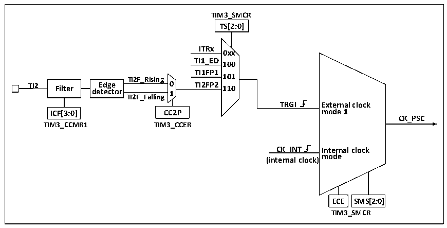

<!-- source-page: 148 -->

[← p.147](0147.md) · [index](../README.md) · [PDF p.148](https://ch32-riscv-ug.github.io/CH32M030/datasheet_zh/CH32M030RM.PDF#page=148) · [p.149 →](0149.md)

<!-- header: CH32M030应用手册 https://wch.cn -->

### 11.2.2 精简定时器和高级定时器的区别

与高级定时器相比，精简定时器缺少以下功能：  
1） 精简定时器缺少对核心计数器的计数周期进行计数的重复计数寄存器。  
2） 精简定时器没有刹车信号机制。  
3） 精简定时器没有编码器模式。  
4） 精简定时器16位自动重装计数器不支持减计数模式和增减计数模式。  
5） 精简定时器不支持外部时钟引脚（ETR）输入时钟。  

### 11.2.3 时钟输入

本节论述CK_PSC的来源。此处截取精简定时器的整体结构框图的时钟源部分。  

图11-2 精简定时器CK_PSC来源框图  
 <!-- rendered from the PDF; verify at https://ch32-riscv-ug.github.io/CH32M030/datasheet_zh/CH32M030RM.PDF#page=148 -->

🖼 Text parsed from the figure above

<strong>TIM3_SMCR</strong>  
<strong>TS[2:0]</strong>  
<strong>ITRx</strong>  
<strong>0xx</strong>  
<strong>TI1_ED</strong>  
<strong>100</strong>  
<strong>TI1FP1</strong>  
<strong>TI2F_Rising 101</strong>  
<strong>TI2 Filter de E t d e g c e tor 0 1 TI2FP2 110</strong>  
<strong>TI2F_Falling</strong>  
<strong>TRGI External clock</strong>  
<strong>ICF[3:0] CC2P mode 1</strong>  
<strong>CK_PSC</strong>  
<strong>TIM3_CCMR1 TIM3_CCER</strong>  
<strong>CK_INT Internal clock</strong>  
<strong>mode</strong>  
<strong>(internal clock)</strong>  
<strong>ECE SMS[2:0]</strong>  
<strong>TIM3_SMCR</strong>  

可选的输入时钟可以分为3类：  
1) 内部HB时钟输入路线：CK_INT；  
2) 来自比较捕获通道引脚（TIM3_CHx）的路线：TIM3_CHx→TIx→TIxFPx；  
3) 来自内部其他定时器的输入：ITRx。  
通过决定CK_PSC来源的SMS的输入脉冲选择可以将实际的操作分为2类：  
1) 选择内部时钟源（CK_INT）；  
2) 外部时钟源模式1。  
上文提到的3种时钟源来源都可通过这2种操作选定。  

#### 11.2.3.1 内部时钟源（CK_INT）

如果将 SMS 域保持为 000b 时启动精简定时器，那么就是选定内部时钟源（CK_INT）为时钟。此  
时CK_INT就是CK_PSC。  

#### 11.2.3.2 外部时钟源模式 1

如果将 SMS域设置为 111b时，就会启用外部时钟源模式 1。启用外部时钟源1时，TRGI被选定  
为CK_PSC的来源，值得注意的，用户还需要通过配置TS域来选择TRGI的来源。TS域可选择以下几  
种脉冲作为时钟来源：  
1） 内部触发（ITRx，x为0,1,2,3）；  
<!-- image: p148-draw-image-00001 bbox=[507.84, 786.48, 527.52, 797.04] -->
<!-- footer: V1.2 147 -->
