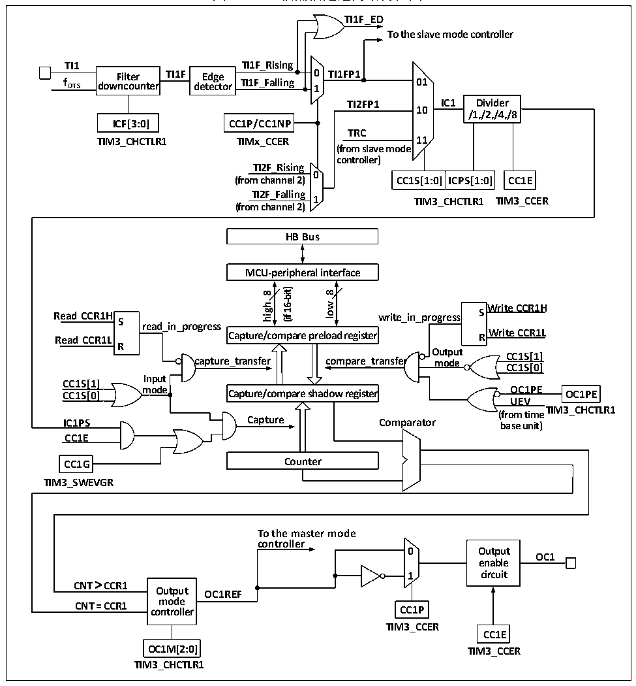

<!-- source-page: 149 -->

[← p.148](0148.md) · [index](../README.md) · [PDF p.149](https://ch32-riscv-ug.github.io/CH32M030/datasheet_zh/CH32M030RM.PDF#page=149) · [p.150 →](0150.md)

<!-- header: CH32M030应用手册 https://wch.cn -->
2） 比较捕获通道1经过边缘检测器后的信号（TI1F_ED）；  
3） 比较捕获通道的信号TI1FP1、TI2FP2；  

### 11.2.4 计数器和周边

CK_PSC输入给预分频器（PSC）进行分频。PSC是16位的，实际的分频系数相当于R16_TIM3_PSC  
的值+1。CK_PSC经过PSC会成为CK_INT。更改R16_TIM1_PSC的值并不会实时生效，而会在更新事件  
后更新给PSC。更新事件包括UG位清零和复位。  

### 11.2.5 比较捕获通道

比较捕获通道是定时器实现复杂功能的核心，它的核心是比较捕获寄存器，辅以外围输入部分的  
数字滤波，分频和通道间复用，输出部分的比较器和输出控制组成。比较捕获通道的结构框图如图11-  
3所示。  

图11-3 比较捕获通道的结构框图  
 <!-- rendered from the PDF; verify at https://ch32-riscv-ug.github.io/CH32M030/datasheet_zh/CH32M030RM.PDF#page=149 -->

🖼 Text parsed from the figure above

<strong>TI1F_ED</strong>  
<strong>To the slave mode controller</strong>  
<strong>TI1 TI1F_Rising</strong>  
<strong>Filter TI1F Edge 0 TI1FP1</strong>  
<strong>f DTS downcounter detector TI1F_Falling 1 01</strong>  
<strong>TI2FP1 IC1 Divider</strong>  
<strong>10</strong>  
<strong>/1,/2,/4,/8</strong>  
<strong>ICF[3:0] CC1P/CC1NP</strong>  
<strong>TRC</strong>  
<strong>TIM3_CHCTLR1 TIMx_CCER 11</strong>  
<strong>(from slave mode</strong>  
<strong>controller)</strong>  
<strong>TI2F_Rising</strong>  
<strong>0</strong>  
CC1S[1:0]  ICPS[1:0]  
<strong>(from channel 2) CC1S[1:0] ICPS[1:0] CC1E</strong>  
<strong>TI2F_Falling</strong>  
<strong>1 TIM3_CCER</strong>  
<strong>TIM3_CHCTLR1</strong>  
<strong>(from channel 2)</strong>  
<strong>HB Bus</strong>  
<strong>MCU-peripheral interface</strong>  
<strong>16-bit)</strong>  
<strong>8</strong>  
<strong>8</strong>  
<strong>low</strong>  
<strong>high</strong>  
<strong>Write CCR1H</strong>  
<strong>Read CCR1H write_in_progress S S</strong>  
<strong>(if</strong>  
<strong>read_in_progress</strong>  
<strong>Write CCR1L Read CCR1L R</strong>  
<strong>Capture/compare preload register</strong>  
<strong>R</strong>  
<strong>Output</strong>  
<strong>CC1S[1]</strong>  
<strong>capture_transfer compare_transfer mode</strong>  
<strong>CC1S[0]</strong>  
<strong>Input</strong>  
<strong>CC1S[1]</strong>  
<strong>mode OC1PE CC1S[0] OC1PE</strong>  
<strong>Capture/compare shadow register</strong>  
<strong>UEV</strong>  
<strong>TIM3_CHCTLR1</strong>  
<strong>(from time</strong>  
<strong>IC1PS Capture Comparator base unit)</strong>  
<strong>CC1E</strong>  
<strong>CC1G Counter</strong>  
<strong>TIM3_SWEVGR</strong>  
<strong>To the master mode</strong>  
<strong>controller</strong>  
<strong>0 Output</strong>  
<strong>OC1</strong>  
<strong>enable</strong>  
<strong>1 circuit</strong>  
<strong>CNT &gt; CCR1</strong>  
<strong>Output OC1REF</strong>  
<strong>mode</strong>  
<strong>CNT = CCR1 controller CC1P</strong>  
<strong>TIM3_CCER</strong>  
<strong>CC1E</strong>  
<strong>OC1M[2:0] TIM3_CCER</strong>  
<strong>TIM3_CHCTLR1</strong>  

信号从通道 x 引脚输入进来后可选做为 TIx（TI1 的来源可以不只是 CH1，见定时器的框图 11-  
<!-- image: p149-draw-image-00001 bbox=[507.84, 786.48, 527.52, 797.04] -->
<!-- footer: V1.2 148 -->
