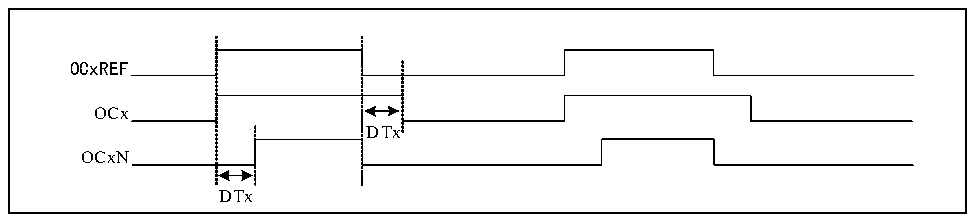

<!-- source-page: 150 -->

[← p.149](0149.md) · [index](../README.md) · [PDF p.150](https://ch32-riscv-ug.github.io/CH32M030/datasheet_zh/CH32M030RM.PDF#page=150) · [p.151 →](0151.md)

<!-- header: CH32M030应用手册 https://wch.cn -->
1），TI1经过滤波器（ICF[3:0]）生成TI1F，再经过边沿检测器分成TI1F_Rising和TI1F_Falling，  
这两个信号经过选择（CC1P）生成TI1FP1，TI1FP1和来自通道 2的 TI2FP1一起送给 CC1S选择成为  
IC1，经过ICPS分频后送给比较捕获寄存器。  
比较捕获寄存器由一个预装载寄存器和一个影子寄存器组成，读写过程仅操作预装载寄存器。在  
捕获模式下，捕获发生在影子寄存器上，然后复制到预装载寄存器；在比较模式下，预装载寄存器的  
内容被复制到影子寄存器中，然后影子寄存器的内容与核心计数器（CNT）进行比较。  

### 11.2.6 互补输出和死区

2 个通道一般有两个输出引脚，能够输出两个互补带死区的信号（OCx 和 OCxN），通过 COxP 和  
COxNP位独立进行极性控制，通过设置DTx位能够设置死区时间大小。  

图11-4 互补输出和死区  
 <!-- rendered from the PDF; verify at https://ch32-riscv-ug.github.io/CH32M030/datasheet_zh/CH32M030RM.PDF#page=150 -->

🖼 Text parsed from the figure above

OCxREF  
OCx  
DTx  
OCxN  
DTx  

## 11.3 功能和实现

精简定时器复杂功能的实现都是对定时器的比较捕获通道、时钟输入电路和计数器及周边组件进  
行操作实现的。定时器的时钟输入可以来自于包括比较捕获通道的输入在内的多个时钟源。对比较捕  
获寄存通道和时钟源选择的操作直接决定其功能。比较捕获通道是双向的，可以工作在输入和输出模  
式。  

### 11.3.1 输入捕获模式

输入捕获模式是定时器的基本功能之一。输入捕获模式的原理是，当检测到ICxPS信号上确定的  
边沿后，则产生捕获事件，计数器当前的值会被锁存到比较捕获寄存器（R16_TIM3_CHCTLRx）中。发  
生捕获事件时，CCxIF（在R16_TIM3_INTFR中）被置位，如果使能了中断或者DMA，还会产生相应中  
断或者DMA。如果发生捕获事件时，CCxIF已经被置位了，那么CCxOF位会被置位。CCxIF可由软件清  
除，也可以通过读取比较捕获寄存器由硬件清除。CCxOF由软件清除。  
举个通道1的例子来说明使用输入捕获模式的步骤，如下：  
1） 配置CCxS域，选择ICx信号的来源。比如设为10b，选择TI1FP1作为IC1的来源，不可以使用  
默认设置，CCxS域默认是使比较捕获模块作为输出通道；  
2） 配置ICxF域，设定TI信号的数字滤波器。数字滤波器会以确定的频率，采样确定的次数，再输  
出一个跳变。这个采样频率和次数是通过ICxF来确定的；  
3） 配置CCxP位，设定TIxFPx的极性。比如保持CC1P位为低，选择上升沿跳变；  
4） 配置ICxPS域，设定ICx信号成为ICxPS之间的分频系数。比如保持ICxPS为00b，不分频；  
5） 配置CCxE位，允许捕获核心计数器（CNT）的值到比较捕获寄存器中。置CC1E位；  
6） 根据需要配置CCxIE和CCxDE位，决定是否允许使能中断或者DMA。  
至此已经将比较捕获通道配置完成。  
当TI1输入了一个被捕获的脉冲时，核心计数器（CNT）的值会被记录到比较捕获寄存器中，CC1IF  
被置位，当CC1IF在之前就已经被置位时，CCIOF位也会被置位。如果CC1IE位，那么会产生一个中  
断；如果CC1DE被置位，会产生一个DMA请求。可以通过写事件产生寄存器的方式（R16_TIM3_SWEVGR）  
的方式由软件产生一个输入捕获事件。  
<!-- image: p150-draw-image-00001 bbox=[507.84, 786.48, 527.52, 797.04] -->
<!-- footer: V1.2 149 -->
