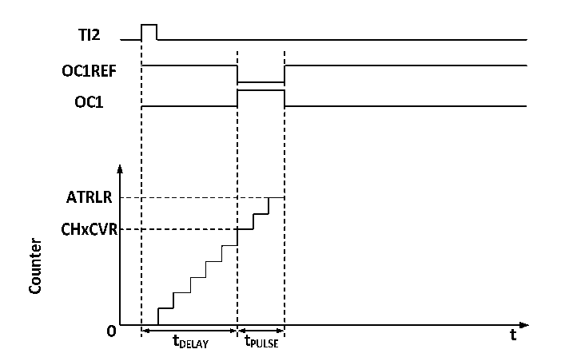

<!-- source-page: 152 -->

[← p.151](0151.md) · [index](../README.md) · [PDF p.152](https://ch32-riscv-ug.github.io/CH32M030/datasheet_zh/CH32M030RM.PDF#page=152) · [p.153 →](0153.md)

<!-- header: CH32M030应用手册 https://wch.cn -->
R16_TIM3_ATRLR的值而恢复成全0时），OCxREF下降为低。  

### 11.3.6 单脉冲模式

单脉冲模式可以响应一个特定的事件，在一个延迟之后产生一个脉冲，延迟和脉冲的宽度可编程。  
置OPM位可以使核心计数器在产生下一个更新事件UEV时（计数器翻转到0）停止。  

图11-5 事件产生和脉冲响应  
 <!-- rendered from the PDF; verify at https://ch32-riscv-ug.github.io/CH32M030/datasheet_zh/CH32M030RM.PDF#page=152 -->

🖼 Text parsed from the figure above

<!-- image: p152-draw-image-00003 inside the figure -->
<!-- image: p152-draw-image-00002 inside the figure -->
<!-- image: p152-draw-image-00004 inside the figure -->
<!-- image: p152-draw-image-00005 inside the figure -->
<!-- image: p152-draw-image-00006 inside the figure -->
<!-- image: p152-draw-image-00007 inside the figure -->
<!-- image: p152-draw-image-00008 inside the figure -->
<!-- image: p152-draw-image-00015 inside the figure -->
<!-- image: p152-draw-image-00016 inside the figure -->
<!-- image: p152-draw-image-00017 inside the figure -->
<!-- image: p152-draw-image-00009 inside the figure -->
<!-- image: p152-draw-image-00014 inside the figure -->
<!-- image: p152-draw-image-00010 inside the figure -->
<!-- image: p152-draw-image-00012 inside the figure -->
<!-- image: p152-draw-image-00013 inside the figure -->
<!-- image: p152-draw-image-00011 inside the figure -->

如图11-5所示，需要在TI2输入引脚上检测到一个上升沿开始，延迟Tdelay之后，在OC1上产  
生一个长度为Tpulse的正脉冲：  
1） 设定TI2为触发。置CC2S域为01b，把 TI2FP2映射到 TI2；置 CC2P位为 0b，TI2FP2设为上升  
沿检测；置TS域为110b，TI2FP2设为触发源；置SMS域为110b，TI2FP2被用来启动计数器；  
2） Tdelay由比较捕获寄存器定义，Tpulse由自动重装值寄存器的值和比较捕获寄存器的值确定。  

### 11.3.7 定时器同步模式

定时器能够输出时钟脉冲（TRGO），也能接收其他定时器的输入（ITRx）。不同的定时器的ITRx  
的来源（别的定时器的TRGO）是不一样的。定时器内部触发连接如表11-1所示。  

<!-- p152-table-002 (table-11-1@1) -->
<table><caption>表11-1 GTPM内部触发连接</caption><tr><th>从定时器</th><th>ITR0(TS=000)</th><th>ITR1(TS=001)</th><th>ITR2(TS=010)</th><th>ITR3(TS=011)</th></tr><tr><td>TIM3</td><td>TIM1</td><td>TIM2</td><td>USB</td><td></td></tr></table>

### 11.3.8 双边沿捕获模式

可通过TIM3_CCER寄存器CAP_ED位开启对应通道双边沿捕获对脉冲进行测量。  
例如：通过通道2来捕获脉冲宽度，在捕获功能配置上，选择IC2信号的来源（TIM3_CHCTLR1寄  
存器的CC2S位为11b），使能通道2的双边沿捕获功能（TIM3_CCER寄存器的CAP_ED位为1）。至此  
已经将双边沿捕获配置完成。  
可通过TIM3_CH2CVR寄存器的CH2CVR位读取捕获的脉冲的高低电平宽度值，开启CAPLVL位可通  
过TIM3_CH2CVR寄存器bit[16]指示捕获值对应的电平。  

### 11.3.9 高频时钟计数模式

定时器3的通道1、2和相应互补通道支持使用PLL时钟作为核心计数器工作时钟产生PWM(OCxM  
位只能选择PWM模式1或PWM模式2)，此功能下仅支持递增计数模式；TIM3_SMCFGR寄存器DT2[3:0]  
可配置在 OCXREF 下降沿死区时间的值，DT1[3:0]可配置在 OCXREF 上升沿死区时间的值；DT_DIV 位  
<!-- image: p152-draw-image-00001 bbox=[507.84, 786.48, 527.52, 797.04] -->
<!-- footer: V1.2 151 -->
