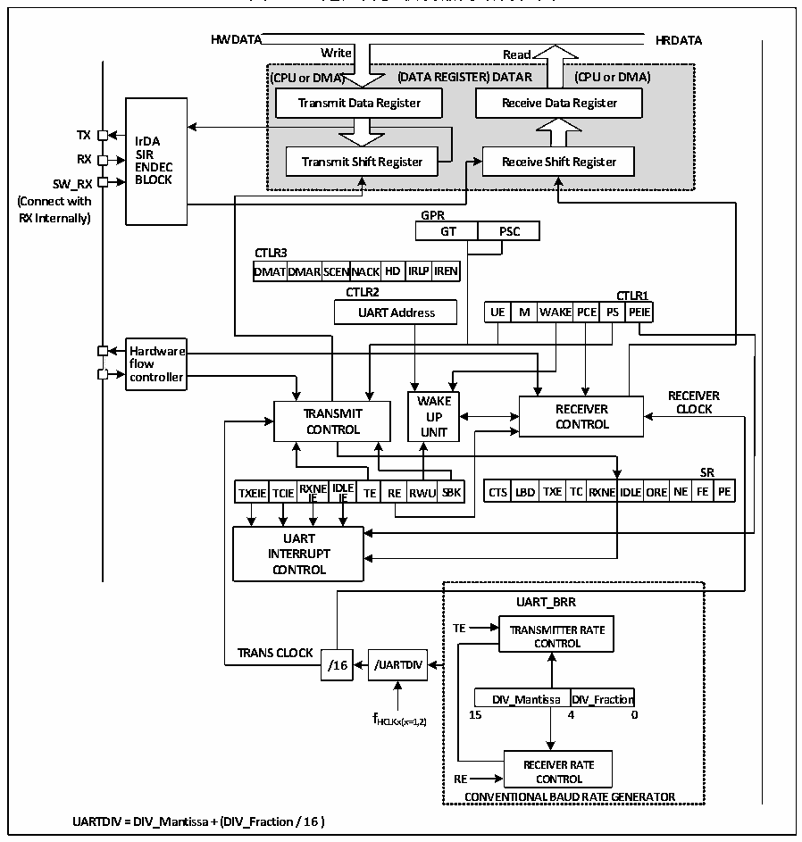

<!-- source-page: 164 -->

[← p.163](0163.md) · [index](../README.md) · [PDF p.164](https://ch32-riscv-ug.github.io/CH32M030/datasheet_zh/CH32M030RM.PDF#page=164) · [p.165 →](0165.md)

<!-- header: CH32M030应用手册 https://wch.cn -->

# 第 12 章 通用异步收发器（UART）

该模块包含1个通用异步收发器UART。  

## 12.1 主要特征

● 全双工或半双工的异步通信  
● NRZ数据格式  
● 分数波特率发生器，最高4.5Mbps  
● 可编程数据长度  
● 可配置的停止位  
● 支持LIN，IrDA编码器  
● 支持DMA  
● 多种中断源  

## 12.2 概述

图12-1 通用异步收发器的结构框图  
 <!-- rendered from the PDF; verify at https://ch32-riscv-ug.github.io/CH32M030/datasheet_zh/CH32M030RM.PDF#page=164 -->

🖼 Text parsed from the figure above

<strong>HWDATA HRDATA</strong>  
<strong>Write Read</strong>  
<strong>(CPU or DMA) (DATA REGISTER) DATAR (CPU or DMA)</strong>  
<strong>Transmit Data Register Receive Data Register</strong>  
<!-- image: p164-draw-image-00004 inside the figure -->
<strong>TX</strong>  
<strong>IrDA</strong>  
<strong>RX S E I N R DEC Transmit Shift Register Receive Shift Register</strong>  
<strong>SW_RX BLOCK</strong>  
<strong>(Connect with</strong>  
<strong>RX Internally) GPR</strong>  
GPRGT  PSC  
<strong>CTLR3</strong>  
DMAT  TDMAR  SCENNA  ACKHD  IRLP  
<strong>DMATDMARSCENNACKHD IRLPIREN</strong>  
<strong>CTLR2 CTLR1</strong>  
WAKE  PCE  CTLR PS PE  R1EIE  
Hardware flow controller  
<!-- image: p164-draw-image-00002 inside the figure -->
<!-- image: p164-draw-image-00003 inside the figure -->
<strong>WWAAKKEE RECEIVER</strong>  
<strong>TRANSMIT UUPP RECEIVER CLOCK</strong>  
<strong>CONTROL UUNNIITT CONTROL</strong>  
TXEIE  TCIE  RXNEIDLE IE IE  TE RE  RWU  
<strong>SR</strong>  
D TXE  TC  RXNE  EIDLE  EORE  NE  SRFE  RPE  
<strong>TXEIE TCIERX IE NEID IE LE TE RE RWU SBK CTS LBD TXE TCRXNEIDLEORE NE FE PE</strong>  
<strong>UART</strong>  
<strong>INTERRUPT</strong>  
<strong>CONTROL</strong>  
<strong>UART_BRR</strong>  
<strong>TE TRANSMITTER RATE</strong>  
<strong>CONTROL</strong>  
<strong>TRANS CLOCK</strong>  
<strong>/16 /UARTDIV</strong>  
DIV_Mantissa  DIV_Fraction  
<strong>f 15 4 0</strong>  
<strong>HCLKx(x=1,2)</strong>  
<strong>RECEIVER RATE</strong>  
<strong>RE CONTROL</strong>  
<strong>CONVENTIONAL BAUD RATE GENERATOR</strong>  
<strong>UARTDIV = DIV_Mantissa + (DIV_Fraction / 16 )</strong>  

<!-- image: p164-draw-image-00001 bbox=[507.84, 786.48, 527.52, 797.04] -->
<!-- footer: V1.2 163 -->
