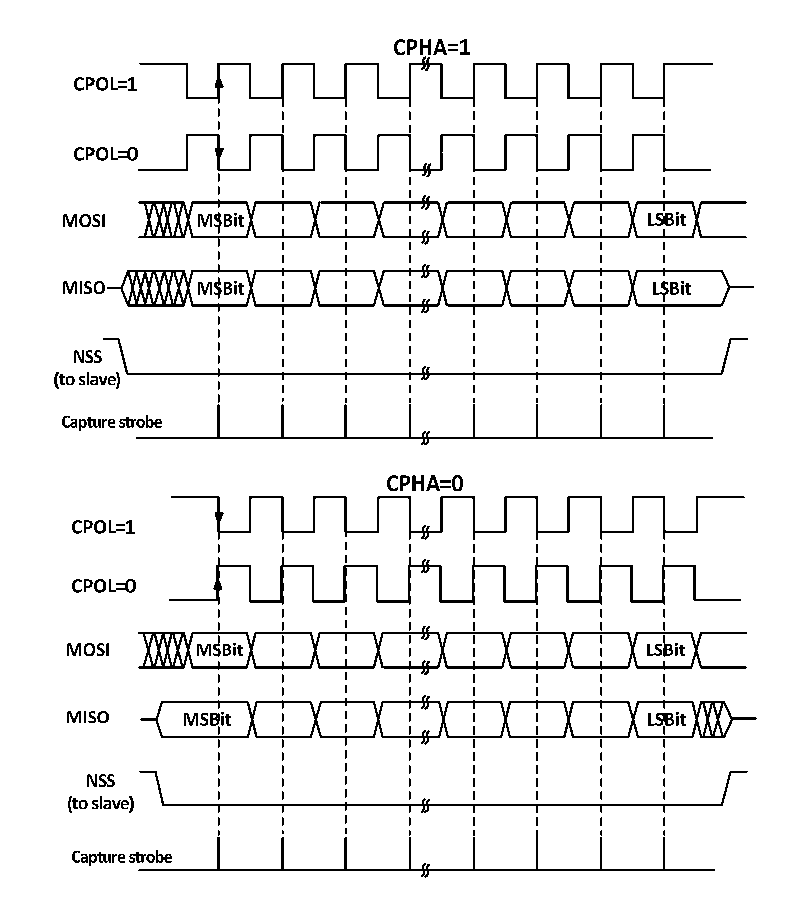

<!-- source-page: 186 -->

[← p.185](0185.md) · [index](../README.md) · [PDF p.186](https://ch32-riscv-ug.github.io/CH32M030/datasheet_zh/CH32M030RM.PDF#page=186) · [p.187 →](0187.md)

<!-- header: CH32M030应用手册 https://wch.cn -->
SPI模块工作在主模式下时，是数据输入引脚；工作在从模式下时，是数据输出引脚。MOSI引脚工作  
在主模式下数时，是数据输出引脚；工作在从模式时，是数据输入引脚。SCK是时钟引脚，时钟信号  
一直由主机输出，从机接收时钟信号并同步数据收发。NSS引脚是片选引脚，有以下用法：  
1）NSS 由软件控制：此时 SSM 被置位，内部 NSS 信号由 SSI 决定输出高还是低，这种情况一般用于  
SPI主模式；  
2）NSS由硬件控制：在NSS输出使能时，即SSOE置位时，在SPI主机向外发送输出时会主动拉低NSS  
引脚，如果没有成功拉低NSS脚，说明主线上有其他主设备正在通信，则会产生一个硬件错误；SSOE  
不置位，则可以用于多主机模式，如果它被拉低则会强行进入从机模式，MSTR位会被自动清除。  
可以通过 CPHA 和 CPOL 配置 SPI 的工作模式。CPHA 置位表示模块在时钟的第二个边沿进行数据  
采样，数据被锁存，CPHA 不置位表示 SPI 模块在时钟的第一个边沿进行采样，数据被锁存。CPOL 则  
表示无数据时时钟保持高电平还是低电平。具体见下图14-2。  

图14-2 SPI模式  
 <!-- rendered from the PDF; verify at https://ch32-riscv-ug.github.io/CH32M030/datasheet_zh/CH32M030RM.PDF#page=186 -->

🖼 Text parsed from the figure above

<!-- image: p186-draw-image-00002 inside the figure -->
<!-- image: p186-draw-image-00004 inside the figure -->
<!-- image: p186-draw-image-00003 inside the figure -->
<!-- image: p186-draw-image-00005 inside the figure -->
<!-- image: p186-draw-image-00007 inside the figure -->
<!-- image: p186-draw-image-00006 inside the figure -->
<!-- image: p186-draw-image-00008 inside the figure -->
<!-- image: p186-draw-image-00028 inside the figure -->
<!-- image: p186-draw-image-00010 inside the figure -->
<!-- image: p186-draw-image-00030 inside the figure -->
<!-- image: p186-draw-image-00009 inside the figure -->
<!-- image: p186-draw-image-00029 inside the figure -->
<!-- image: p186-draw-image-00020 inside the figure -->
<!-- image: p186-draw-image-00018 inside the figure -->
<!-- image: p186-draw-image-00011 inside the figure -->
<!-- image: p186-draw-image-00019 inside the figure -->
<!-- image: p186-draw-image-00021 inside the figure -->
<!-- image: p186-draw-image-00012 inside the figure -->
<!-- image: p186-draw-image-00013 inside the figure -->
<!-- image: p186-draw-image-00014 inside the figure -->
<!-- image: p186-draw-image-00016 inside the figure -->
<!-- image: p186-draw-image-00015 inside the figure -->
<!-- image: p186-draw-image-00017 inside the figure -->
<!-- image: p186-draw-image-00022 inside the figure -->
<!-- image: p186-draw-image-00024 inside the figure -->
<!-- image: p186-draw-image-00023 inside the figure -->
<!-- image: p186-draw-image-00025 inside the figure -->
<!-- image: p186-draw-image-00027 inside the figure -->
<!-- image: p186-draw-image-00026 inside the figure -->
<!-- image: p186-draw-image-00031 inside the figure -->
<!-- image: p186-draw-image-00033 inside the figure -->
<!-- image: p186-draw-image-00032 inside the figure -->
<!-- image: p186-draw-image-00041 inside the figure -->
<!-- image: p186-draw-image-00043 inside the figure -->
<!-- image: p186-draw-image-00034 inside the figure -->
<!-- image: p186-draw-image-00035 inside the figure -->
<!-- image: p186-draw-image-00042 inside the figure -->
<!-- image: p186-draw-image-00044 inside the figure -->
<!-- image: p186-draw-image-00036 inside the figure -->
<!-- image: p186-draw-image-00037 inside the figure -->
<!-- image: p186-draw-image-00039 inside the figure -->
<!-- image: p186-draw-image-00038 inside the figure -->
<!-- image: p186-draw-image-00040 inside the figure -->

主机和设备需要设置为相同的SPI模式，在配置SPI模式前，需要清除SPE位。DEF位可以决定  
SP的单个数据长度是8位还是16位。LSBFIRST可以控制单个数据字是高位在前还是低位在前。  

### 14.2.2 主模式

在SPI模块工作在主模式时，由SCK产生串行时钟。配置成主模式进行以下步骤：  
1）配置控制寄存器的BR[2:0]域来确定时钟；  
<!-- image: p186-draw-image-00001 bbox=[507.84, 786.48, 527.52, 797.04] -->
<!-- footer: V1.2 185 -->
