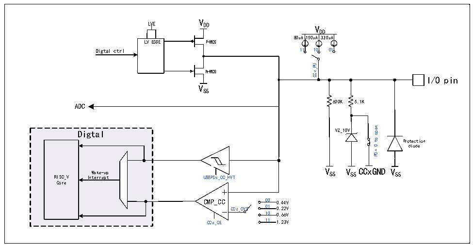

<!-- source-page: 193 -->

[← p.192](0192.md) · [index](../README.md) · [PDF p.193](https://ch32-riscv-ug.github.io/CH32M030/datasheet_zh/CH32M030RM.PDF#page=193) · [p.194 →](0194.md)

<!-- header: CH32M030应用手册 https://wch.cn -->

# 第 15 章 USB PD 控制器（USBPD）

## 15.1 USB PD 控制器简介

芯片内置了2组USB Power Delivery控制器和PD收发器PHY，提供4个耐高压的CC引脚。  
持USB Type-C主从检测，自动BMC编解码和CRC，硬件边沿控制，支持USB PD2.0和PD3.0电  
力传输控制，支持快充，支持UFP/PD受电端Sink和DFP/PD供电端Source应用、DRP应用以及动态  
切换。内置USB Type-C接口，支持主从检测，支持DRP、Sink/Consumer和Source/Provider。  
● 内置USB PD 收发器PHY，集成硬件边沿斜率控制  
● 内置USB Power Delivery控制器，自动BMC编解码、4b5b编解码和CRC  
● 支持SOP、SOP’、SOP”等PD包，支持USB PD 复位信号帧硬件复位  
● 支持最大包长度510字节，支持DMA  
● 支持USB PD 2.0和3.0 电力传输协议，USB端口支持BC等充电协议  
● 支持比较器且负端输入参考电压多档可选，可编程上拉电流  
● 支持可编程灌电流模块ISINK配合可以支持PPS高精度调压。  

图15-1 CC端口结构图  
 <!-- rendered from the PDF; verify at https://ch32-riscv-ug.github.io/CH32M030/datasheet_zh/CH32M030RM.PDF#page=193 -->

🖼 Text parsed from the figure above

V  
LVE  
DD V  
DD  
80uA150uA330uA  
LVEDGE  
P-MOS  
Digtal ctrl 11 10 01  
CCx_PU  
N-MOS  
I/O pin  
VSS  
600K  
5.1K  
ADC  
open  
VZ_10V  
Digtal  
to  
Protection  
diode  
0  
PD=  
<!-- image: p193-draw-image-00002 inside the figure -->
<!-- image: p193-draw-image-00003 inside the figure -->
Wake-up V SS V SS CCxGND V SS  
RISC_V  
USBPDx_CC_HVT  
Interrupt  
Core  
CMP_CC 00 0.44V  
CCx_CVS 01 0.22V  
10 0.66V  
CCx_CE 11 1.23V  

注：CCxGND为CCx的内部GND，CCx如果有后缀R即CCxR，则其CCxGND已在芯片内部短接VSS。  

## 15.2 寄存器描述

<!-- p193-table-001 (table-15-1@1) pages 193-194 -->
<table><caption>表15-1 USBPD0相关寄存器列表</caption><tr><th>名称</th><th>访问地址</th><th>描述</th><th>复位值</th></tr><tr><td>R32_USBPD_CONFIG</td><td>0x40024000</td><td>PD配置寄存器</td><td>0x0000000X</td></tr><tr><td>R16_CONFIG</td><td>0x40024000</td><td>PD中断使能寄存器</td><td>0x000X</td></tr><tr><td>R16_BMC_CLK_CNT</td><td>0x40024002</td><td>BMC采样时钟计数器</td><td>0x0000</td></tr><tr><td>R32_USBPD_CONTROL</td><td>0x40024004</td><td>PD控制寄存器</td><td>0x00000000</td></tr><tr><td>R16_CONTROL</td><td>0x40024004</td><td>PD收发控制寄存器</td><td>0x0000</td></tr><tr><td>R8_CONTROL</td><td>0x40024004</td><td>PD收发使能寄存器</td><td>0x00</td></tr><tr><td>R8_TX_SEL</td><td>0x40024005</td><td>PD发送SOP选择寄存器</td><td>0x00</td></tr><tr><td>R16_BMC_TX_SZ</td><td>0x40024006</td><td>PD发送长度寄存器</td><td>0x0000</td></tr><tr><td>R32_USBPD_STATUS</td><td>0x40024008</td><td>PD状态寄存器</td><td>0x000000XX</td></tr><tr><td>R16_STATUS</td><td>0x40024008</td><td>PD中断和数据寄存器</td><td>0x00XX</td></tr><tr><td>R8_DATA_BUF</td><td>0x40024008</td><td>DMA缓存数据寄存器</td><td>0xXX</td></tr><tr><td>R8_STATUS</td><td>0x40024009</td><td>PD中断标志寄存器</td><td>0x00</td></tr><tr><td>R16_BMC_BYTE_CNT</td><td>0x4002400A</td><td>字节计数器</td><td>0x0000</td></tr><tr><td>R32_USBPD_PORT</td><td>0x4002400C</td><td>端口控制寄存器</td><td>0x00030003</td></tr><tr><td>R8_PORT_CC1</td><td>0x4002400C</td><td>CC1端口控制寄存器</td><td>0x03</td></tr><tr><td>R8_PORT_CC2</td><td>0x4002400E</td><td>CC2端口控制寄存器</td><td>0x03</td></tr><tr><td>R32_USBPD_DMA</td><td>0x40024010</td><td>DMA缓存地址寄存器</td><td>0x0000XXXX</td></tr><tr><td>R16_DMA</td><td>0x40024010</td><td>PD缓冲区起始地址寄存器</td><td>0x0XXX</td></tr></table>

<!-- image: p193-draw-image-00001 bbox=[507.84, 786.48, 527.52, 797.04] -->
<!-- footer: V1.2 192 -->
